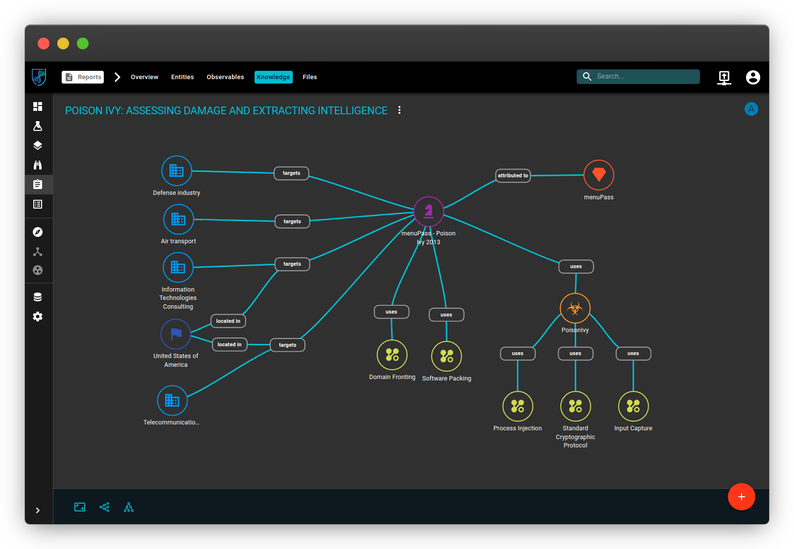
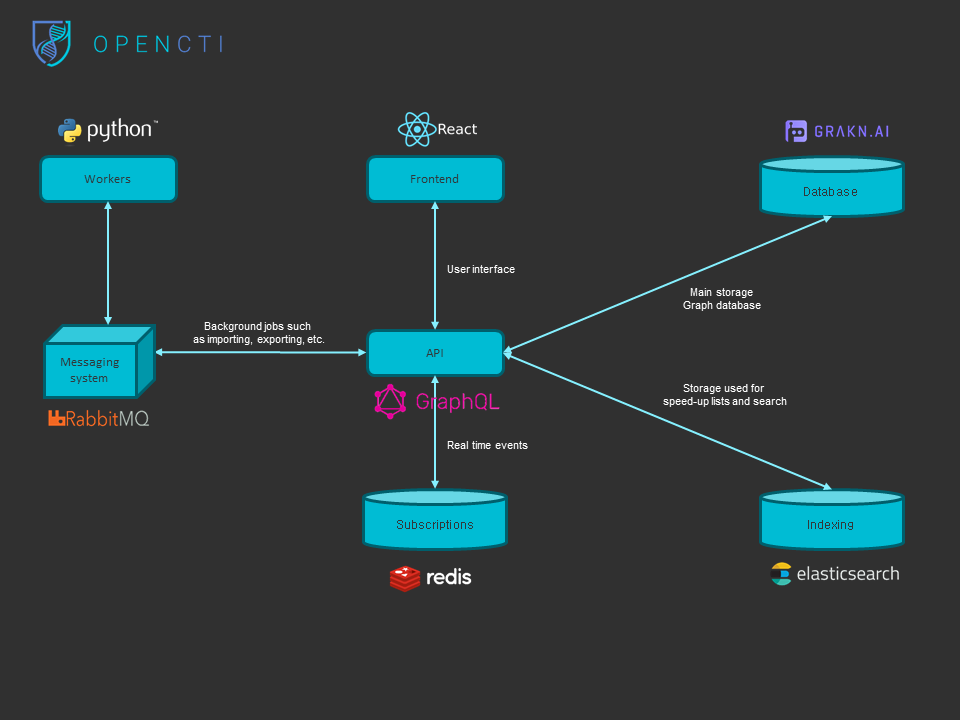

---

OpenCTI is an open source platform allowing organizations to manage their cyber threat intelligence knowledge, investigations and indicators of compromise. OpenCTI can be integrated with other applications such as [Maltego](https://www.paterva.com/web7/buy/maltego-clients/maltego-ce.php), [MISP](https://www.misp-project.org/), [CORTEX](https://github.com/TheHive-Project/Cortex) and many other STIX2 compliant products. It has been designed as a modern web application including a GraphQL API and an UX oriented frontend.

## Releases download

The releases are available on the [Github releases page](https://github.com/LuatixHQ/opencti/releases). You can also access to the [rolling release package](https://releases.opencti.io) generated from the mater branch of the repository.

## Installation

* [Use Docker](docker)
* [Install OpenCTI manually](docs/Installation.md)
* [Install OpenCTI for development](docs/Development.md)

## Details

### Architecture

### Native graph database visualizer

The [Grakn](https://github.com/graknlabs/grakn) knowledge graph database provides a client called the [Grakn workbase](https://github.com/graknlabs/workbase) that can be used to explore the whole database. You can use it in order to explore your data in an original way.

## Community

### Status & bugs

Currently OpenCTI is under heavy development, if you wish to report bugs or ask for new features, you can directly use the [Github issues module](https://github.com/LuatixHQ/opencti/issues).

### Discussion

If you need support or you wish to engage a discussion about the OpenCTI platform, feel free to join us on our [Slack channel](https://slack.luatix.org).

### About

OpenCTI is a product powered by the collaboration of the [French national cybersecurity agency (ANSSI)](https://ssi.gouv.fr), the [CERT-EU](https://cert.europa.eu) and the [Luatix](https://www.luatix.org) non-profit organization.
