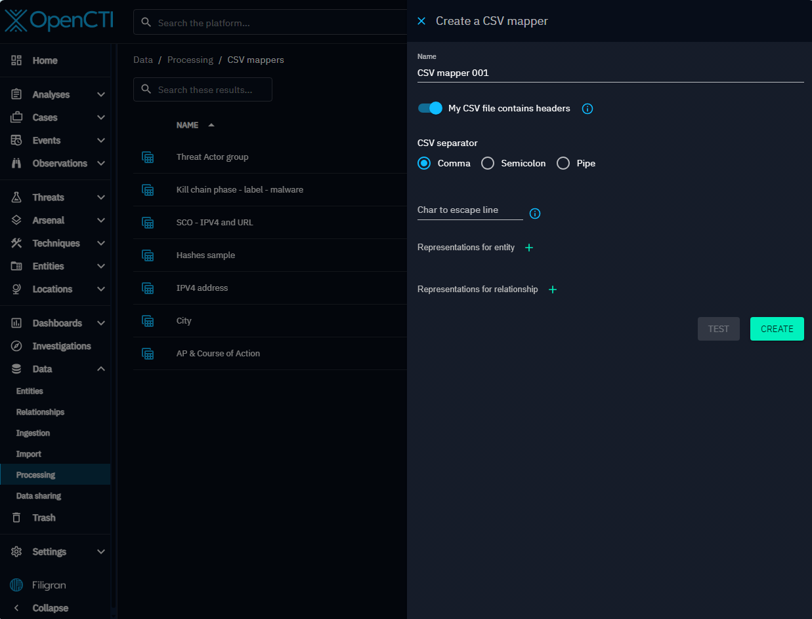
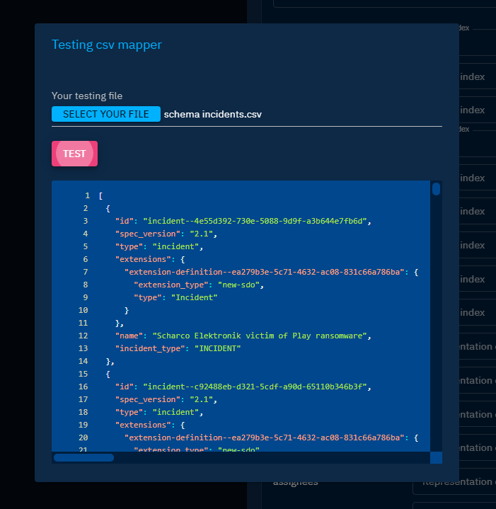

# CSV Mappers

In OpenCTI, CSV Mappers allow to parse CSV files in a STIX 2.1 Objects. The mappers are created and configured by users with the Manage CSV mappers capability and
then made available to users who import CSV files, for instance inside a report or in the global import view, and want to extract information inside these files.

## Principles

The mapper contains __representations__ of STIX 2.1 entities and relationships, in order for the parser to properly extract them.   
One mapper is dedicated to parsing a specific CSV file structure, and thus dedicated mappers should be created for each 
and every specific CSV structure you might need to ingest in the platform.

## Create a new CSV Mapper

In menu _Data_, select the submenu _Processing_, and on the right menu select _CSV Mappers_. You are presented with a list of all the mappers set in the platform.
Note that you can delete or update any mapper from the context menu via the burger button beside each mapper.

Click on the button __+__ in the bottom-right corner to add a new Mapper.

Enter a name for your mapper and some basic information about your CSV files: 

* The line separator used (defaults to the standard comma character)
* The presence of a header on the first line

!!! info
    Note that the parser will not extract any information from the CSV header if any ; it will just skip
    the first line during parsing.



Then, you need to create every representation, one per entity and relationship type represented in the CSV file.
Click on the __+__ button to add an empty representation in the list, and click on the chevron to expand the section and configure the representation.

Depending on the entity type, the form contains the fields that are either required (input outlined in red) or optional.
For each field, set the corresponding columns mapping (the letter-based index of the column in the CSV table, as presented in common spreadsheet tools). 

References to other entities should be picked from the list of all the other representations already defined earlier in the mapper.

You can do the same for all the relationships between entities that might be defined in this particular CSV file structure.


Fields might have options besides the mandatory column index, to help extract relevant data.

* __Date__ values are expected in [ISO 8601](https://en.wikipedia.org/wiki/ISO_8601?oldformat=true) format, but you can set your own format to the time parser
* __Multiple values__ can be extracted by specifying the separator used inside the cell (e.g. `+` or `|`)


## CSV Mapper validity

The only parameter required to save a CSV Mapper is a name ; creating and refining its representations can be done iteratively.

All CSV Mappers go through a quick validation that checks if all the representations have all their mandatory fields set. 
Only valid mappers can be run by the users on their CSV files.

Mapper validity is visible in the list of CSV Mappers as shown below.


## Test your CSV mapper

In the creation or edition form, hit the button __Test__ to open a dialog. Select a sample CSV file and hit the __Test__ button.

The code block contains the raw result of the parsing attempt, in form of a STIX 2.1 bundle in JSON format.

You can then check if the extracted values match the expected entities and relationships.




## Use a mapper for importing a CSV file

You can change the default configuration of the import csv connector in your configuration file.
```json
  "import_csv_built_in_connector": {
    "enabled": true, 
    "interval": 10000, 
    "validate_before_import": false
},
```

In Data import section, or Data tab of an entity, when you upload a CSV, you can select a mapper to apply to the file. 
The file will then be parsed following the representation rules set in the mapper.

By default, the imported elements will be added in a new Analyst Workbench where you will be able to check the result of the import.

