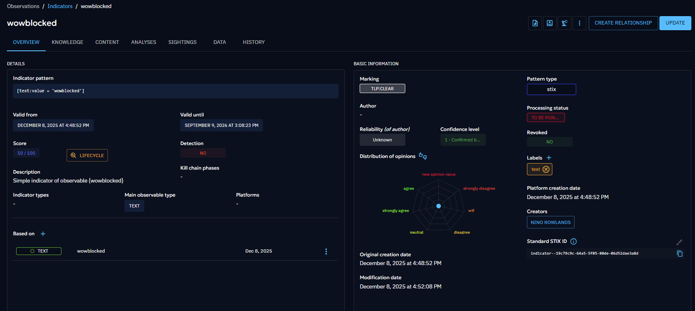

# Decay exclusion rules

Decay exclusion rules are used to automatically exclude some IOCs from our Decay engine. 

Multiple reasons explain the existence this feature: 
- Some IOCs, such as YARA rules, should not expire. Indeed, you always want detection rules to be enabled so that your detection system can always detect any threat.
- Some IOCs are coming from some sources that already manage the IOCs lifecycle. Therefore, our own decay engine conflicts with the source's decay.

Without this feature, the only way to avoid some IOCs to decay, the only solution was to disable the [decay manager](https://docs.opencti.io/latest/deployment/managers/?h=mana#indicator-decay-manager). But this would prevent any IOC for decaying, which was not a suitable solution.

## Configuration

Decay exclusion rules can be configured in the "Settings > Customization > Decay rule" menu. This screen contains two tabs: decay rules & decay exclusion rules.

To create a new decay exclusion rule, click on the decay exclusion rule tab. Here you can find all your decay exclusion rules. You can create a new one by clicking on create. 

By **default**, a decay exclusion rule will be created as **Disabled**, unless you change this in the creation drawer.

### Filters available
Decay exclusion rules offer some filters, to allow you to be precise in the definition of indicators that should be prevented from Decaying.

Currently, you can filter on: 
- Creator
- Author
- Marking
- Label
- Main observable type
- Indicator type
- Pattern type

!!! warning "Always add a filter with a value before enabling the decay exclusion rule"

    Creating a decay exclusion rule without any filter will by default match any IOC created in the platform. As a result, all IOCs will not revoke automatically.

## Events when decay exclusion rule are triggered

### Creation
Both decay and decay exclusion rules evaluate IOCs when they are created. In other words, creating an IOC will trigger either a decay rule or a decay exclusion rule (assuming your manager is enabled). 

#### Decay rules & Decay exclusion rules at creation: priority

Currently decay exclusion rules are taking over Decay rules: this means that if an IOC **created** matches both a Decay rule and a Decay exclusion rule, **the IOC will be under the decay exclusion rule (and will not revoke automatically)**

#### IOC created as revoked=TRUE will also be impacted by Exclusion decay rules
Sometimes, a source creates an IOC as revoked. 
However, the same IOC can be created or even upserted by another source and marked as revoked = FALSE. 

Regardless of the value of the revoked field, the IOC will always be evaluated against decay exclusion rules.

### Upsert
Upserting an IOC would also trigger both decay rules & decay exclusion rules. As a result, this is where defining the **correct filters** is crucial to avoid any unwanted behavior. 

#### Decay rules & Decay exclusion rules at upsert: priority
Currently decay exclusion rules are taking over Decay rules: this means that if an IOC **upserted** matches both a Decay rule and a Decay exclusion rule, **the IOC will be under the decay exclusion rule (and will not revoke automatically)**

#### Example of expected behavior that can occur
- Decay Exclusion Rule filters on creator = [c] Sekoia
If an IOC has been created by [c] AnotherSource and had a Decay rule associated to it and [c] Sekoia upsert this IOC, this IOC will now fall under the Decay exclsuion rule since it matches the filter.

- Decay Exclusion Rule filters on label = Test
If an IOC is created by a source and upserted with a a new label Test, this IOC will now fall under the Decay Exclusion rule since it matches the filters. 

### Update
Updating an IOC should not impact which rule type the IOC is impacted by. 
To be clear: assuming an IOC is under a specific Decay rule, if the update of this IOC would make it match a Decay exclusion rule,** the IOC would remain only impacted by the Decay rule.**

## How to differentiate whether an IOC is under a Decay Rule or a Decay Exclusion Rule

If your IOC is under a decay exclusion rule, you will notice that the lifecyle button next to the IOC overview differs whether yout IOC is impacted by a Decay rule or by a Decay exclusion rule.

If you have the right, you can even view the rule name & be redirected to the screen of decay exclusion rule, to help you understand (and manage) which rule is impacting which IOC.

## How do the various exclusion rules work all together

You can create multiple decay exclusion rules: there is no notion of order, like the decay rules. Instead, you can consider each rule as a set a filter and each new rule added would correspond to have a "OR" operator between all your filters.
As a result, you can create multiple decay exclusion rules to create complex filtering group.

## How to remove the decay exclusion rule impacting an IOC
It's currently not possible. Even if you delete the rule, the IOC would still be impacted by the decay exclusion rule. This is the exact same behavior than the decay rule. 

## Changing the filter of a decay exclusion rule 
Changing the filter of a decay exclusion rule will not affect already impacted IOC by this rule.
This means that even if the filters of the decay exclusion rule are modified and do not match the IOC anymore, the IOC will still be impacted by the exclusion rule.

## Main takeways:
- Once an IOC is impacted by a decay exclusion rule, it is not possible to change this.
- Therefore, it's important to properly define your filters.
- Do not create a decay exclusion rule without filters: it will impact all your IOCs.
- Decay exclusion rules have a higher priority than exclusion rules. 

