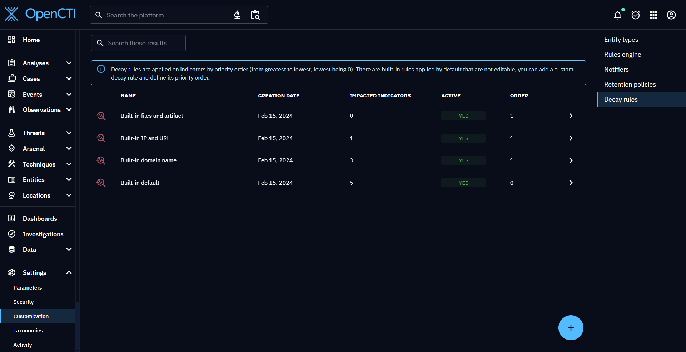
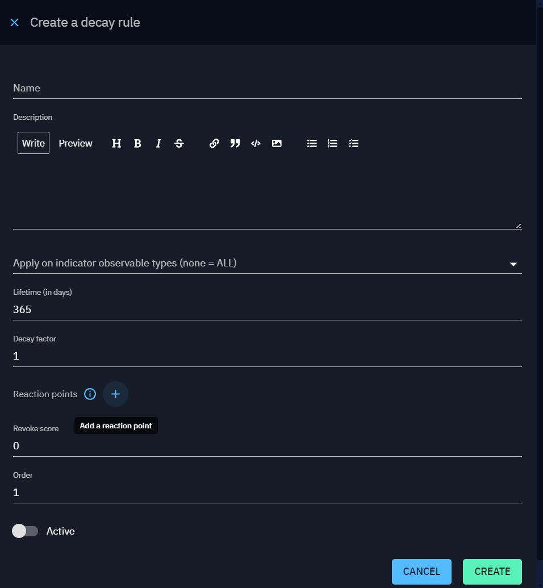

# Decay rules

Decay rules are used to update automatically indicators score in order to represent their lifecycle.

## Configuration

Decay rules can be configured in the "Settings > Customization > Decay rule" menu.

There are built-in decay rules that can't be modified and are applied by default to indicators depending on their main observable type.
Decay rules are applied following their order : from highest to lowest (lowest being 0).

You can create new decay rules with higher order to apply them along with (or instead of) the built-in rules.

When you create a decay rule, you can specify on which indicators' main observable types it will apply. If you don't enter any, it will apply to all indicators.

You can also add reaction points which represent the scores at which indicators are updated. For example if you add one reaction point at 60 and another one at 40, indicators that have an initial score of 80 will be updated with a score of 60, then 40, depending on the decay curve.

The decay curve is based on two parameters : lifetime and decay factor. Decay factor represent the speed at which the score drops, and lifetime is how long (in days) it will drop until reaching 0.

Finally, the revoke score is the score at which the indicator can be revoked automatically.

Once you have created a new decay rule, you will be able to view its details, along with a life curve graph showing the score evolution over time.

You will also be able to edit your rule, change all its parameters and order, activate or deactivate it (only activated rules are applied), or delete it.

!!! tip "Indicator decay manager"

    Decay rules are only applied, and indicators score updated, if indicator decay manager is enabled (enabled by default). 

    [Please read the dedicated page to have all information](../../deployment/managers#indicator-decay-manager.md)
