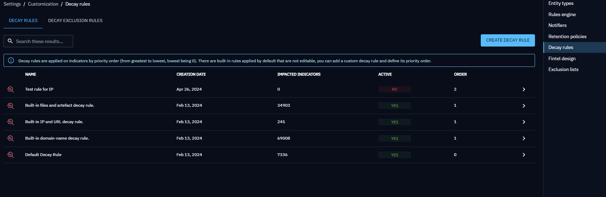
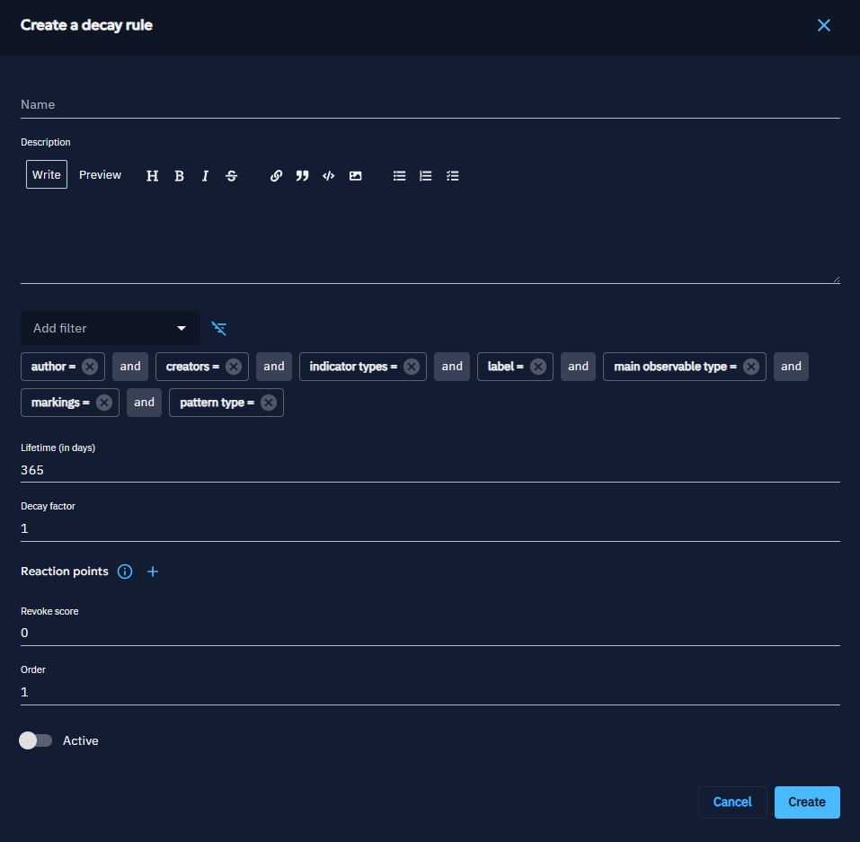
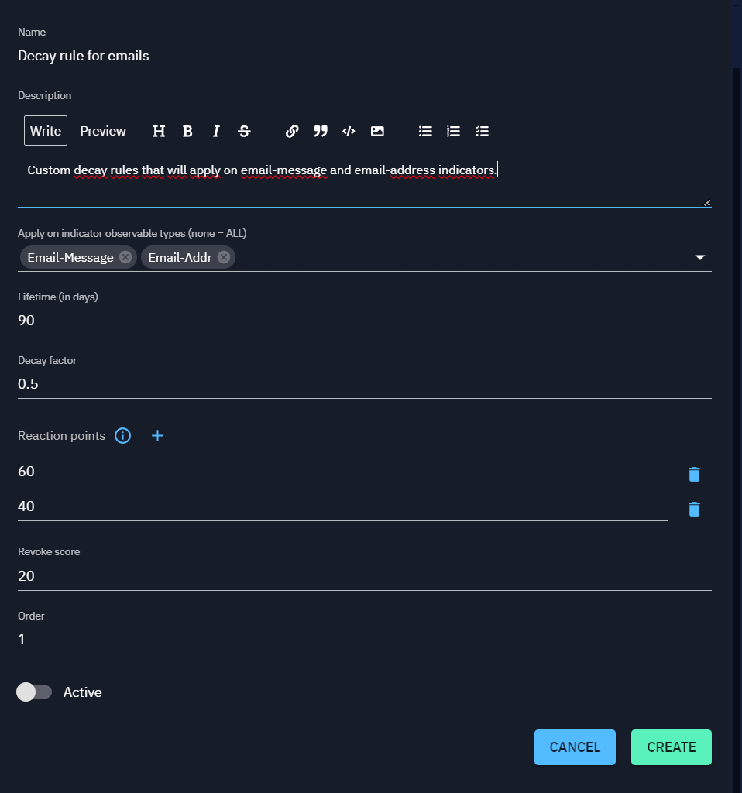
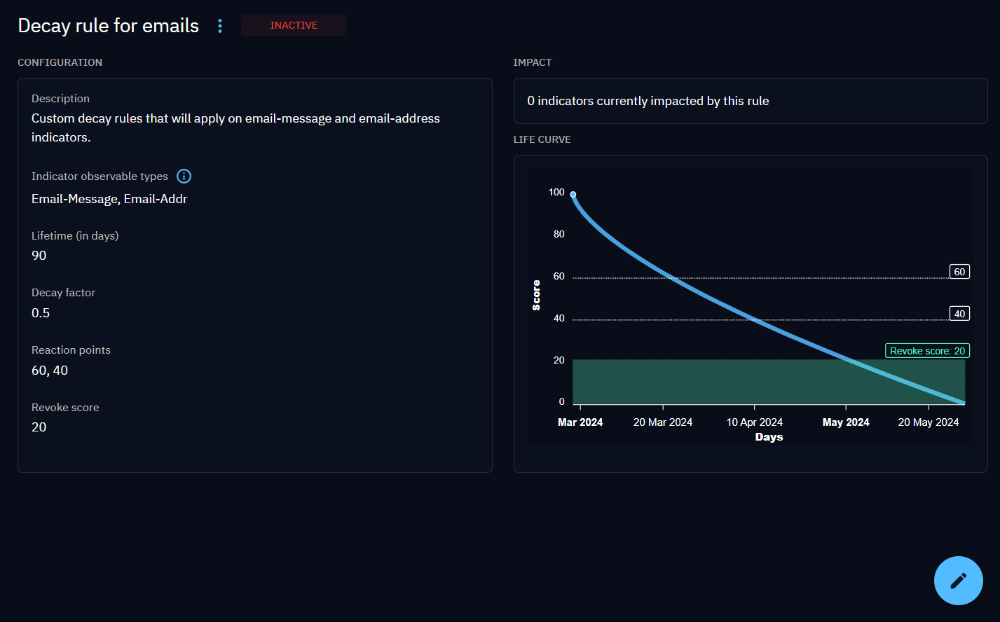

# Decay rules

Decay rules are used to update automatically indicators score in order to represent their lifecycle.

## Configuration

Decay rules can be configured in the "Settings > Customization > Decay rule" menu.

There are built-in decay rules that can't be modified and are applied by default to indicators depending on their main observable type.
Decay rules are applied from highest to lowest order (the lowest being 0).

You can create new decay rules with higher order to apply them along with (or instead of) the built-in rules.

## Decay rules configuration

### Add filters to your decay rules

You may need, because of the source, the marking or any other reason, to be able to specify with granularity how fast an indicator needs to decay. 

Therefore, when creating (or editing) a decay rule, multiple filters are present:

- Author
- Creator
- Main observable type
- Label
- Marking
- Indicator type
- Pattern type

### Business rules related to filters

#### Decay rules do not change at indicator upsert 

Defining which rule should be applicable to a specific indicator happens at indicator creation: this means that if an indicator matches another rule during an upsert, the indicator will remain under the same initial rule. 

#### No filters means that the rule is applied to all indicators

Filters aim to provide more granularity when it comes to applying a needed decay rule.

Therefore, if you do not apply filter, any created indicator will be impacted by the rule.
Additionally, not selecting **any main observable type** as a filter would impact all indicators (that would match your other filters)

#### The highest order takes priority 

The rule with the highest order will be run in priority. 

Example: 

- Context

   - _let's assume that an indicator with a **stix pattern** `[url:value = 'test.com']`, **Pattern type** = `Stix` , **label**= `test` and **marking** = `TLP:GREEN` is created_
   - A decay rule called "Decay1" exists, filtering on **Pattern type** = `Stix` , **label**= `test` and **order** = 5
   - A decay rule called "Decay2" exists, filtering on **Pattern type** = `Stix` , **label**= `test` and **marking** = `TLP:GREEN` and **order** = 4

- Result: Decay1 will be applied, even though Decay2 match more filters, since Decay1 filters match the indicator and the order of Decay1 is higher.

#### If two rules are created with the same order, the first one created will be applied.

The rule created first will be applied if two rules matching the indicator have the same order.

Example: 

- Context

   - _let's assume that an indicator with a **stix pattern** `[url:value = 'test.com']`, **Pattern type** = `Stix` , **label**= `test` and **marking** = `TLP:GREEN` is created_
   - A decay rule called "Decay1" exists, filtering on **Pattern type** = `Stix` , **label**= `test` and **order** = 5, created **first**
   - A decay rule called "Decay2" exists, filtering on **Pattern type** = `Stix` , **label**= `test` and **marking** = `TLP:GREEN` and **order** = 5, **created after Decay1**

- Result: Decay1 will be applied, even though Decay2 match more filters, since Decay1 has been created first.

#### Decay exclusion rules always have priority over decay rules

If an indicator matches both a decay exclusion rule (see [decay exclusion rules](./decay-exclusion-rules.md)), the decay exclusion rule will always apply.

#### Update a filter of a decay rule does not impact current indicators under this decay rule

If an indicator is under a decay rule and a user updates the decay rule, resulting in the indicator no longer matching the decay rule, the indicator will *still remain* impacted by the decay rule.

Example:

- Context

   - _let's assume that an indicator with a **stix pattern** `[url:value = 'test.com']`, **Pattern type** = `Stix` , **label**= `test` and **marking** = `TLP:GREEN` is created_
   - A decay rule called "Decay1" exists, filtering on **Pattern type** = `Stix` , **label**= `test` and **order** = 5, and is applied on the IOC
   - A user updated the rule. New filters are: **Pattern type** = `yara` , **label**= `test`

- Result:
   
   - The indicator will still remain under Decay1 despite the fact that the filter no longer matches the indicator.

### Reaction points, decay curve and impact on revocation score

You can also add reaction points which represent the scores at which indicators are updated. For example, if you add one reaction point at 60 and another one at 40, indicators that have an initial score of 80 will be updated with a score of 60, then 40, depending on the decay curve.

The decay curve is based on two parameters: 

- the decay factor, which represents the speed at which the score falls, and
- the lifetime, which represents the time (in days) during which the value will be lowered until it reaches 0.

Finally, the revoke score is the score at which the indicator can be revoked automatically.

Once you have created a new decay rule, you will be able to view its details, along with a life curve graph showing the score evolution over time.

You will also be able to edit your rule, change all its parameters and order, activate or deactivate it (only activated rules are applied), or delete it.

!!! tip "Indicator decay manager"

    Decay rules are only applied, and indicators score updated, if [indicator decay manager](../deployment/managers.md) is enabled (enabled by default).

## Specific behavior when two sources are trying to position a score

It can happen that two sources would like to push a score update on your indicator. This can impact your platform since the two sources could trigger endless updates on your platform.

You could avoid this by either reducing the confidence level of the user associated to one of the sources.

But if the two sources are of equal trust, a specific behavior exists: **a source cannot set the same score that has been set in the past**.

Example:

- Source1 has created the indicator with a score of 90.
- Source2 updates the indicator with a score of 95.
- Source1 updates again the indicator to set the score to 90

Result:
- The last update from source1 is not applied.

## Related reading:

- [Indicator decay manager](../deployment/managers.md)
- [Decay rules configuration](../administration/decay-rules.md)
