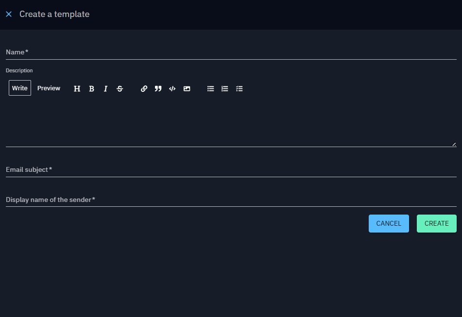
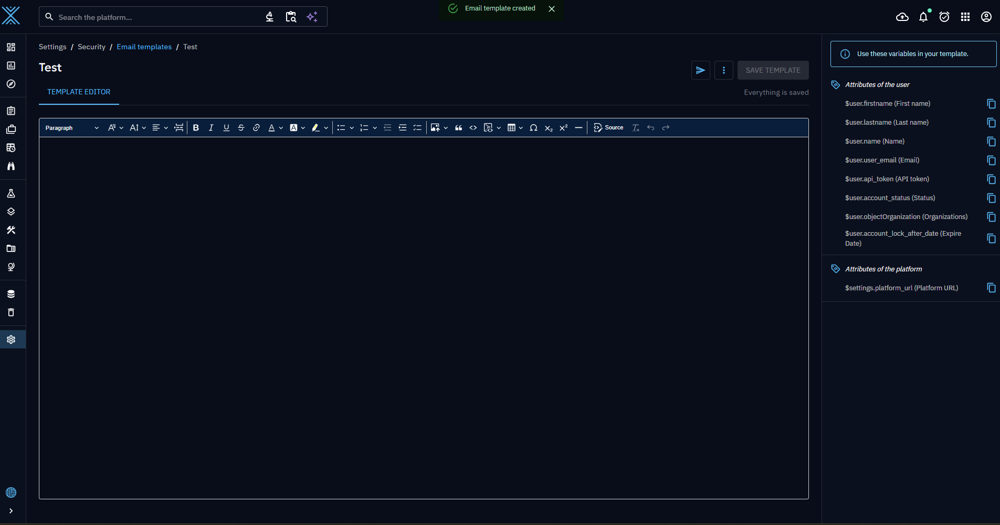
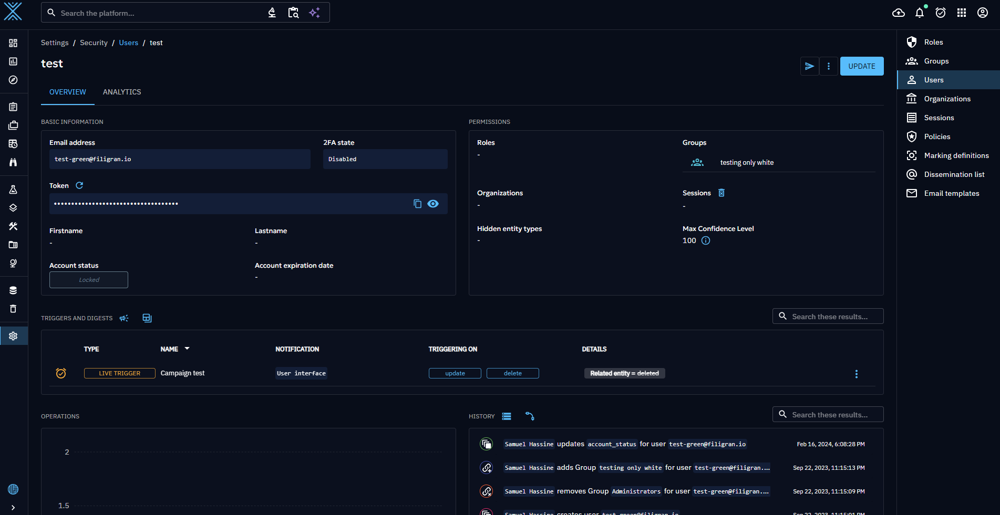

# Email templates

!!! tip "Enterprise edition"

   Email templates are under the "OpenCTI Enterprise Edition" license. Please read the page below to have all the information.

Email templates have been built in order to send administrative emails to your users. These templates cannot be used in the context of knowledge notification email (for instance, cannot be used to notify that a new report has been created).

The use cases that this feature will enable you to reach are:
- the ability to send an email automatically when a user is created
- send an email to a subset of users (your admins, for instance), to notify them about a process change
- send an email to all the users of the platform to notify them of a future downtime due to some maintenance

## Create a template

You need the capabily to manage credentials to access this feature.

Go to parameters/security and you will find the menu on the right handside.
Click on Create an email template to create a new one and ensure that the fields below are provided.

### Fields to create a new template

- **Email template name**: Give your template a name to easily find it.
- **Email subject**: Provide a subject to your email.
- **Display name of the sender**: Instead of only using the platform sender email address defined in settings/parameters, you can define the name of the sender of the email. 

### Configure your template

When you create your template, you will land on an email template interface, allowing you to configure the look and feel of your email. 

!!! Warning "Save your template"

   Please remember to save your template to avoid losing any changes. Each time you update your template, the save button will be highlighted to avoid forgetting about it.

#### Use variables

Some variables can be used to help you build your template. Copy/paste them or simply write them into your template to use them

You can find them on the right-hand side: 

- **$user.firstname (First name)**: First name of the user
- **$user.lastname (Last name)**: Last name of the user
- **$user.name (Name)**: Name of the user
- **$user.user_email (Email)**: Email of the user
- **$user.api_token (API token)**: Token of the user
- **$user.account_status (Status)**: Account status of the user
- **$user.objectOrganization (Organizations)**: Organization of the user
- **$user.account_lock_after_date (Expire Date)**: Expiry date of the account 
- **$settings.platform_url (Platform URL)**: Platform URL of the platform

#### Additional options

You can use our HTML editor to format your text, but also insert images, to define the email of your choice. 

### Test your template

Click on the Send test email: this will send you an email, using all the configuration, the variables, and the format you have defined to help you assess whether it is the final version or not.

## Use template

### Automatically send an email at user creation 

If you want an email to be sent at user creation, simply fill the field "Email Template" within the user form and an email will be triggered to the email you have provided.

### Massively send an email

Select a user from the list of users and click on the send email button. Simply choose the email template you want and click on send.

### Send an email to a single user

Go to the overview of a user and click on send email. Simply choose the email template you want and click on send.

