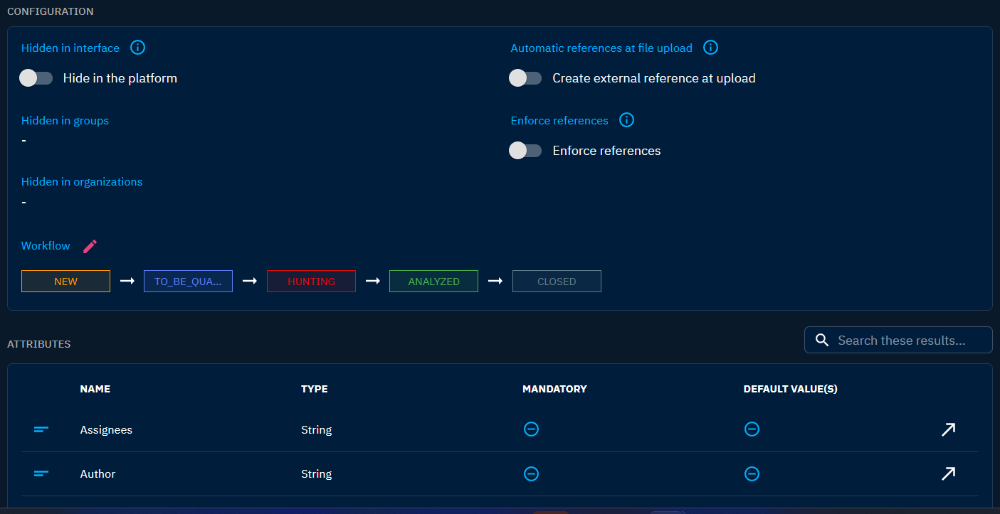

# Customize entities

## Introduction

A variety of entity customization options are available to optimize data representation, workflow management, and enhance overall user experience. Whether you're fine-tuning processing statuses, configuring entities' attributes, or hiding entities, OpenCTI's customization capabilities provide the flexibility you need to create a tailored environment for your threat intelligence and cybersecurity workflows.

The following chapter aims to provide readers with an understanding of the available customization options by entity type. Customize entities can be done in "Settings > Customization".

## Hidden in interface

This configuration allows to hide a specific entity type throughout the entire platform. It provides a potent means to simplify the interface and tailor it to your domain expertise. For instance, if you have no interest in disinformation campaigns, you can conceal related entities such as Narratives and Channels from the menus.

You can specify which entities to hide on a platform-wide basis from "Settings > Customization" and from "Settings > Parameters", providing you with a list of hidden entities. Furthermore, you can designate hidden entities for specific Groups and Organizations from "Settings > Security > Groups/Organizations" by editing a Group/Organization.

An overview of hidden entity types is available in the "Hidden entity types" field in "Settings > Parameters."

## Automatic references at file upload

This configuration enables an entity to automatically construct an external reference from the uploaded file.

## Enforce references

This configuration enables the requirement of a reference message on an entity creation or modification. This option is helpful if you want to keep a strong consistency and traceability of your Knowledge and is well suited for manual creation and update.

## Workflow

For now, OpenCTI has a simple workflow approach. They're represented by the "Processing status" field embedded in each object. By default, this field is disabled for most objects but can be activated through the platform settings:

1. Navigate to "Settings > Customization > Entity types > [Desired object type]."
2. Click on the small pink pen icon next to "Workflow" to access the object customization window.
3. Add and configure the desired statuses, defining their order within the workflow.

In addition, the available statuses are defined by a collection of status templates visible in "Settings > Taxonomies > Status templates". This collection can be customized.

## Attributes

Each attribute in an Entity offers several customization options:

- It can be set as mandatory if not already defined as such in the STIX standard.
- A default value can be established to streamline entity creation through the creation forms.
- Different thresholds and their corresponding labels for scalable attributes can be defined.

### Confidence scale configuration

Confidence scale can be customized for each entity type by selecting another scale template or by editing directly the scale values.
Once you have customized your scale, click on "Update" to save your configuration.

