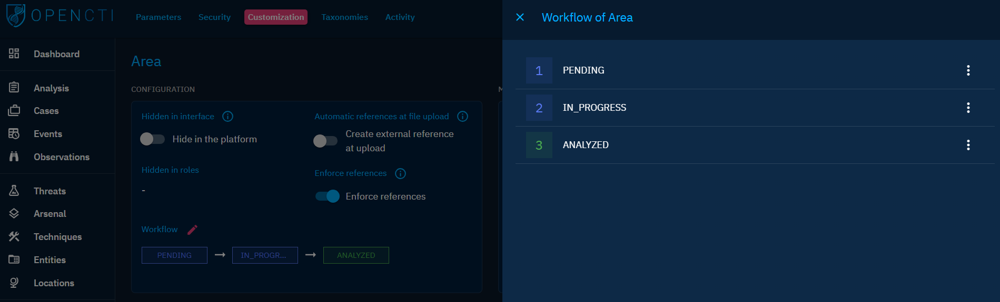

# Customize entities

## Introduction

The following chapter aims at giving the reader an understanding of possible options by entity type. Customize entities can be done in « Settings » --> « Customization ».

## Hidden in interface

This configuration hides a specific entity type across the entire platform. It is a powerfull way to simplify the interface and focus on your domain expertise. For example, if you are not interested in disinformation campaign, you can hide related entities like Narratives and Channels from the menus.

You can define which Entities to hide platform-wide from « Settings » --> « Customization », and also from « Settings » --> « Parameters » giving you a list of hidden entities.

You can also define hidden entities for specific users Groups and users Organizations, from « Settings » --> « Security » --> « Groups/Organizations » and editing a Group/Organization.

An overview is available in Parameters > Hidden entity types.

## Automatic references at file upload

This configuration enables an entity to automatically construct an external reference from the uploaded file.

## Enforce references

This configuration enables the requirement of a reference message on an entity creation or modification. This option is helpfull if you want to keep a strong consistency and traceability of your Knowledge and is well suited for manual creation and update.

## Workflow

For now, OpenCTI have a simple workflow approach.

The available status for an entity is first defined by a collection of status templates (that can be defined from « Settings » --> « Taxonomies » --> « Status Template »).

Then, a workflow can be defined by ordering a sequence of status template. 

## Attributes

In an Entity, each attribute offers some customization options :

- Become mandatory if not already defined as such in the stix standard
- Have a default value to facilitate the creation of an entity via the creation forms
- Define the different thresholds and corresponding label for scalable attribute

### Confidence scale configuration

Confidence scale can be customized for each entity type by selecting another scale template or by editing directly the scale values.
Once you have customized your scale, click on "Update" to save your configuration.

