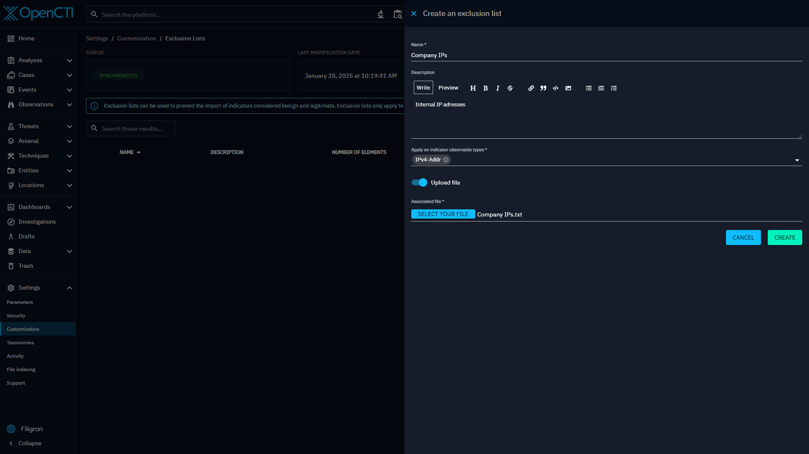

# Exclusion List

Exclusion lists are used to exclude some stix pattern type indicators from being created in the platform, depending on it's stix pattern values.

## Create an exclusion  list
Exclusion lists can be configured on the "Settings > Customization > Exclusion lists" menu.

On this first screen, you can see the main view of the interface aiming to present a clear, organised presentation of the existing lists.

When creating a list, you can provide the following data:

- Name
- Description
- Indicator observable types : this corresponds to the contents of the exclusion list
- Content : you can upload a file or copy/paste your content using the toggle button

As said before, there are different indicator observable types possible :

`Artifact`, `Domain-name`, `Email-Addr`, `Hostname`, `Ipv4-Addr`, `ipv6-Addr`, `StixFile`, `Url`

Once created, you can see that the status is In progress and that the Last modification date has changed.
This is because the new exclusion list has been created, but still need to be propagated to all of the platform nodes.

Once the `last modification date` and the `Current cache version date` are up to date, the status is `Synchronized` again. Your new exclusion list is ready to be applied!
On the list of exclusion lists, you can also see some additional information: the number of lines contained in your list, the creation date and the activation status.

There are several options available in your exclusion list:

- delete: if you want to completely remove the list from the settings
- activate/deactivate: this can be used to temporally pause the application of a list
- edit: if you want to edit my current list

You can also download the raw file containing all of your exclusion list values.

## Edit an exclusion list

If you want to modify my list, you can open the edit drawer.
Here the information can be changed and you can edit the contents of your file directly (if the file size is less than 1M).

It is also possible to completely change the file, by toggling `Upload a file` .

## Use an exclusion list

From now on, when an indicator is about to be created, if its pattern contains an observable value belonging to an exclusion list, then this indicator will not be created, with an error message of `Indicator of type stix is contained in exclusion list`.
This applies regardless of the source of ingestion: Manual, Connectors, Feed ingestors (CSV, RSS, TAXII) and also Playbook.

