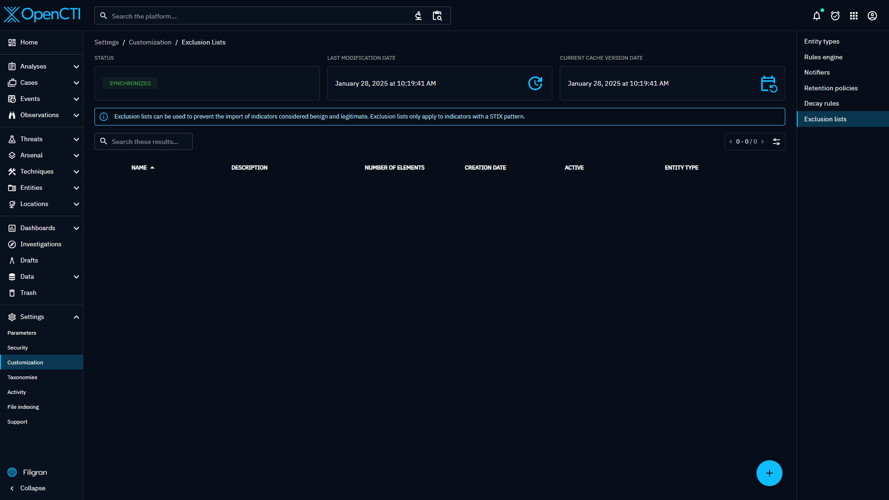
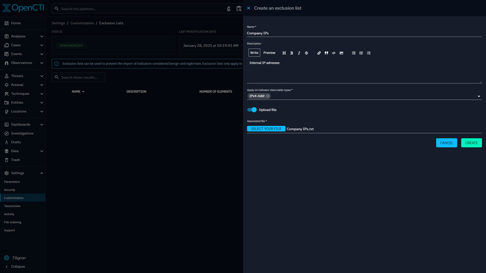
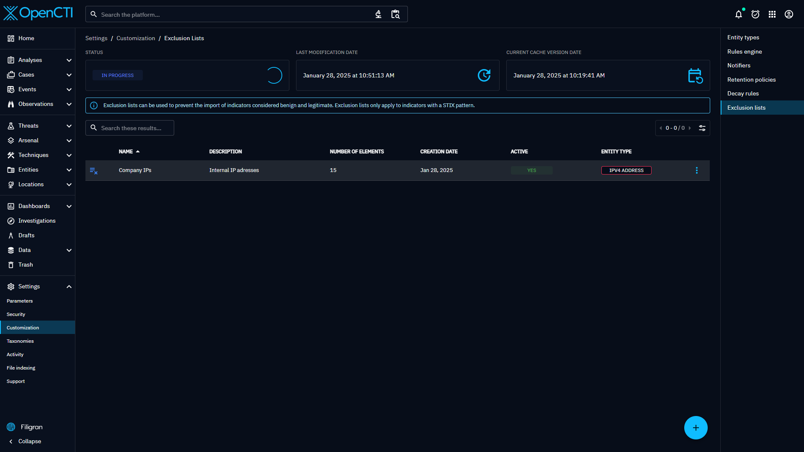
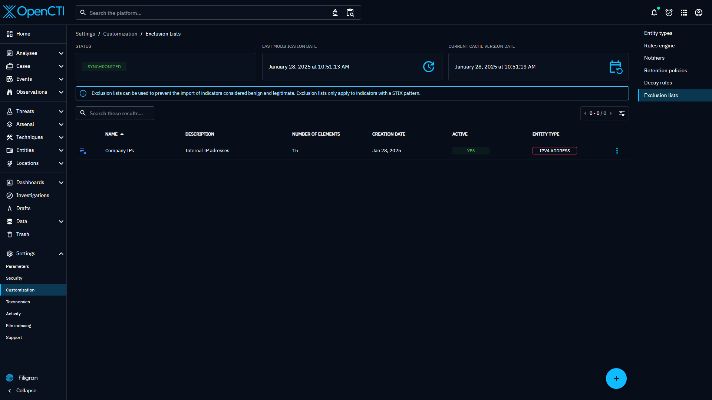
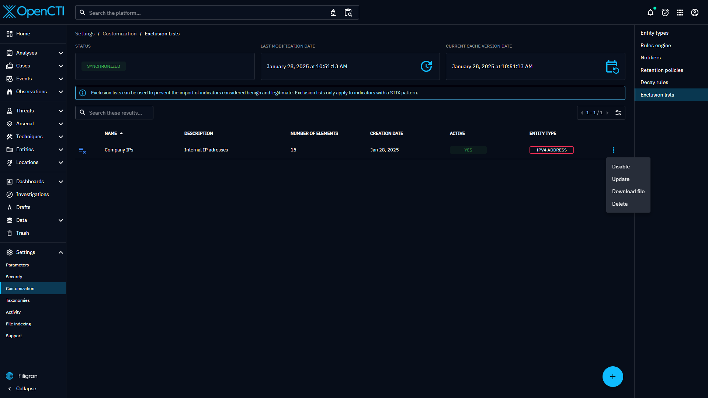
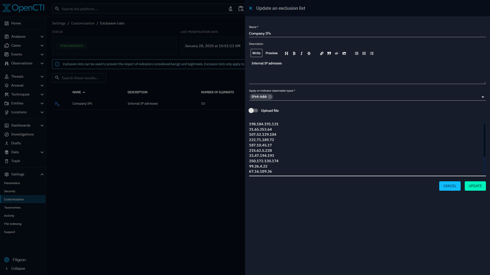
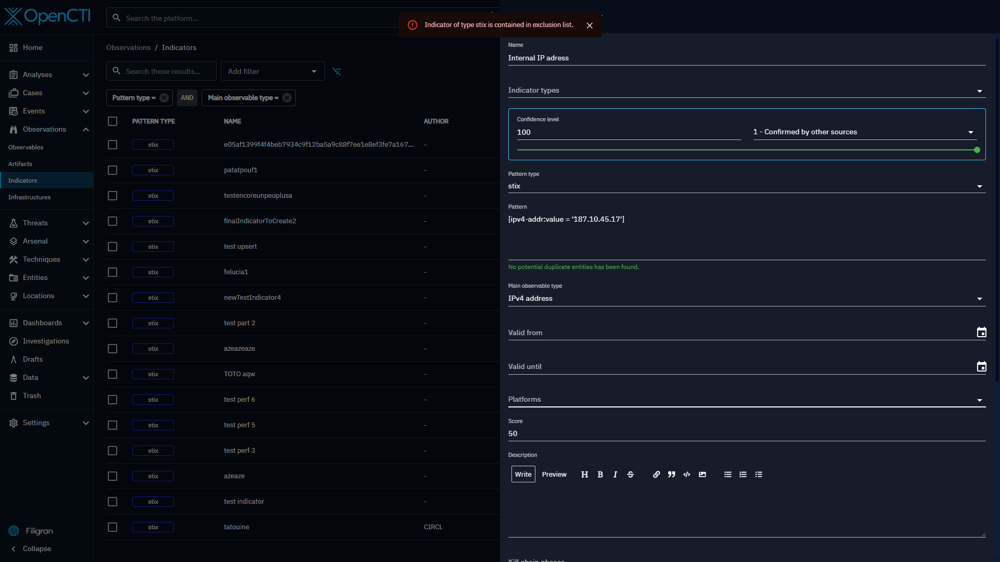

# Exclusion List

Exclusion lists are used to exclude some stix pattern type indicators from being created in the platform, depending on it's stix pattern values.


## Create an exclusion  list
Exclusion lists can be configured on the "Settings > Customization > Exclusion lists" menu.

On this first screen, you can see the main view of the interface aiming to present a clear, organised presentation of the existing lists.



When creating a list, you can provide the following data:

- Name
- Description
- Indicator observable types : this corresponds to the contents of the exclusion list
- Content : you can upload a file or copy/paste your content using the toggle button 

**Details on file upload** 
- File format expected: .txt
- Formatting of values within the file itself: please only add a flat list of value, one value per line.

As said before, there are different indicator observable types possible :

`Artifact`, `Domain-name`, `Email-Addr`, `Hostname`, `Ipv4-Addr`, `ipv6-Addr`, `StixFile`, `Url`



Once created, you can see that the status is In progress and that the Last modification date has changed.
This is because the new exclusion list has been created, but still need to be propagated to all of the platform nodes.



Once the `last modification date` and the `Current cache version date` are up to date, the status is `Synchronized` again. Your new exclusion list is ready to be applied!
On the list of exclusion lists, you can also see some additional information: the number of lines contained in your list, the creation date and the activation status.



There are several options available in your exclusion list:

- delete: if you want to completely remove the list from the settings
- activate/deactivate: this can be used to temporally pause the application of a list
- edit: if you want to edit my current list

You can also download the raw file containing all of your exclusion list values.



## Edit an exclusion list

If you want to modify my list, you can open the edit drawer.
Here the information can be changed and you can edit the contents of your file directly (if the file size is less than 1M).

It is also possible to completely change the file, by toggling `Upload a file` .



## Use an exclusion list

From now on, when an indicator is about to be created, if its pattern contains an observable value belonging to an exclusion list, then this indicator will not be created, with an error message of `Indicator of type stix is contained in exclusion list`.
This applies regardless of the source of ingestion: Manual, Connectors, Feed ingestors (CSV, RSS, TAXII) and also Playbook.



## Updating an Exclusion List via API (Python script)

For large exclusion lists or automation purposes, you can update an existing exclusion list programmatically using the OpenCTI GraphQL API.

### Prerequisites

- Python 3.x + `requests` library (`pip install requests`)
- An OpenCTI API token with administrator permissions
- Your exclusion list as a `.txt` file (one value per line)

### How to find the Exclusion List ID

The ID is not visible in the UI. To retrieve it, you have two ways :
1. With your **browser's Developer Tools > Network** tab, trigger an update on the target list in **Settings > Customization > Exclusion lists**, and inspect the GraphQL request payload : the `id` field in `variables` is your Exclusion List ID. (to help you, you can use the [GraphQL Network Inspector Browser Extension](https://chromewebstore.google.com/detail/graphql-network-inspector/ndlbedplllcgconngcnfmkadhokfaaln)

2. With a GraphQL request : 
```graphql
query GetExclusionLists {
  exclusionLists {
    edges {
      node {
        id
        name
        description
      }
    }
  }
}
```
OR 

```graphql
query GetExclusionListByName {
  exclusionLists(
    filters: {
      mode: and
      filters: [{ key: "name", values: ["my_exclusionlist_name"] }]
      filterGroups: []
    }
  ) {
    edges {
      node {
        id
        name
      }
    }
  }
}
```

### Configuration

Update the following variables before running the script:

| Variable | Description |
|---|---|
| `OPENCTI_URL` | Base URL of your OpenCTI instance |
| `API_TOKEN` | Your OpenCTI API token (found in your profile settings) |
| `EXCLUSION_LIST_ID` | ID of the exclusion list to update (see above) |
| `FILE_PATH` | Path to your `.txt` exclusion list file |

> **Note:** If your source file is in another format (e.g. `.json`), convert it to `.txt` first.

### Script

```python
import requests

OPENCTI_URL = "https://your_opencti_instance.io/" #TO_BE_MODIFIED
API_TOKEN = "your_api_token" #TO_BE_COMPLETED
EXCLUSION_LIST_ID = "g50ea9c3-2aaa-4843-aa94-f0235162c6bf" #TO_BE_MODIFIED. You can find it in the network traffic view when you update your exclusion list.
FILE_PATH = "/your_path/your_exclusion_list.txt" #TO_BE_MODIFIED. you would have to add a step here to convert your .json file to .txt

MUTATION = """
  mutation exclusionListFileUpdate($id: ID!, $input: [EditInput!], $file: Upload) {
    exclusionListFieldPatch(id: $id, input: $input, file: $file) {
      id
      file_id
      exclusion_list_values_count
      exclusion_list_file_size
    }
  }
"""

# GraphQL multipart request (https://github.com/jaydenseric/graphql-multipart-request-spec)
operations = {
    "query": MUTATION,
    "variables": {
        "id": EXCLUSION_LIST_ID,
        "input": [],   
        "file": None   
    }
}

map_data = {
    "0": ["variables.file"]
}

with open(FILE_PATH, "rb") as f:
    response = requests.post(
        f"{OPENCTI_URL}/graphql",
        headers={"Authorization": f"Bearer {API_TOKEN}"},
        data={
            "operations": __import__("json").dumps(operations),
            "map": __import__("json").dumps(map_data),
        },
        files={"0": (FILE_PATH.split("/")[-1], f, "text/plain")},
    )

print(response.json())
```

> After a successful update, the exclusion list will be replaced with the content of your text file.

*For any question : please contact Emma Cagnazzo*
