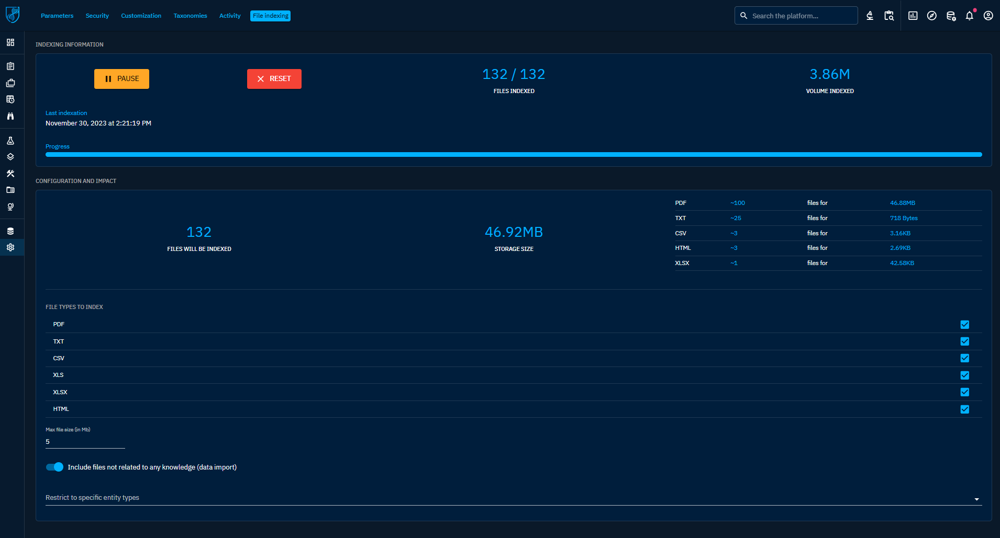

# File indexing

## Files search requirements

In order to [search in files](../usage/search.md#full-text-search-in-files-content), we need to extract and index files text content, which requires to have one of these database configurations :

* Elasticsearch >= 8.4
* Elasticsearch < 8.4 with [ingest-attachment plugin](https://www.elastic.co/guide/en/elasticsearch/plugins/8.3/ingest-attachment.html)
* OpenSearch with [ingest-attachment plugin](https://opensearch.org/docs/2.9/install-and-configure/plugins/)

## File indexing configuration

File indexing can be configured via the ``File indexing`` tab in the ``Settings`` menu.

The configuration and impact panel shows all file types that can be indexed, as well as the volume of storage used.

It is also possible to include or exclude files uploaded from the global Data import panel and that are not associated with a specific entity in the platform.

Finally, it is possible to set a maximum file size for indexing (5 Mb by default).

Currently supported content types : `application/pdf`, `text/plain`, `text/csv`, `text/html`, `application/vnd.ms-excel`, `application/vnd.openxmlformats-officedocument.spreadsheetml.sheet` (excel sheets).

Once indexing has been launched by pressing the ``Start`` button, you can follow its progress. 

You will also be able to ``Pause`` it and restart from the beginning by pressing ``Reset`` button which deletes all indexed files from the database.

If you change the configuration while file indexing is running, you might need to reset in order to include newly impacted files.

File indexing runs every 5 minutes to index last uploaded files.

