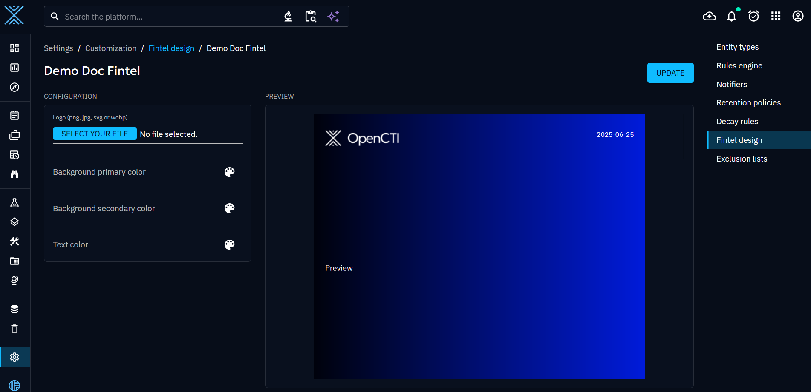
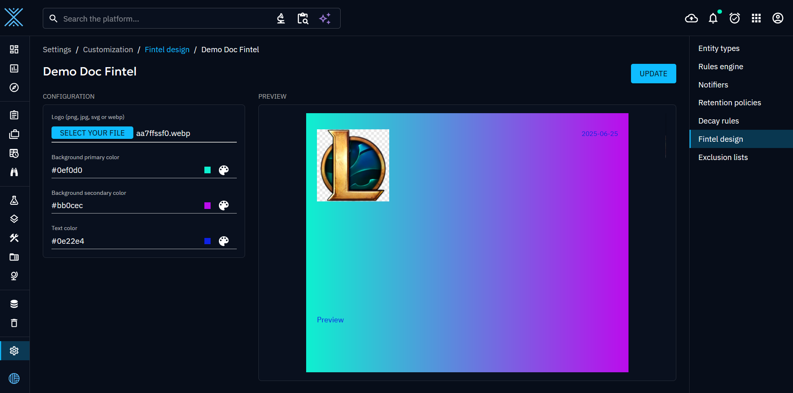
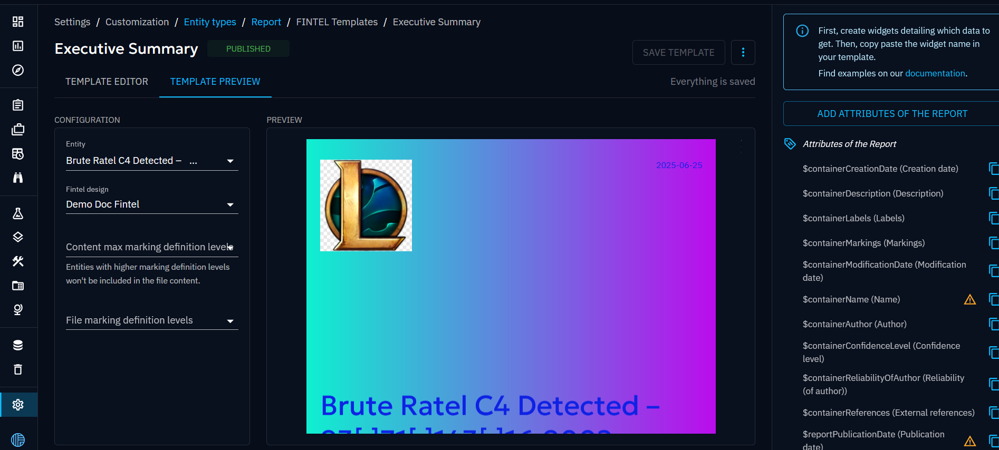
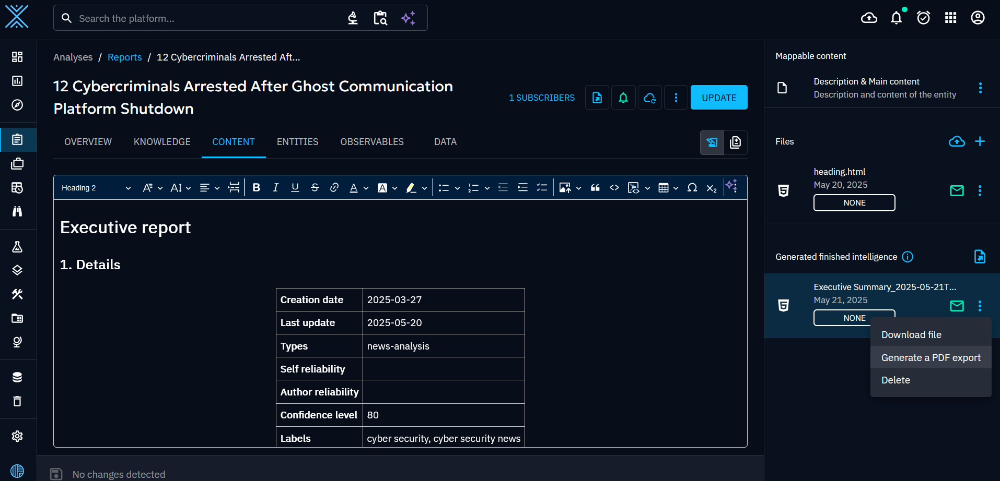
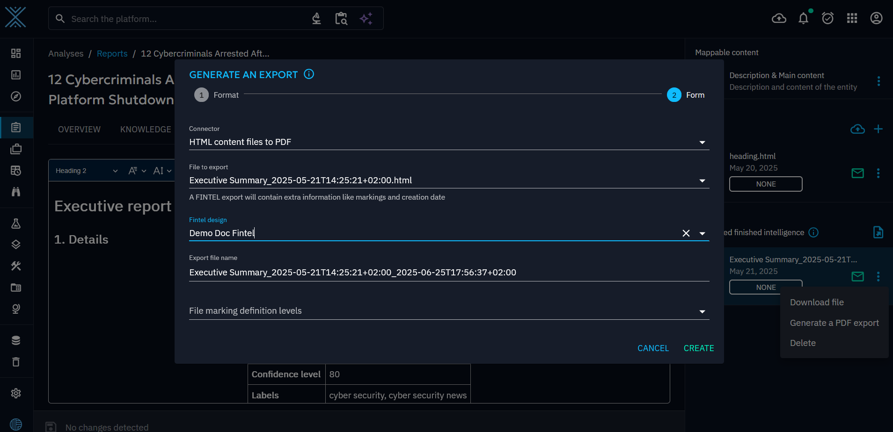

# Fintel Design

Fintel design are used to customize and preview your own fintel template. You can now create fintel designs to produce finished intelligence documents matching your organization's brand guidelines.

## Create a fintel design
Fintel designs can be configured on the "Settings > Customization > Fintel designs" menu.

On this first screen, you can see the main view of the interface aiming to present a clear, organised presentation of the existing lists.

When creating a design you can provide the following data:
- Name
- Description

When created you will be automatically redirected to the newly created design

The preview will display the default design of a fintel template with OpenCTI colors and logo.

You can update the name and the description with the update button on the up right.

Now let's customize a little bit this template.

As you can see now in the preview you can change the following data:
- Logo: you can use png, jpg, svg files (even url are accepted)
- Gradiant color
- Text color

## Use a fintel design in preview

Now that your design is ready, let's see how to use it and where.

First you can apply your design to your fintel template preview in the customization of a container.
Here for the example, we will check the template preview of a Report:

As you can see, you can select the previously created design of your choice and see the result with real datas.

## Apply a fintel design to a PDF export

Let's apply a fintel design to a PDF export now.
Go first to a container of your choice, let's say a Report and then select the "Content" tab.

Generate a PDF export as below

And select the fintel design of your choice to apply

Click on create and it's done ! You now have your PDF Report with the proper style

