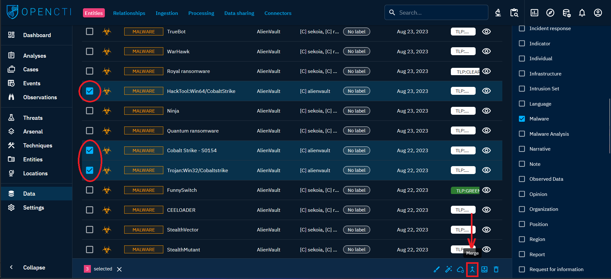
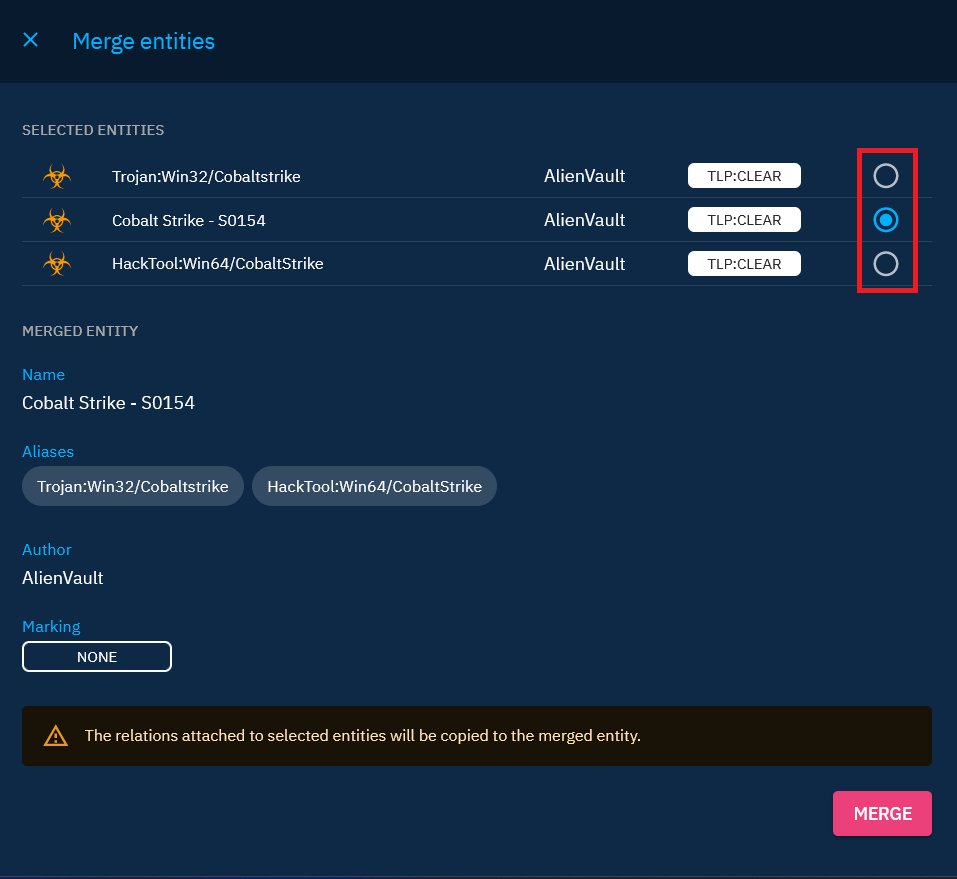

# Merging

## Data merging

Within the OpenCTI platform, the merge capability is present into the "Data > Entities" tab, and is fairly straightforward to use. To execute a merge, select the set of entities to be merged, then click on the Merge icon.

!!! info "Merging limitation"

    It is not possible to merge entities of different types, nor is it possible to merge more than 4 entities at a time (it will have to be done in several stages).

Central to the merging process is the selection of a main entity. This primary entity becomes the anchor, retaining crucial attributes such as name and description. Other entities, while losing specific fields like descriptions, are aliased under the primary entity. This strategic decision preserves vital data while eliminating redundancy.

Once the choice has been made, simply validate to run the task in the background. Depending on the number of entity relationships, and the current workload on the platform, the merge may take more or less time. In the case of a healthy platform and around a hundred relationships per entity, merge is almost instantaneous.

## Data preservation and relationship continuity

A common concern when merging entities lies in the potential loss of information. In the context of OpenCTI, this worry is alleviated. Even if the merged entities were initially created by distinct sources, the platform ensures that data is not lost. Upon merging, the platform automatically generates relationships directly on the merged entity. This strategic approach ensures that all connections, regardless of their origin, are anchored to the consolidated entity. Post-merge, OpenCTI treats these once-separate entities as a singular, unified entity. Subsequent information from varied sources is channeled directly into the entity resulting from the merger. This unified entity becomes the focal point for all future relationships, ensuring the continuity of data and relationships without any loss or fragmentation.

## Important considerations

- **Reversible during a retention window only, and not always:** A merge is recorded in a merge record (unless merge records are disabled with `curation:merge_records_enabled`). A merge recorded as reversible can be reverted from **Data > Curation > Merges** or from the **Merges** view of the entity's **Changes** tab during the merge record retention window (365 days by default), as long as the merged entity still exists. A merge is irreversible past that window, when it was recorded as not reversible at merge time (it removed or moved more relationships than a merge record keeps, or a merged entity had a file with the same name as another file of the merge), and when it has no merge record (for example merges done in a draft, before merge records existed or while they are disabled). The header of the merge record says whether the merge can still be undone, and why not. Careful consideration and validation remain crucial before initiating the merge process. See [Knowledge curation](../usage/knowledge-curation.md#reversible-merges-and-unmerge).
- **Loss of fields in aliased entities:** Fields, such as descriptions, in aliased entities - entities that have not been chosen as the main - will be lost during the merge (an unmerge restores them). Ensuring that essential information is captured in the primary entity is crucial to prevent data loss.

## Additional resources

- **Usefulness:** To understand the benefits of entity merger, refer to the [Merge objects](../usage/merging.md) page in the User Guide section of the documentation.
- **Deduplication mechanism:** the platform is equipped with [deduplication processes](../usage/deduplication.md) that automatically merge data at creation (either manually or by importing data from different sources) if it meets certain conditions.
- **Knowledge curation:** [knowledge curation](../usage/knowledge-curation.md) finds the entities that are likely duplicates, proposes their merge with the evidence behind it, and lets you revert recorded merges.