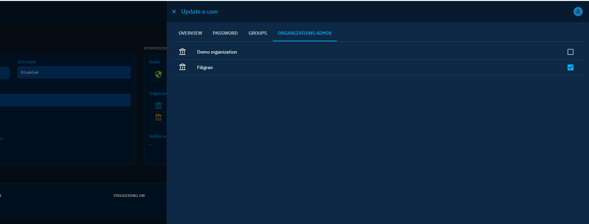

# Organization segregation

!!! tip "Enterprise edition"

    Platform segregation by organization is available under the "OpenCTI Enterprise Edition" license. Please read the [dedicated page](enterprise.md) to have all the information.

<!-- Introduction of the feature -->

<!-- 
PART 1
About set-up/parameterization section: 
- prerequisites (e.g. all users must be in an organization, otherwise they won't be able to connect to the platform + connector users must be in the main platform organization)
- Where to enable it (Settings > Security > Policy)
-->

<!-- 
PART 2
How it works / How to use it:
- who will see what 
- click on the button existing in each entity OR/AND automating with playbooks
- if a container is shared -> its contents are shared automatically
- ...
-->

## Organization administration

Platform administrators can promote members of an organization as "Organization administrator". This elevated role grants them the necessary capabilities to create, edit and delete users from the corresponding Organization. Additionally, administrators have the flexibility to define a list of groups that can be granted to newly created members by the organization administrators. This feature simplifies the process of granting appropriate access and privileges to individuals joining the organization.

The platform administrator can promote/demote an organization admin through its user edition form.

!!! info "Organization admin rights"

    The "Organization admin" has restricted access to Settings. They can only manage the members of the organizations for which they have been promoted as "admins".