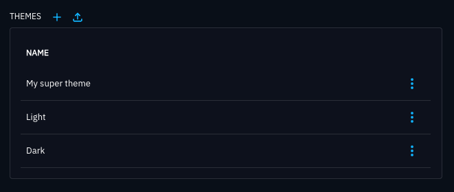
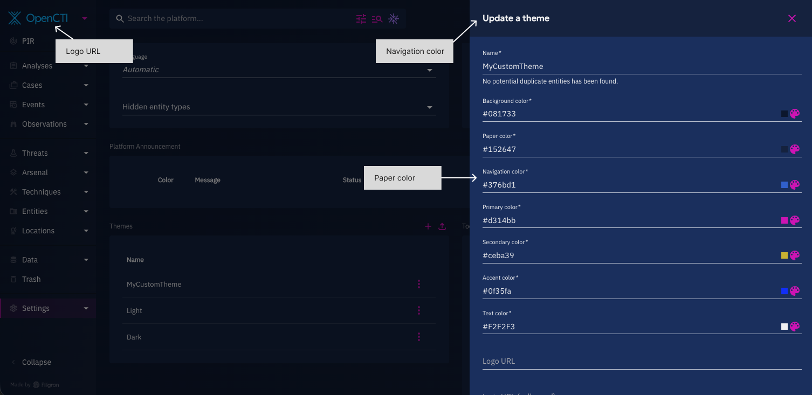
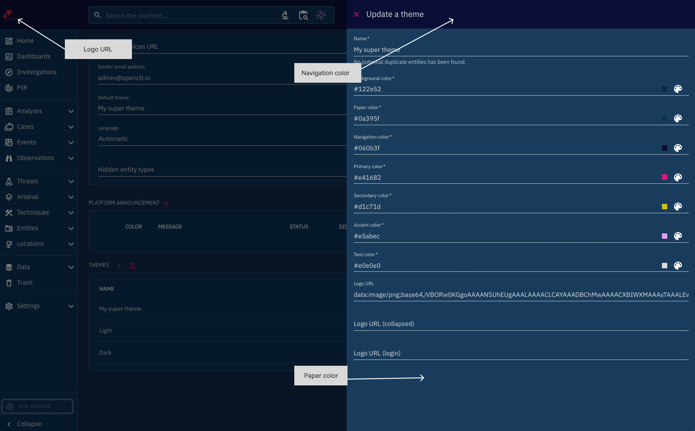
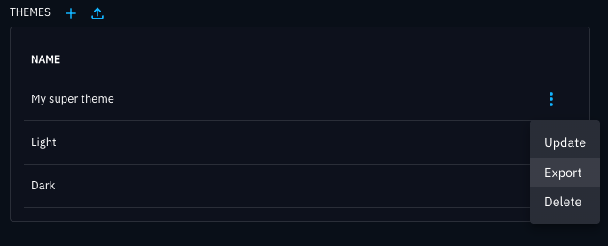
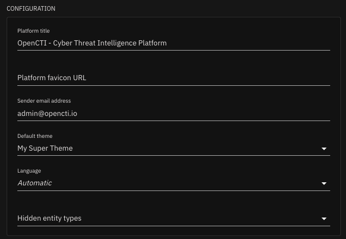

# Parameters

## Description

This part of the interface wil let you configure global platform settings, like title, favicon, etc.

It will also give you important information about the platform.

## The "Configuration" section


This section allows the administrator to edit the following settings:

- Platform title
- Platform favicon URL
- Sender email address: email address displayed as sender when sending notifications. The technical sender is defined in the [SMTP configuration](../deployment/configuration.md#smtp-service).
- Theme
- Language
- Hidden entity types: allows you to customize which types of entities you want to see or hide in the platform. This can help you focus on the relevant information and avoid cluttering the platform with unnecessary data.

## OpenCTI Platform


This is where the [Enterprise edition](enterprise.md) can be enabled.

This section gives important information about the platform like the used version, the edition, the architecture mode (can be Standalone or Cluster) and the number used nodes.

Through the "Remove Filigran logos" toggle, the administrator has the option to hide the Filigran logo on the login page and the sidebar.


## Platform Announcement

This section gives you the possibility to set and display Announcements in the platform. Those announcements will be visible to every user in the platform, on top of the interface.

They can be used to inform some of your users or all of important information, like a scheduled downtime, an incoming upgrade, or even to share important tips regarding the usage of the platform.


An Announcement can be accompanied by a "Dismiss” button. When clicked by a user, it makes the message disappear for this user.


This option can be deactivated to have a permanent announcement.


⚠️ Only one announcement is shown at a time, with priority given to dismissible ones. If there are no dismissible announcements, the most recent non-dismissible one is shown.

## Third-party Analytics

!!! tip "Enterprise edition"

    Analytics is available under the "OpenCTI Enterprise Edition" license.

    [Please read the dedicated page to have more information](enterprise.md)

This is where you can configure analytics providers. At the moment only Google Analytics v4 is supported.

## Theme customization

In this section, administrators can customize OpenCTI themes to match their organization's branding or visual preferences.

> **Note:** The default Light and Dark themes are system themes and cannot be deleted.



## Quick Start

1. Navigate to **Settings > Configuration > Theme customization**
2. Click **"Create theme"** or **"Import theme"** to add a new theme
3. Configure your colors and logos (see property descriptions below)
4. Save your theme
5. Apply it to see changes immediately across the application

## Managing themes

You can create custom themes from scratch or import existing theme configurations in JSON format.

### Creating a custom theme

Click on the **+** icon and configure your theme properties. 

> **Important:** Theme names are case-sensitive and must be unique.

#### Theme properties

| Property              | Description                                                                                           | Where it appears                                      | Example       |
| --------------------- | ----------------------------------------------------------------------------------------------------- | ----------------------------------------------------- | ------------- |
| **Name**              | Unique identifier for the theme (case-sensitive)                                                      | Theme selector                                        | `My Theme`    |
| **Background color**  | Main application background                                                                           | Behind all content areas                              | `#122e52`     |
| **Paper color**       | Background for content containers                                                                     | Cards, side panels, dialog bodies                     | `#0a395f`     |
| **Navigation color**  | Navigation and header elements                                                                        | Top app bar, dialog headers, right navigation panels  | `#060b3f`     |
| **Primary color**     | Main interactive elements                                                                             | Icon buttons, action buttons, highlights | `#e41682`  |
| **Secondary color**   | Secondary actions                                                                                     | Primary action buttons in dialogs                     | `#d1c71d`     |
| **Accent color**      | Highlight and emphasis                                                                                | Copied items, history entries, selected items         | `#e5abec`     |
| **Text color**        | Primary text throughout the application                                                               | All text content                                      | `#e0e0e0`     |
| **Logo URL**          | Full-size logo                                                                                        | Expanded left navigation panel                        | URL or Base64 |
| **Logo URL (collapsed)** | Compact logo                                                                                       | Collapsed left navigation panel                       | URL or Base64 |
| **Logo URL (login)**  | Login page logo                                                                                       | Authentication screen                                 | URL or Base64 |






#### Color requirements
- **Format:** All colors must be in hexadecimal format (e.g., `#122e52`)
- **Contrast:** Ensure adequate contrast between text and background colors for accessibility
  - Text color vs. Paper color (main content readability)
  - Text color vs. Navigation color (header readability)

#### Logo guidelines

Logos can be provided as URLs or Base64-encoded images:

**URL format:**
```
https://example.com/logo.png
```

**Base64 format:**
```
data:image/png;base64,iVBORw0KGgoAAAANS...
```

**Recommended dimensions:**
- **Logo URL (expanded):** 900×200px (will be scaled down to ~165×35px display size)
- **Logo URL (collapsed):** 350×350px square (displays at 35×35px)
- **Logo URL (login):** 900×200px (displays at ~400×85px)

**Supported formats:** PNG, JPG, SVG


### Importing a theme

To import a pre-configured theme:

1. Click **"Import theme"**
2. Select a JSON file with the following structure:

```json
{
  "name": "My Super Theme",
  "theme_background": "#122e52",
  "theme_paper": "#0a395f",
  "theme_nav": "#060b3f",
  "theme_primary": "#e41682",
  "theme_secondary": "#d1c71d",
  "theme_accent": "#e5abec",
  "theme_text_color": "#e0e0e0",
  "theme_logo": "",
  "theme_logo_collapsed": "",
  "theme_logo_login": ""
}
```

3. The theme will be added to your theme list and ready to apply

### Exporting a theme

To save a theme configuration for backup or sharing:

1. Click the action button (⋮) next to the theme you want to export
2. Select **"Export"** from the dropdown menu
3. A JSON file will be downloaded to your computer




### Applying a theme

To activate a theme:

1. Navigate to **Settings > Configuration > Theme customization**
2. Click on the theme you want to use from the themes list
3. The theme is applied immediately across the application for all users using the default theme in the user profile settings (need to refresh their page)




### Deleting a theme

To remove a custom theme:

1. Locate the theme in the themes list
2. Click the dots icon next to the theme name and select **Delete**
3. Confirm the deletion

> **Important:** You cannot delete a theme that is currently in use. Apply a different theme first, then delete the unused theme.


## Tools

This section informs the administrator of the statuses of the different managers used in the Platform. More information about the managers can be found [here](../deployment/managers.md).
It shows also the used versions of the search engine database, RabbitMQ and Redis.

In cluster mode, the fact that a manager appears as enabled means that it is active in at least one node. 


