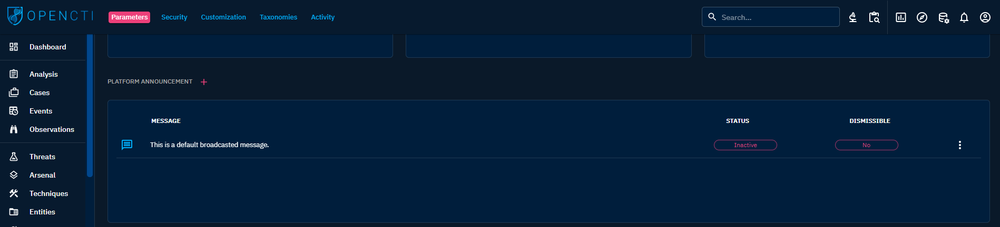
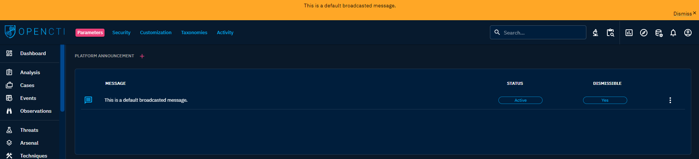
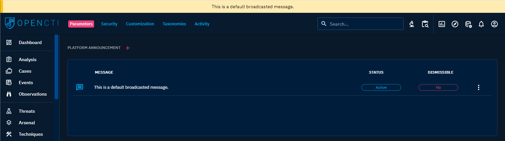

# Platform

## Platform Announcement

This section gives you the possibility to set and display Announcements in the platform. Those announcement will be visible to every users in the platform, on top of the interface.

They can be used to inform all your users' community of an important information, like a scheduled downtime, an incoming upgrade, or even an important tips regarding the usage of the platform.

An Announcement can be accompanied by a “Dismiss” button. When click by a user, it makes the message disappeared
for this user.

This option can be deactivated to have a permanent Announcement.

⚠️ We can have one broadcast message displayed in the header. The dismissable messages are showed in first, then the
latest no dismissible message.
