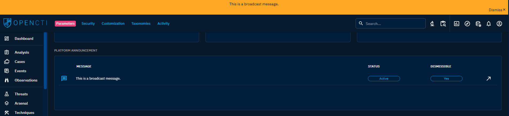

# Platform

## Platform Announcement

This section gives you the possibility to display a broadcast message as a platform header.

The message can be accompanied by a “Dismiss” button. When click by a user, it make disappear the message
for this user. This option can be deactivated to have a permanent broadcast message.

