# Parameters

## Description

This part of the interface, in **Settings > Parameters**, lets you configure global platform settings, like the title, the favicon or the default theme.

It also gives you important information about the platform: its version and edition, the services it depends on and the status of every manager.

The page reads from top to bottom: the platform summary, the Enterprise Edition and its license (when enabled), the configuration and appearance settings, the announcements and the map configuration next to the themes, the dependencies and the managers.

## OpenCTI platform
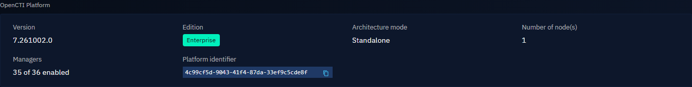

The summary at the top of the page gives the used version, the edition (Community or Enterprise), the architecture mode (Standalone or Cluster), the number of nodes, how many managers are enabled and the platform identifier, which you can copy with the button next to it. When no XTM One platform is registered, it also shows whether AI features are powered and by which provider.

On a Community platform, this is where the [Enterprise edition](enterprise.md) can be enabled.

## Enterprise Edition and License

When the Enterprise Edition is enabled, two cards give the organization, the creator and the scope of the license, then its start date, expiration date and type. A warning appears when the license expires in less than three months.

The "Disable Enterprise Edition" action asks for a confirmation that explains the consequence; your existing data stays intact. When this setting is protected as a sensitive configuration, only the users allowed to change sensitive configurations can use it.

## Configuration and Appearance
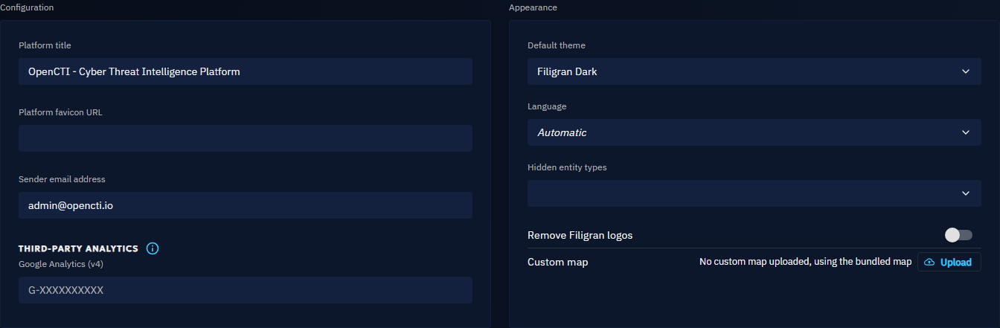

The **Configuration** card allows the administrator to edit the following settings:

- Platform title
- Platform favicon URL
- Sender email address: email address displayed as sender when sending notifications. The technical sender is defined in the [SMTP configuration](../deployment/configuration.md#smtp-service).
- Third-party analytics (see below)

The **Appearance** card groups the settings that change what users see:

- Default theme
- Language
- Hidden entity types: allows you to customize which types of entities you want to see or hide in the platform. This can help you focus on the relevant information and avoid cluttering the platform with unnecessary data.
- Remove Filigran logos: hides the Filigran logo on the login page and the sidebar (Enterprise Edition).


## Platform Announcement

This section gives you the possibility to set and display Announcements in the platform. Those announcements will be visible to every user in the platform, on top of the interface.

They can be used to inform some of your users or all of important information, like a scheduled downtime, an incoming upgrade, or even to share important tips regarding the usage of the platform.


An Announcement can be accompanied by a "Dismiss” button. When clicked by a user, it makes the message disappear for this user.

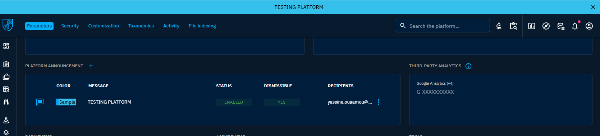

This option can be deactivated to have a permanent announcement.

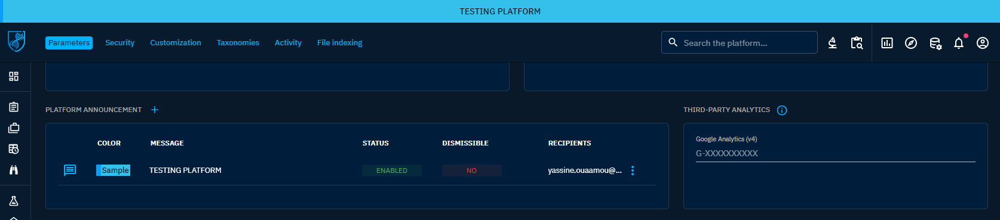
⚠️ Only one announcement is shown at a time, with priority given to dismissible ones. If there are no dismissible announcements, the most recent non-dismissible one is shown.

## Third-party Analytics

!!! tip "Enterprise edition"

    Analytics is available under the "OpenCTI Enterprise Edition" license.

    [Please read the dedicated page to have more information](enterprise.md)

This is where you can configure analytics providers, at the bottom of the Configuration card. At the moment only Google Analytics v4 is supported. If needed, you can set a consent message shown on user login in the [policies](policies.md).

## Theme customization

In this section, administrators can customize OpenCTI themes to match their organization's branding or visual preferences.

> **Note:** The default Light and Dark themes are system themes and cannot be deleted.

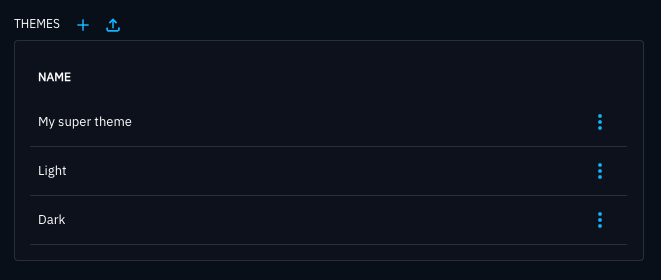

## Quick Start

1. Navigate to **Settings > Parameters**, card **Themes**
2. Click **"Create theme"** or **"Import theme"** to add a new theme
3. Configure your colors and logos (see property descriptions below)
4. Save your theme
5. Apply it to see changes immediately across the application

## Managing themes

You can create custom themes from scratch or import existing theme configurations in JSON format.

### Creating a custom theme

Click on the **+** icon and configure your theme properties. 

> **Important:** Theme names are case-sensitive and must be unique.

#### Theme properties

| Property              | Description                                                                                           | Where it appears                                      | Example       |
| --------------------- | ----------------------------------------------------------------------------------------------------- | ----------------------------------------------------- | ------------- |
| **Name**              | Unique identifier for the theme (case-sensitive)                                                      | Theme selector                                        | `My Theme`    |
| **Background color**  | Main application background                                                                           | Behind all content areas                              | `#122e52`     |
| **Paper color**       | Background for content containers                                                                     | Cards, side panels, dialog bodies                     | `#0a395f`     |
| **Navigation color**  | Navigation and header elements                                                                        | Dialog headers, right navigation panels  | `#060b3f`     |
| **Primary color**     | Main interactive elements                                                                             | Icon buttons, action buttons, highlights | `#e41682`  |
| **Secondary color**   | Secondary actions                                                                                     | Badge color                     | `#d1c71d`     |
| **Accent color**      | Highlight and emphasis                                                                                | Copied items, history entries, selected items         | `#e5abec`     |
| **Text color**        | Primary text throughout the application                                                               | All text content                                      | `#e0e0e0`     |
| **Logo URL**          | Full-size logo                                                                                        | Expanded left navigation panel                        | URL or Base64 |
| **Logo URL (collapsed)** | Compact logo                                                                                       | Collapsed left navigation panel                       | URL or Base64 |
| **Logo URL (login)**  | Login page logo                                                                                       | Authentication screen                                 | URL or Base64 |


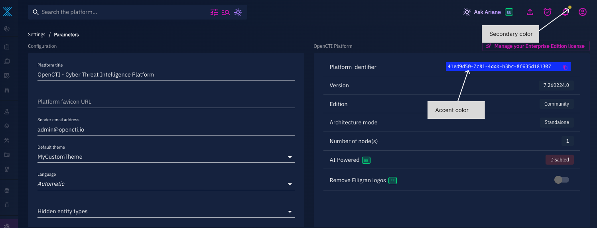


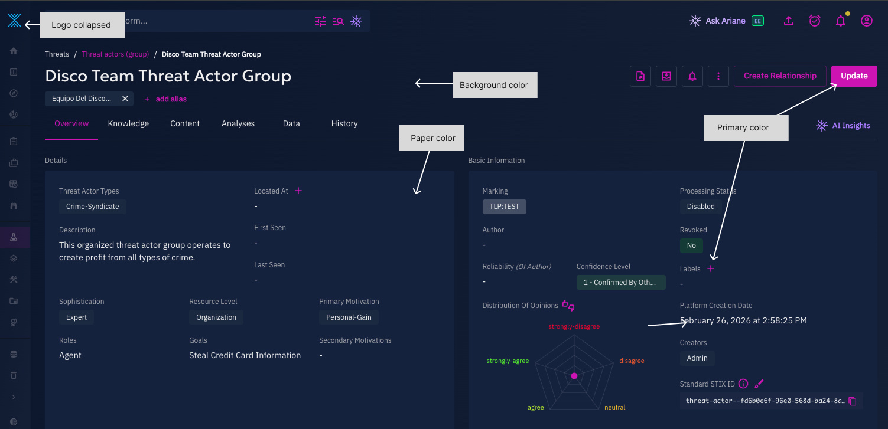

#### Login aside customization

The right panel of the login page can be customized with three options:

- **Color**: a single solid background color
- **Gradient**: a linear gradient between two colors applied horizontally from the start color to the end color
- **Image**: full-cover background image via URL or Base64. The image is scaled to cover the entire panel and centered, so edges may be cropped on smaller screens. Prefer images with a centered subject.

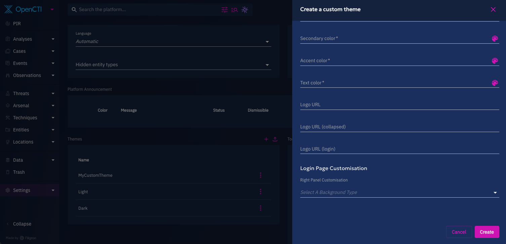


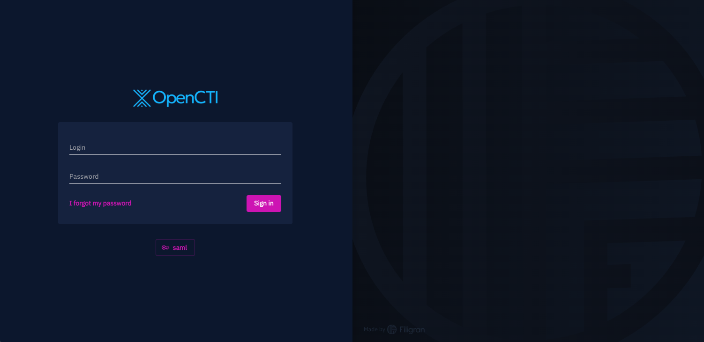
*Login page with no aside config set*

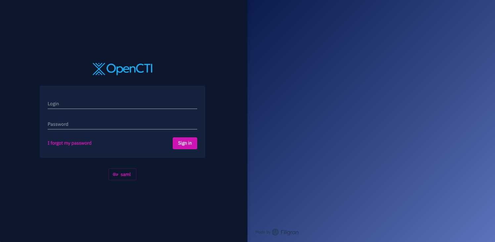
*Login page with a custom gradient background*


#### Color requirements
- **Format:** All colors must be in hexadecimal format (e.g., `#122e52`)
- **Contrast:** Ensure adequate contrast between text and background colors for accessibility
  - Text color vs. Paper color (main content readability)
  - Text color vs. Navigation color (header readability)

#### Logo guidelines

Logos can be provided as URLs or Base64-encoded images:

**URL format:**
```
https://example.com/logo.png
```

**Base64 format:**
```
data:image/png;base64,iVBORw0KGgoAAAANS...
```

**Recommended dimensions:**
- **Logo URL (expanded):** 900×200px (will be scaled down to ~165×35px display size)
- **Logo URL (collapsed):** 350×350px square (displays at 35×35px)
- **Logo URL (login):** 900×200px (displays at ~400×85px)

**Supported formats:** PNG, JPG, SVG


### Importing a theme

To import a pre-configured theme:

1. Click **"Import theme"**
2. Select a JSON file with the following structure:

```json
{
  "name": "My Super Theme",
  "theme_background": "#122e52",
  "theme_paper": "#0a395f",
  "theme_nav": "#060b3f",
  "theme_primary": "#e41682",
  "theme_secondary": "#d1c71d",
  "theme_accent": "#e5abec",
  "theme_text_color": "#e0e0e0",
  "theme_logo": "",
  "theme_logo_collapsed": "",
  "theme_logo_login": ""
}
```

3. The theme will be added to your theme list and ready to apply

### Exporting a theme

To save a theme configuration for backup or sharing:

1. Click the action button (⋮) next to the theme you want to export
2. Select **"Export"** from the dropdown menu
3. A JSON file will be downloaded to your computer

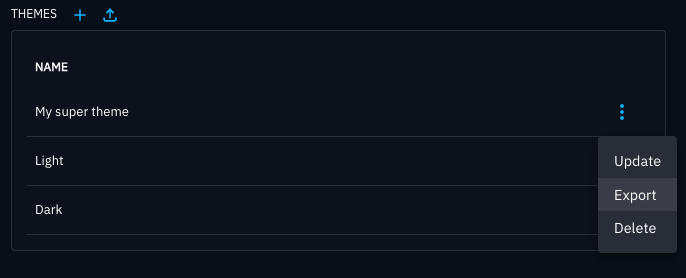


### Applying a theme

To activate a theme:

1. Navigate to **Settings > Parameters**, card **Themes**
2. Click on the theme you want to use from the themes list
3. The theme is applied immediately across the application for all users using the default theme in the user profile settings (need to refresh their page)

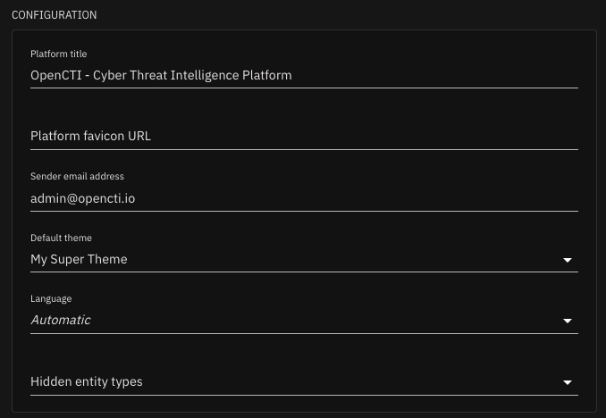


### Deleting a theme

To remove a custom theme:

1. Locate the theme in the themes list
2. Click the dots icon next to the theme name and select **Delete**
3. Confirm the deletion

> **Important:** You cannot delete a theme that is currently in use. Apply a different theme first, then delete the unused theme.

## Map configuration

The **Map configuration** card, under the announcements, holds the two files map widgets are drawn from: the custom map (`.pmtiles` tiles) and the custom country boundaries (GeoJSON). Each row shows whether the bundled file or a custom one is used, and its `⋮` menu uploads, downloads, replaces or deletes the custom file. See [Map configuration](../deployment/advanced/map.md) for the file formats and the propagation delay.


## Dependencies

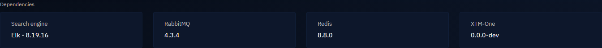

One card per service the platform depends on gives its version: the search engine (Elasticsearch or OpenSearch), RabbitMQ, Redis and, once registered, XTM One.

## Managers

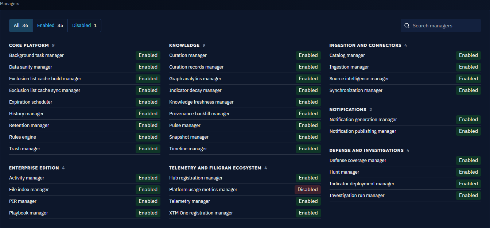

This section informs the administrator of the status of every manager used in the platform. More information about the managers can be found [here](../deployment/advanced/managers.md).

- Managers are grouped by domain: core platform, knowledge, ingestion and connectors, notifications, defense and investigations, Enterprise Edition, telemetry and Filigran ecosystem.
- The filter above the list shows how many managers are enabled and disabled; select "Enabled" or "Disabled" to keep only those, and use the search to find a manager by its name or its identifier. On a Community platform, a fourth "Enterprise Edition" segment counts the managers that require the Enterprise Edition, so the segments always add up to "All".
- A manager reads "Enabled" when the platform configuration turns it on and "Disabled" when the configuration switches it off. The status describes the configuration: it does not tell whether the manager is processing something at this moment. On a Community platform, the managers that require the Enterprise Edition read "Enterprise Edition".

In cluster mode, a manager reads "Enabled" when the configuration of at least one node turns it on.
