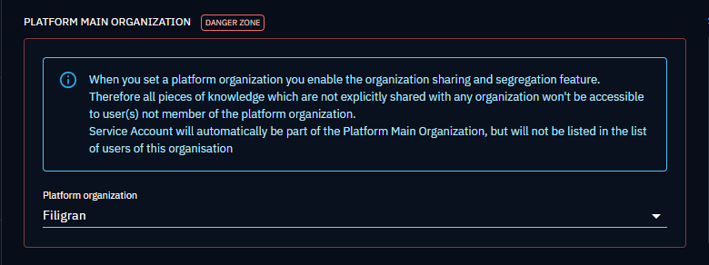
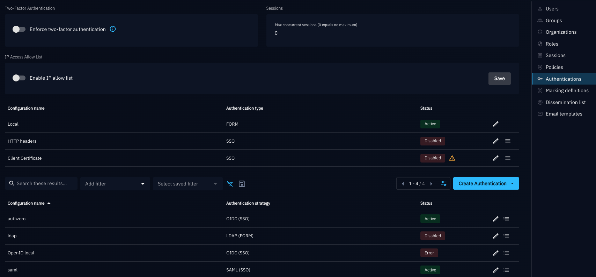
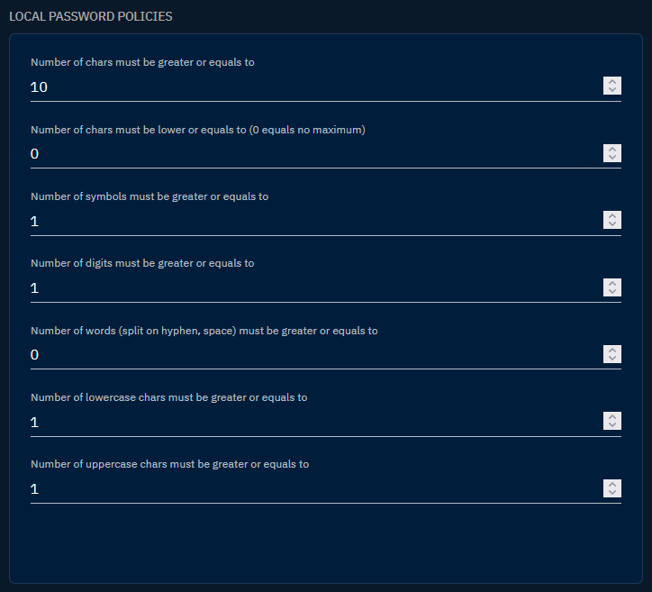
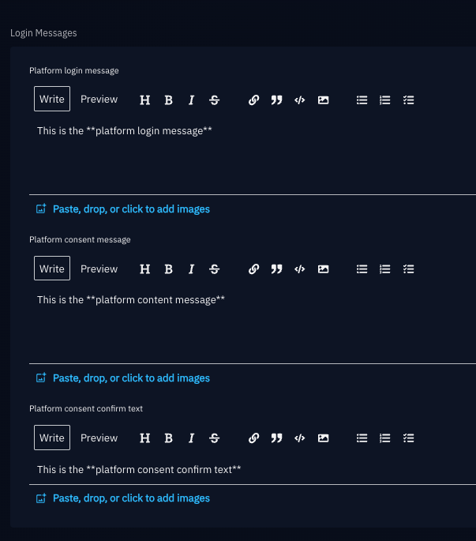
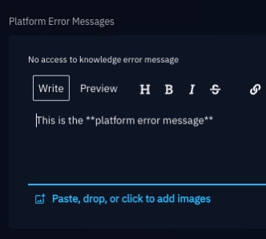
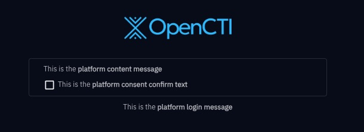
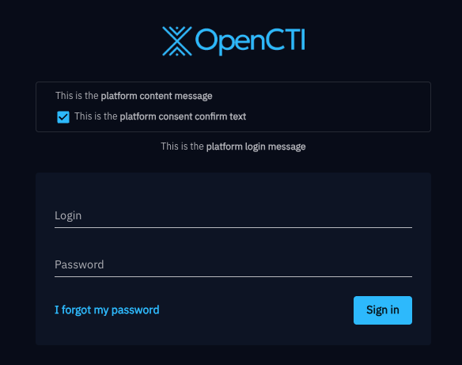
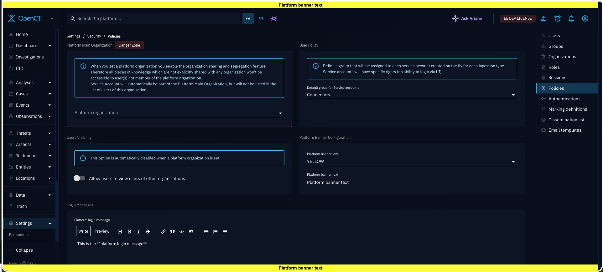

# Policies

The Policies configuration window (in "Settings > Security > Policies") encompasses essential settings that govern the organizational sharing, authentication strategies, password policies, login messages, and banner appearance within the OpenCTI platform.

## Platform main organization

Allow to set a main organization for the entire platform. Users belonging to the main organization enjoy unrestricted access to all data stored in the platform. In contrast, users affiliated with other organizations will only have visibility into data explicitly shared with them.

!!! warning "Numerous repercussions linked to the activation of this feature"

    This feature has implications for the entire platform and must be fully understood before being used. For example, it's mandatory to have organizations set up for each user, otherwise they won't be able to log in. It is also advisable to include connector's users in the platform main organization to avoid import problems.

## Authentication strategies

The authentication strategies section provides insights into the configured authentication methods. Additionally, an "Enforce Two-Factor Authentication" button is available, allowing administrators to mandate 2FA activation for users, enhancing overall account security.

Please see the [Authentication section](../deployment/authentication.md) for further details on available authentication strategies.

## Local password policies

This section encompasses a comprehensive set of parameters defining the local password policy. Administrators can specify requirements such as minimum/maximum number of characters, symbols, digits, and more to ensure robust password security across the platform. Here are all the parameters available:

| Parameter                                                               | Description                                                   |
|:------------------------------------------------------------------------|:--------------------------------------------------------------|
| `Number of chars must be greater than or equals to`                     | Define the minimum length required for passwords.             |
| `Number of chars must be lower or equals to (0 equals no maximum)`      | Set an upper limit for password length.                       |
| `Number of symbols must be greater or equals to`                        | Specify the minimum number of symbols required in a password. |
| `Number of digits must be greater or equals to`                         | Set the minimum number of numeric characters in a password.   |
| `Number of words (split on hyphen, space) must be greater or equals to` | Enforce a minimum count of words in a password.               |
| `Number of lowercase chars must be greater or equals to`                | Specify the minimum number of lowercase characters.           |
| `Number of uppercase chars must be greater or equals to`                | Specify the minimum number of uppercase characters.           |
| `Password validity duration in days (0 equals unlimited)`              | Define how long a password remains valid before the user is forced to change it. A value of `0` means passwords never expire. |

## Password validity and forced password change

When a non-zero password validity duration is configured, each user's password is assigned an expiration date (visible in the user overview and user list as "Password valid until"). Once expired, the user is redirected to a dedicated password change screen upon their next interaction with the platform.

### How it works

1. **Admin configures the policy**: In "Settings > Security > Policies > Local password policies", set the "Password validity duration in days" to a non-zero value (e.g., 90).
2. **Expiration is computed**: When a user sets or changes their password, the expiration date is set to `now + N days`.
3. **Enforcement**: Once the date is reached, the user cannot perform any action until they set a new password.
4. **Admin-triggered reset**: Administrators can also force a password change for specific users (individually or in bulk) via the user management interface.

### Admin actions

- **Individual reset**: In the user edition drawer (Password tab), click "Force password change". This immediately sets the user's `password expiration date` to the current time, forcing a change on their next request.
- **Bulk reset (Mass operation)**: In the users list, select the target users, click **Mass operation**, then set **Password valid until** to **Today** and apply. This expires all selected users' passwords immediately and forces a password change on their next request.
 - **Policy change**: When the validity duration is changed, existing users' password expiration dates may be recalculated to align with the new policy. Setting the value back to `0` disables password expiration.

### User experience

- **Authenticated users**: When a password expires while the user is logged in, they are redirected to a dedicated full-screen password change page.
- **At login**: If the password is already expired at login time, the user is shown a password change form directly within the login page.
- **Session invalidation**: After changing an expired password, all other active sessions for that user are terminated.

## Login messages

Allow to define messages on the login page to customize and highlight your platform's security policy. Three distinct messages can be customized:

- Platform login message: Appears above the login form to convey important information or announcements.
- Platform consent message: A consent message that obscures the login form until users check the approval box, ensuring informed user consent.
- Platform consent confirm text: A message accompanying the consent box, providing clarity on the consent confirmation process.

### Platform banner configuration

The platform banner configuration section allows administrators to display a custom banner message at the top and bottom of the screen. This feature enables customization for enhanced visual communication and branding within the OpenCTI platform. It can be used to add a disclaimer or system purpose.

This configuration has two parameters:

- Platform banner level: Options defining the banner background color (Green, Red, or Yellow).
- Platform banner text: Field referencing the message to be displayed within the banner.

