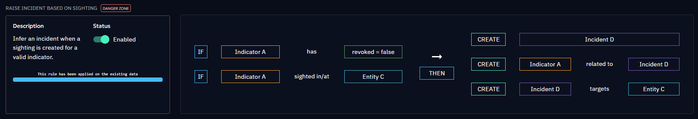
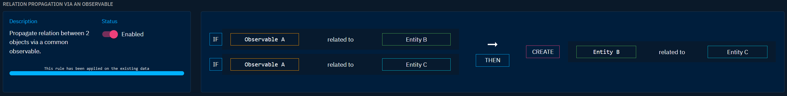
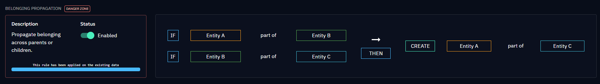
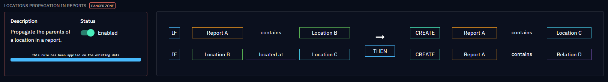
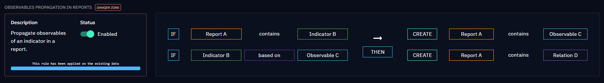
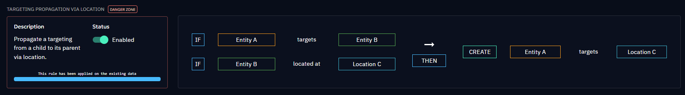
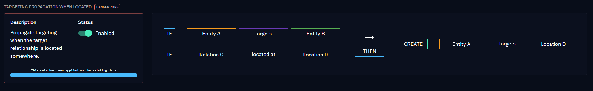

# Rules engine

## Inference rules

The rules engine comprises a set of predefined rules (named inference rules) that govern how new relationships are inferred based on existing data. These rules are carefully crafted to ensure logical and accurate relationship creation. Here is the list of existing inference rules:

#### Raise incident based on sighting

| Conditions                                      | Creations                                                                       |
|:------------------------------------------------|:--------------------------------------------------------------------------------|
| A non-revoked Indicator is sighted in an Entity | Creation of an Incident linked to the sighted Indicator and the targeted Entity |

#### Sightings of observables via observed data

| Conditions                                                           | Creations                                                                                   |
|:---------------------------------------------------------------------|:--------------------------------------------------------------------------------------------|
| An Indicator is based on an Observable contained in an Observed Data | Creation of a sighting between the Indicator and the creating Identity of the Observed Data |

#### Sightings propagation from indicator

| Conditions                                                  | Creations                               |
|:------------------------------------------------------------|:----------------------------------------|
| An Indicator based on an Observable is sighted in an Entity | The Observable is sighted in the Entity |

#### Sightings propagation from observable

| Conditions                                                  | Creations                              |
|:------------------------------------------------------------|:---------------------------------------|
| An Indicator is based on an Observable sighted in an Entity | The Indicator is sighted in the Entity |

#### Relation propagation via an observable

| Conditions                                 | Creations                                                  |
|:-------------------------------------------|:-----------------------------------------------------------|
| An observable is _related to_ two Entities | Create a _related to_ relationship between the two Entities |

#### Attribution propagation

| Conditions                                                                                     | Creations                              |
|:-----------------------------------------------------------------------------------------------|:---------------------------------------|
| An Entity A is attributed to an Entity B and this Entity B is itself attributed to an Entity C | The Entity A is attributed to Entity C |

#### Belonging propagation

| Conditions                                                                         | Creations                        |
|:-----------------------------------------------------------------------------------|:---------------------------------|
| An Entity A is part of an Entity B and this Entity B is itself part of an Entity C | The Entity A is part of Entity C |

#### Location propagation

| Conditions                                                                                    | Creations                               |
|:----------------------------------------------------------------------------------------------|:----------------------------------------|
| A Location A is located at a Location B and this Location B is itself located at a Location C | The Location A is located at Location C |

#### Organization propagation via participation

| Conditions                                                                      | Creations                                    |
|:--------------------------------------------------------------------------------|:---------------------------------------------|
| A User is affiliated with an Organization B, which is part of an Organization C | The User is affiliated to the Organization C |

#### Identities propagation in reports

| Conditions                                                                   | Creations                                                                                     |
|:-----------------------------------------------------------------------------|:----------------------------------------------------------------------------------------------|
| A Report contains an Identity B and this Identity B is part of an Identity C | The Report contains Identity C, as well as the Relationship between Identity B and Identity C |

#### Locations propagation in reports

| Conditions                                                                    | Creations                                                                                     |
|:------------------------------------------------------------------------------|:----------------------------------------------------------------------------------------------|
| A Report contains a Location B and this Location B is located at a Location C | The Report contains Location B, as well as the Relationship between Location B and Location C |

#### Observables propagation in reports

| Conditions                                                                  | Creations                                                                                                |
|:----------------------------------------------------------------------------|:---------------------------------------------------------------------------------------------------------|
| A Report contains an Indicator and this Indicator is based on an Observable | The Report contains the Observable, as well as the Relationship between the Indicator and the Observable |

#### Usage propagation via attribution

| Conditions                                               | Creations                      |
|:---------------------------------------------------------|:-------------------------------|
| An Entity A, attributed to an Entity C, uses an Entity B | The Entity C uses the Entity B |

#### Inference of targeting via a sighting

| Conditions                                                  | Creations                         |
|:------------------------------------------------------------|:----------------------------------|
| An Indicator, sighted at an Entity C, indicates an Entity B | The Entity B targets the Entity C |

#### Targeting propagation via attribution

| Conditions                                                  | Creations                         |
|:------------------------------------------------------------|:----------------------------------|
| An Entity A, attributed to an Entity C, targets an Entity B | The Entity C targets the Entity B |

#### Targeting propagation via belonging

| Conditions                                               | Creations                           |
|:---------------------------------------------------------|:------------------------------------|
| An Entity A targets an Identity B, part of an Identity C | The Entity A targets the Identity C |

#### Targeting propagation via location

| Conditions                                                                    | Creations                         |
|:------------------------------------------------------------------------------|:----------------------------------|
| An Entity targets a Location B and this Location B is located at a Location C | The Entity targets the Location C |

#### Targeting propagation when located

| Conditions                                                                | Creations                           |
|:--------------------------------------------------------------------------|:------------------------------------|
| An Entity A targets an Entity B and this target is located at Location D. | The Entity A targets the Location D |

## Rule execution

### Rule activation

When a rule is activated, a background task is initiated. This task scans all platform data, identifying existing relationships that meet the conditions defined by the rule. Subsequently, it creates new objects (entities and/or relationships), expanding the network of insights within your threat intelligence environment. Then, activated rules operate continuously. Whenever a relationship is created or modified, and this change aligns with the conditions specified in an active rule, the reasoning mechanism is triggered. This ensures real-time relationship inference.

### Rule deactivation

Deactivating a rule leads to the deletion of all objects and relationships created by it. This cleanup process maintains the accuracy and reliability of your threat intelligence database.

## Access restrictions and data impact

Access to the rule engine panel is **restricted to administrators** only. Regular users do not have visibility into this section of the platform. Administrators possess the authority to activate or deactivate rules.

The rules engine empowers OpenCTI with the capability to automatically establish intricate relationships within your data. However, these rules can lead to a very large number of objects created. Even if the operation is reversible, an administrator should consider the impact of activating a rule.

## Additional resources

- **Usefulness:** To understand the benefits and results of these rules, refer to the [Inferences and reasoning](../usage/inferences.md) page in the User Guide section of the documentation.
- **New inference rule:** Given the potential impact of a rule on your data, users are not allowed to add new rules. However, users can submit rule suggestions via a GitHub issue for evaluation. These suggestions are carefully evaluated by our team, ensuring continuous improvement and innovation.