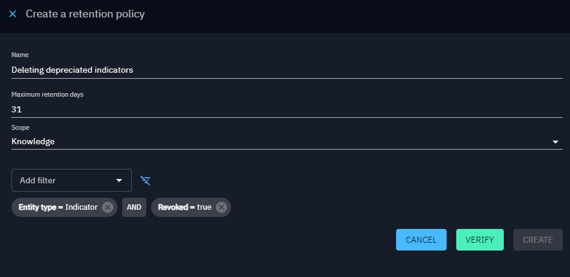

# Retention policies

Retention rules serve the purpose of establishing data retention times, specifying when data should be automatically deleted from the platform. Any object meeting the retention rule criteria (scope and filters) and that haven't been updated within the designated time frame will be permanently deleted.

Note that the data deleted by an active retention policy will not appear in the [trash](../usage/delete-restore.md) and thus cannot be restored.  

## Configuration

Retention rules can be configured in the "Settings > Customization > Retention policies" window. A set of parameters must be configured:
- Scope: Define which data are concerned by the retention rule. The 3 possible scopes are: Knowledge, File, Workbench.
- Maximum retention days: Set the maximum number of days an object can remain unchanged before being eligible for deletion.
- Filters (for Knowledge scope only): Define filters based on specific criteria to select the types of objects subject to retention rules.

## Scopes

There are 3 possible scopes for a retention rule:
- **Knowledge**: The rule concerns all the entities of the platform. Users can define filters to target specific objects. Any object respecting the specified filters and that haven't been updated within the duration set in 'maximum retention days' will be permanently deleted.

- **File**: The rule is applied on the global files (i.e. contained in Data > Import) that have been correctly uploaded (upload status is 'complete') and whose eventual imports have all been correctly completed. Such files are permanently deleted if they has been uploaded for a longer duration then the one set in 'maximum retention days'.

- **Workbench**: The rule is applied on the global workbenches (i.e. contained in Data > Import). The global workbenches that hasn't been updated for the duration set in 'maximum retention days' will be permanently deleted.

## Verification process

Before activating a retention rule, users have the option to verify its impact using the "Verify" button. This action provides insight into the number of objects that currently match the rule's criteria and would be deleted if the rule is activated.

!!! warning "Verify before activation"

    Always use the "Verify" feature to assess the potential impact of a retention rule before activating it. Once the rule is activated, data deletion will begin, and retrieval of the deleted data will not be possible.

Retention rules contribute to maintaining a streamlined and efficient data lifecycle within OpenCTI, ensuring that outdated or irrelevant information is systematically removed from the platform, thereby optimizing disk space usage.
