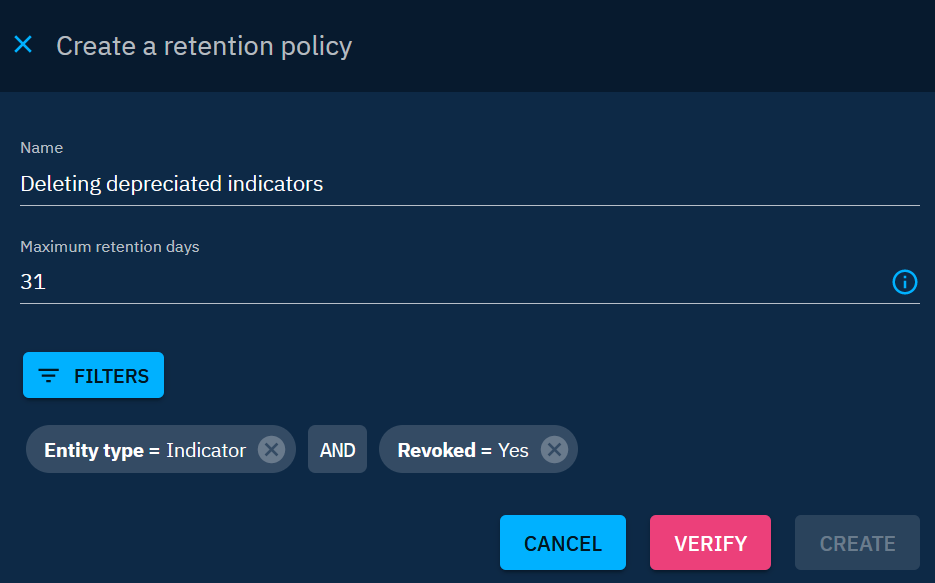
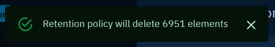

# Retention policies

Retention rules serve the purpose of establishing data retention times, specifying when data should be automatically deleted from the platform. Any object meeting the retention rule criteria (scope and filters) and that haven't been updated within the designated time frame will be permanently deleted.

Note that the data deleted by an active retention policy will not appear in the [trash](../usage/delete-restore.md) and thus cannot be restored.  

## Configuration

Retention rules can be configured in the "Settings > Customization > Retention policies" window. A set of parameters must be configured:

- **Scope**: Define which data are concerned by the retention rule. The possible scopes are: Knowledge, File, Workbench, History, Activity.
- **Maximum retention**: Set the maximum amount of time an object can remain unchanged before being eligible for deletion.
- **Unit**: The time unit for the maximum retention value: minutes, hours or days.
- **Active**: Toggle to enable or disable the retention rule without deleting it (see [Enabling and disabling a rule](#enabling-and-disabling-a-rule)).
- **Filters** (for Knowledge scope only): Define filters based on specific criteria to select the types of objects subject to retention rules.



## Scopes

There are 5 possible scopes for a retention rule:

- **Knowledge**: The rule concerns all the entities of the platform. Users can define filters to target specific objects. Any object respecting the specified filters and that haven't been updated within the maximum retention duration will be permanently deleted.

- **File**: The rule is applied on the global files (i.e. contained in Data > Import) that have been correctly uploaded (upload status is 'complete') and whose eventual imports have all been correctly completed. Such files are permanently deleted if they has been uploaded for a longer duration then the maximum retention duration.

- **Workbench**: The rule is applied on the global workbenches (i.e. contained in Data > Import). The global workbenches that hasn't been updated for the maximum retention duration will be permanently deleted.

- **History**: The rule is applied on the history logs of all knowledge entities. History log entries older than the maximum retention duration are permanently deleted. This scope requires the `ACTIVITY_HISTORY_RETENTION` feature flag to be enabled (see [History and Activity scopes](#history-and-activity-scopes)).

- **Activity**: The rule is applied on the platform activity logs (administration events such as login, logout, and security actions). Activity log entries older than the maximum retention duration are permanently deleted. This scope requires the `ACTIVITY_HISTORY_RETENTION` feature flag to be enabled (see [History and Activity scopes](#history-and-activity-scopes)).

## Enabling and disabling a rule

Each retention rule has an **Active** toggle that allows enabling or disabling it independently, without having to delete it. When a rule is inactive, it is not executed by the retention manager and no data deletion occurs.

This is particularly useful to:

- Temporarily pause a rule during a data migration or a maintenance operation.
- Prepare rules in advance and activate them only when needed.
- Quickly suspend a rule after an unexpected deletion and assess its impact.

The active status of a rule is displayed in the retention policies list with a colored badge. It can be changed at any time from the rule edition drawer.

!!! warning "Rules inactive by default for History and Activity scopes"

    When creating a retention rule with the **History** or **Activity** scope, the rule is created with `active: false` by default. This is intentional to avoid accidental deletion of audit logs. Make sure to verify the rule before enabling it.

## History and Activity scopes

The **History** and **Activity** scopes target internal platform logs (indices) rather than STIX knowledge objects. Because these logs contain sensitive audit data, these scopes are protected by a dedicated feature flag and must be explicitly enabled on the platform.

### Enabling the feature flag

To use the History or Activity scopes, the `ACTIVITY_HISTORY_RETENTION` feature flag must be added to the platform configuration:

```yaml
app:
  enabled_dev_features:
    - ACTIVITY_HISTORY_RETENTION
```

If this flag is not set, any attempt to verify or create a retention rule with the History or Activity scope will result in an error:

```
The history/activity scope for retention rules is not enabled on this platform
```

!!! info "No filters for History and Activity scopes"

    Unlike the Knowledge scope, History and Activity retention rules do not support custom filters. All log entries older than the maximum retention duration are deleted regardless of their content.

## Verification process

Before activating a retention rule, users have the option to verify its impact using the "Verify" button. This action provides insight into the number of objects that currently match the rule's criteria and would be deleted if the rule is activated.



!!! warning "Verify before activation"

    Always use the "Verify" feature to assess the potential impact of a retention rule before activating it. Once the rule is activated, data deletion will begin, and retrieval of the deleted data will not be possible.

Retention rules contribute to maintaining a streamlined and efficient data lifecycle within OpenCTI, ensuring that outdated or irrelevant information is systematically removed from the platform, thereby optimizing disk space usage.
