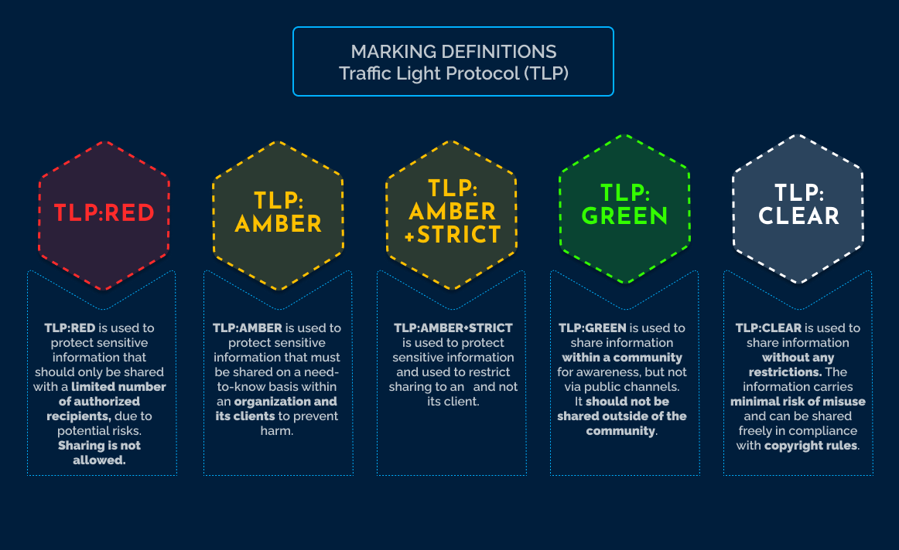
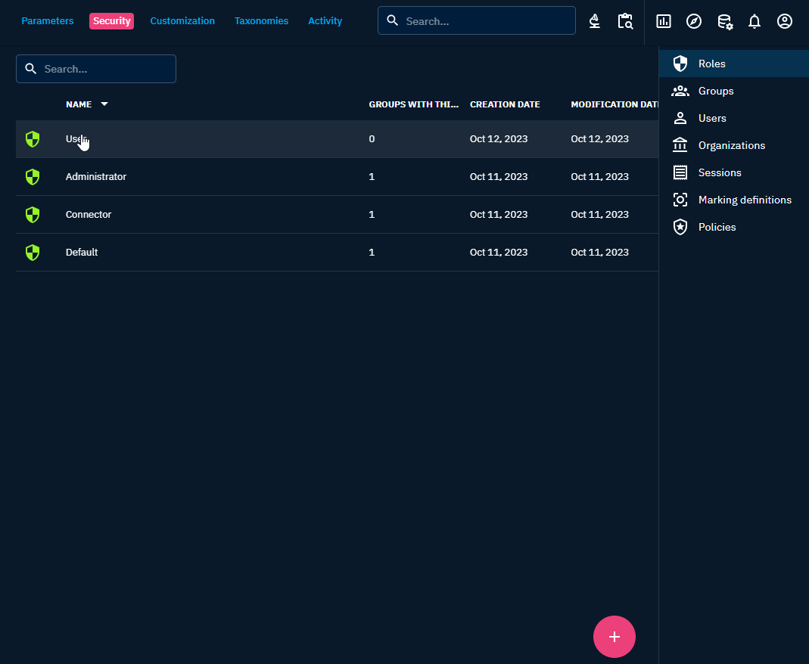
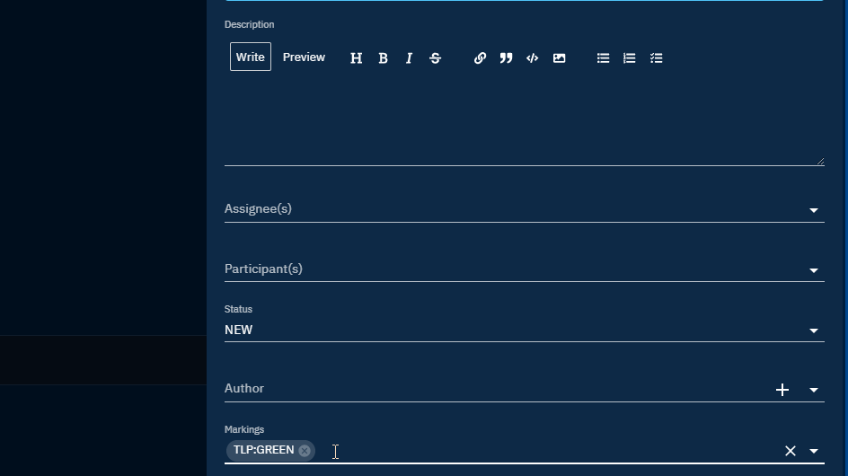

# Data segregation

## Introduction

*Data segregation* in the context of *Cyber Threat Intelligence* refers to the practice of categorizing and separating different types of data or information related to cybersecurity threats based on specific criteria.

This separation helps organizations manage and analyze threat intelligence more effectively and securely and the goal of data segregation is to ensure that only those individuals who are authorized to view a particular set of data have access to that set of data.

Practically, "Need-to-know basis" and "classification level" are data segregation measures.

## Marking Definitions

### Description

*Marking definitions* are essential in the context of data segregation to ensure that data is appropriately categorized and protected based on its sensitivity or classification level. Marking definitions establish a standardized framework for classifying data.

Marking Definition objects are unique among STIX objects in the [STIX 2.1 standard](https://docs.oasis-open.org/cti/stix/v2.1/stix-v2.1.html) in that they cannot be versioned.  This restriction is in place to prevent the possibility of indirect alterations to the markings associated with a STIX Object.

Multiple markings can be added to the same object. Certain categories of marking definitions or trust groups may enforce rules that specify which markings take precedence over others or how some markings can be added to complement existing ones.

In OpenCTI, data is segregated based on knowledge marking. The diagram provided below illustrates the manner in which OpenCTI establishes connections between pieces of information to authorize data access for a user:

### Traffic Light Protocol

The Traffic Light Protocol is implemented by default as marking definitions in OpenCTI. It allows you to segregate information by TLP level in your platform and restrict access to marked data if users are not authorized to see the corresponding marking.

The *Traffic Light Protocol* (TLP) was designed by the *Forum of Incidence Response and Security Teams* ([FIRST](https://www.first.org/tlp/)) to provide a standardized method for classifying and handling sensitive information, based on four categories of sensitivity.

For more details, the diagram provided below illustrates how are categorized the marking definitions:

### Create new markings

In order to create a marking, you must first have the ability to access the Settings tab. For example, a user who is in a group with the role of Administrator can bypass all capabilities or a user who is in a group with the role that has `Access administration` checked can access the Settings tab. For more details about user administration here: [Users and Role Based Access Control](./users.md)

Once you have access to the settings, you can create your new marking in `Security` -> `Marking Definitions`

A marking has:

* a type
* a definition
* a color
* an order

### Allowed marking definitions 

In order for all users in a group to be able to see entities and relationships that have specific markings on them, allowed markings can be checked when updating a group:

### Default marking definitions

To apply a default marking when creating a new entity or relationship, you can choose which marking to add by default from the list of allowed markings. You can add *only one marking per type*, but you can have multiple types.

Be careful, add markings as default markings is not enough to see the markings when you create an entity or relationship, you need to enable default markings in an entity or relationship customization.

For example, if you create a new report, got to `Settings` -> `Customization` -> `Report` -> `Markings` and click on `Activate/Desactivate default values`

### Authorize a group to new marking definition

To authorize a group to automatically have access to a newly created marking definition in allowed marking definitions, you can check `Automatically authorize this group to new marking definition` when update a group:

### Behavior on the OpenCTI Platform

#### Create a new entity or relationship

When a new entity or a new relationship is created, if multiple markings of the same type and different order are added, the platform will only keep the highest order for each type.

For example:

Create a new report and add markings `PAP:AMBER`,`PAP:RED`,`TLP:AMBER+STRICT`,`TLP:CLEAR` and a statement `CC-BY-SA-4.0 DISARM Foundation`

The final markings kept are: `PAP:RED`, `TLP:AMBER+STRICT` and `CC-BY-SA-4.0 DISARM Foundation`

#### Update an entity or a relationship

When update an entity or a relationship:

- add a marking with *same type and different order*, a pop-up will be displayed to confirm the choice
- add a marking with *same type and same order*, the marking will be added
- add a marking with *different type*, the marking will be added

#### Merge entities

When you merge multiple entities, the platform will keep the highest order for each type of markings when the merge is complete:

For example, merging 2 observables, one with `TLP:CLEAR` and `PAP:CLEAR` and the other one with `PAP:RED` and `TLP:GREEN` from 198.250.250.11 to 197.250.251.12.

As final result, you will have the observable with the value 197.250.251.12 with `PAP:RED` and `TLP:GREEN`

#### Import data from a connector

When you import data from a connector, the connector cannot downgrade a marking for the same entity, if a same type of marking is set on it.

For example, if you create a new observable with same values as Alien Vault data and change marking in the platform as `TLP:AMBER`, when importing data, the platform will keep the highest rank for the same type of markings.

