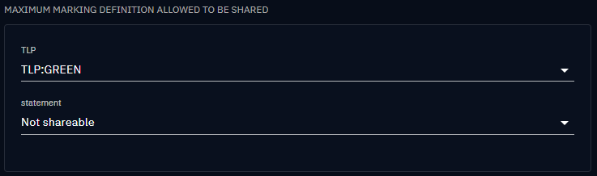

# Marking restriction

Data segregation in the context of Cyber Threat Intelligence refers to the practice of categorizing and separating different types of data or information related to cybersecurity threats based on specific criteria.

This separation helps organizations manage and analyze threat intelligence more effectively and securely and the goal of data segregation is to ensure that only those individuals who are authorized to view a particular set of data have access to that set of data.

Practically, "Need-to-know basis" and "classification level" are data segregation measures.

## Description

Marking definitions are essential in the context of data segregation to ensure that data is appropriately categorized and protected based on its sensitivity or classification level. Marking definitions establish a standardized framework for classifying data.

Marking Definition objects are unique among STIX objects in the [STIX 2.1 standard](https://docs.oasis-open.org/cti/stix/v2.1/stix-v2.1.html) in that they cannot be versioned. This restriction is in place to prevent the possibility of indirect alterations to the markings associated with a STIX Object.

Multiple markings can be added to the same object. Certain categories of marking definitions or trust groups may enforce rules that specify which markings take precedence over others or how some markings can be added to complement existing ones.

In OpenCTI, data is segregated based on knowledge marking. The diagram provided below illustrates the manner in which OpenCTI establishes connections between pieces of information to authorize data access for a user:

## Manage markings

### Create new markings

To create a marking, you must first possess the capability `Manage marking definitions`. For further information on user administration, please refer to the [Users and Role Based Access Control page](./users.md).

Once you have access to the settings, navigate to "Settings > Security > Marking Definitions" to create a new marking.

A marking consists of the following attributes:

- Type: Specifies the marking group to which it belongs.
- Definition: The name assigned to the marking.
- Color: The color associated with the marking.
- Order: Determines the hierarchical order among markings of the same type.

### Allowed marking  

The configuration of authorized markings for a user is determined at the [Group](users.md#group-section) level. To access entities and relationships associated with specific markings, the user must belong to a group that has been granted access to those markings.

There are two ways in which markings can be accessed:

- The user is a member of a group that has been granted access to the marking.
- The user is a member of a group that has access to a marking of the same type, with an equal or higher hierarchical order.

!!! note "Access to an object with several markings"

    Access to all markings attached to an object is required in order to access it (not only one).

!!! tip "Automatically grant access to the new marking"

    To allow a group to automatically access a newly created marking definition, you can check `Automatically authorize this group to new marking definition`.

### Default marking definitions

To apply a default marking when creating a new entity or relationship, you can choose which marking to add by default from the list of allowed markings. You can add *only one marking per type*, but you can have multiple types. This configuration is also done at the [Group](users.md#group-section) level.

!!! note "Need a configuration change"
    
    Simply adding markings as default markings is insufficient to display the markings when creating an entity or relationship. You also need to enable default markings in the customization settings of an entity or relationship. For example, to enable default markings for a new report, navigate to "Settings > Customization > Report > Markings" and toggle the option to `Activate/Desactivate default values`.

### Maximum shareable marking definitions

This configuration allows to define, for each type of marking definitions, until which level
we allow to share data externally (via Public dashboard or file export).

The marking definitions that can be shared by a group are the ones

- that are allowed for this group
- and whose order are inferior or equal to the order of the maximum shareable markings defined for each marking type.

Users with the Bypass capability can share all the markings.

By default, every marking of a given marking type is shareable.

For example in the capture below, for the type of marking `TLP`, only data  with a marking
definition that is allowed and has a level equal or below `GREEN` will be shareable. And no data with marking
definition `statement` will be shared at all.

### Management of multiple markings

In scenarios where multiple markings of the same type but different orders are added, the platform will retain only the marking with the highest order for each type. This consolidation can occurs in various instances:

- During entity creation, if multiple markings are selected.
- During entity updates, whether manually or via a connector, if additional markings are introduced.
- When multiple entities are merged, their respective markings will be amalgamated.

For example:

Create a new report and add markings `PAP:AMBER`,`PAP:RED`,`TLP:AMBER+STRICT`,`TLP:CLEAR` and a statement `CC-BY-SA-4.0 DISARM Foundation`

The final markings kept are: `PAP:RED`, `TLP:AMBER+STRICT` and `CC-BY-SA-4.0 DISARM Foundation`

### Update an object manually

When update an entity or a relationship:

- add a marking with the *same type and different orders*, a pop-up will be displayed to confirm the choice,
- add a marking with the *same type and the same order*, the marking will be added,
- add a marking with *different types*, the marking will be added.

### Import data from a connector

As a result of this mechanism, when importing data from a connector, the connector is unable to downgrade a marking for an entity if a marking of the same type is already present on it.

## Additional information

The Traffic Light Protocol is implemented by default as marking definitions in OpenCTI. It allows you to segregate information by TLP levels in your platform and restrict access to marked data if users are not authorized to see the corresponding marking.

The Traffic Light Protocol (TLP) was designed by the Forum of Incident Response and Security Teams ([FIRST](https://www.first.org/tlp/)) to provide a standardized method for classifying and handling sensitive information, based on four categories of sensitivity.

For more details, the diagram provided below illustrates how are categorized the marking definitions:

