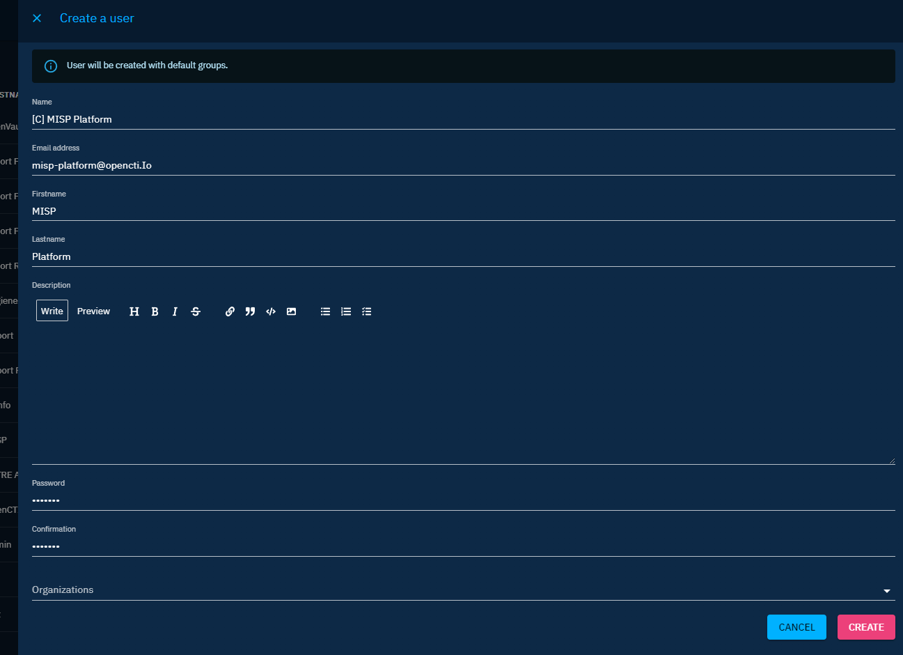
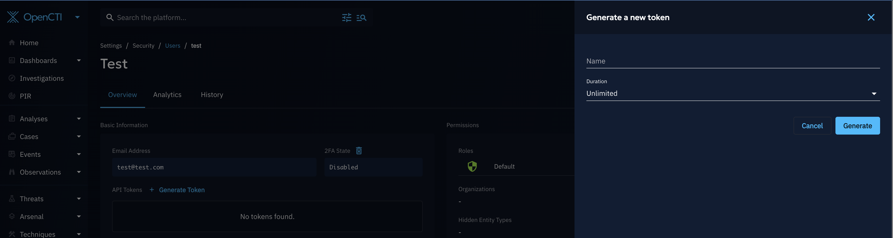

# Connectors

## Introduction

!!! question "Connectors list"
    
    You are looking for the available connectors? The list is in the [OpenCTI Ecosystem](https://filigran.notion.site/OpenCTI-Ecosystem-868329e9fb734fca89692b2ed6087e76).

Connectors are the cornerstone of the OpenCTI platform and allow organizations to easily ingest, enrich or export data in the platform. According to their functionality and use case, they are categorized in following classes.


### Import

These connectors automatically retrieve information from an external organization, application or service, convert it to STIX 2.1 bundles and import it into OpenCTI using the workers.

### Enrichment

When a new object is created in the platform or on the user request, it is possible to trigger the internal enrichment connector to lookup and/or search the object in external organizations, applications or services. If the object is found, the connectors will generate a STIX 2.1 bundle which will increase the level of knowledge about the concerned object.

### Stream

These connectors connect to a platform [data stream](reference/data-stream) and continously *do* something with the received events. In most cases, they are used to consume OpenCTI data and insert them in third-party platforms such as SIEMs, XDRs, EDRS, etc. In some cases, stream connectors can also query the external system on a regular basis and act as import connector for instance to gather alerts and sightings related to CTI data and push them to OpenCTI (bi-directional).

### Import files

Information from an uploaded file can be extracted and ingested into OpenCTI. Examples are files attached to a report or a STIX 2.1 file.

### Export files

Information stored in OpenCTI can be extracted into different file formats like .csv or .json (STIX 2).

## Connector configuration

All connectors have to be able to access to the OpenCTI API. To allow this connection, they have 2 mandatory configuration parameters, the `OPENCTI_URL` and the `OPENCTI_TOKEN`. In addition of these 2 parameters, connectors have other mandatory parameters that need to be set in order to get them work.

!!! warning "Connectors tokens"
    
    Be careful, we strongly recommend to use a dedicated token for each connector running in the platform. So you have to **create a specific user for each of them**.

    Also, if all connectors users can run in with a user belonging to the `Connectors` group (with the `Connector` role), the `Internal Export Files` should be run with a user who is Administrator (with bypass capability) because they imperstonate the user requesting the export to avoid data leak.

    | Type                 | Required role       | Used permissions                                                                                  
    | :------------------- | :------------------ | :----------------------------------------------------- |
    | EXTERNAL_IMPORT      | Connector           | Import data with the connector user.                   | 
    | INTERNAL_ENRICHMENT  | Connector           | Enrich data with the connector user.                   |
    | INTERNAL_IMPORT_FILE | Connector           | Import data with the connector user.                   |
    | INTERNAL_EXPORT_FILE | Administrator       | Export data with the user who requested the export.    |
    | STREAM               | Connector           | Consume the streams the connector user.                |

Here is an example of a connector `docker-compose.yml` file:
```yaml
- CONNECTOR_ID=ChangeMe
- CONNECTOR_TYPE=EXTERNAL_IMPORT
- CONNECTOR_NAME=MITRE ATT&CK
- CONNECTOR_SCOPE=identity,attack-pattern,course-of-action,intrusion-set,malware,tool,report
- CONNECTOR_CONFIDENCE_LEVEL=3
- CONNECTOR_UPDATE_EXISTING_DATA=true
- CONNECTOR_LOG_LEVEL=info
```

Here is an example in a connector `config.yml` file:

```yaml
-connector:
  id: 'ChangeMe'
  type: 'EXTERNAL_IMPORT'
  name: 'MITRE ATT&CK'
  scope: 'identity,attack-pattern,course-of-action,intrusion-set,malware,tool,report'
  confidence_level: 3
  update_existing_data: true
  log_level: 'info'
```

## Networking

Be aware that all connectors are reaching RabbitMQ based the RabbitMQ configuration provided by the OpenCTI platform. The connector must be able to reach RabbitMQ on the specified hostname and port. If you have a specific Docker network configuration, please be sure to adapt your `docker-compose.yml` file in such way that the connector container gets attached to the OpenCTI Network, e.g.:

```yaml
networks:
  default:
    external: true
    name: opencti-docker_default
```

## Connector token

### Create the user

As mentionned previously, it is strongly recommended to run each connector with its own user. **The `Internal Export File` connectors should be launched with a user that belongs to a group which has an “Administrator” role (with bypass all capabilities enabled).**

By default in platform, a group named "Connectors" already exists. So just create a new user with the name `[C] Name of the connector` in Settings > Security > Users.



### Put the user in the group

Just go to the user you have just created and add it to the `Connectors` group.


Then just get the token of the user displayed in the interface.



## Docker activation

You can either directly run the Docker image of connectors or add them to your current `docker-compose.yml` file.

### Add a connector to your deployment

For instance, to enable the MISP connector, you can add a new service to your `docker-compose.yml` file:

```docker
  connector-misp:
    image: opencti/connector-misp:latest
    environment:
      - OPENCTI_URL=http://localhost
      - OPENCTI_TOKEN=ChangeMe
      - CONNECTOR_ID=ChangeMe
      - CONNECTOR_TYPE=EXTERNAL_IMPORT
      - CONNECTOR_NAME=MISP
      - CONNECTOR_SCOPE=misp
      - CONNECTOR_CONFIDENCE_LEVEL=3
      - CONNECTOR_UPDATE_EXISTING_DATA=false
      - CONNECTOR_LOG_LEVEL=info
      - MISP_URL=http://localhost # Required
      - MISP_KEY=ChangeMe # Required
      - MISP_SSL_VERIFY=False # Required
      - MISP_CREATE_REPORTS=True # Required, create report for MISP event
      - MISP_REPORT_CLASS=MISP event # Optional, report_class if creating report for event
      - MISP_IMPORT_FROM_DATE=2000-01-01 # Optional, import all event from this date
      - MISP_IMPORT_TAGS=opencti:import,type:osint # Optional, list of tags used for import events
      - MISP_INTERVAL=1 # Required, in minutes
    restart: always
```

### Launch a standalone connector

To launch standalone connector, you can use the `docker-compose.yml` file of the connector itself. Just download the latest [release](https://github.com/OpenCTI-Platform/connectors/releases) and start the connector:

```
$ wget https://github.com/OpenCTI-Platform/connectors/archive/{RELEASE_VERSION}.zip
$ unzip {RELEASE_VERSION}.zip
$ cd connectors-{RELEASE_VERSION}/misp/

```

Change the configuration in the `docker-compose.yml` according to the parameters of the platform and of the targeted service. Then launch the connector:

```
$ docker-compose up
```

## Manual activation

If you want to manually launch connector, you just have to install Python 3 and pip3 for dependencies:

```
$ apt install python3 python3-pip
```

Download the [release](https://github.com/OpenCTI-Platform/connectors/archive/%7BRELEASE_VERSION%7D.zip) of the connectors:

```
$ wget <https://github.com/OpenCTI-Platform/connectors/archive/{RELEASE_VERSION}.zip>
$ unzip {RELEASE_VERSION}.zip
$ cd connectors-{RELEASE_VERSION}/misp/src/

```

Install dependencies and initialize the configuration:

```
$ pip3 install -r requirements.txt
$ cp config.yml.sample config.yml
```

Change the `config.yml` content according to the parameters of the platform and of the targeted service and launch the connector:

```
$ python3 misp.py
```

## Connectors status

The connector status can be displayed in the dedicated section of the platform available in Data > Connectors. You will be able to see the statistics of the RabbitMQ queue of the connector:


!!! bug "Problem"

    If you encounter problems deploying OpenCTI or connectors, you can consult the [troubleshooting page](deployment/troubleshooting) page.