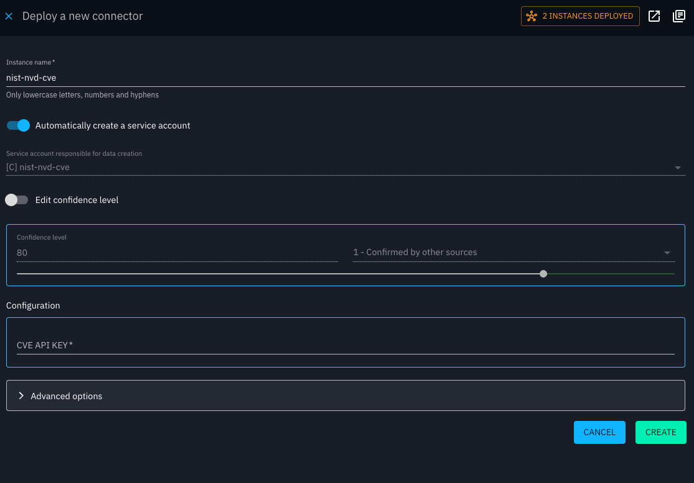

# Integration Manager

## Introduction

The OpenCTI Integration Manager is a deployment tool that simplifies the management and deployment of connectors within the platform. It supports two deployment methods:

- An intuitive web interface for direct UI-based deployment.

- A container-based method for self-hosted deployments requiring infrastructure control.

    - [Quick start](integration-manager/quick-start.md) - Get up and running quickly
    - [Architecture design](integration-manager/architecture.md) - Detailed technical architecure documentation
    - [Private Registry Authentication](integration-manager/registry-authentification.md) - Configure private Docker registries and authentication handling
    - [Proxy Support](integration-manager/proxy-configuration.md) - Configure system proxy and HTTPS proxy certificates
    - [Installation guide](integration-manager/installation.md) - System requirements and installation methods
    - [Configuration reference](integration-manager/configuration.md) - Complete configuration documentation
    - [Security deep dive](integration-manager/security.md) - Database, encryption, and access control documentation
    - [Development guide](../development/integration-manager.md) - Setup for development and contribution
    - [Troubleshooting guide](integration-manager/troubleshooting.md) - Solutions to common issues

## How to use in OpenCTI

### Prerequisites

- An **Enterprise Edition license** is required to use this feature. Without it, the catalog is available in read-only mode. You can enter the license key from:
    - the **Deploy** action on a connector card,
    - the connector’s detail view,
    - or the **Settings** page.

- The **Integration Manager** must be installed and operational to deploy connectors.

## Browsing the connector catalog

- Navigate to **Data > Ingestion > Connector Catalog**

- Use the search bar to find connectors by name or description. You can also apply filters (e.g., by connector type or use case).

- If a connector has already been deployed, a **badge** will appear on its **Deploy** button.

- In the configuration dialog header, if an instance is already deployed, you can click the instance button to go directly to the **Ingestion monitoring** page with the connector type pre-filtered.

- The **Details** shows additional information about each connector.

## Deploying a connector

!!! info "Multiple instances support"

    You can deploy multiple instances of the same connector with different names. This allows you to configure different data sources or settings for the same connector type (e.g., multiple MISP instances, different API endpoints, etc.).

    Even though it is possible to have multiple instances, there is a risk of significant impact on the platform, and it is **strongly discouraged**.

1. Click the **Deploy** button on a connector card. A form will appear with required configuration fields.

2. Fill in the required options (you can also expand **Advanced options** to configure additional settings):

    - **Instance name**: must be unique.

    - **Service account**: create a new one or use an existing one.

!!! warning "Name uniqueness validation"

    OpenCTI enforces strict name uniqueness to prevent conflicts:
    
    - **Instance names**: Two connector instances can't share the same name
    - **Service accounts**: The system also verifies that service account names don't conflict with existing users or instances

    - **Validation error**: If a duplicate name is detected, a blocking error will prevent deployment until a unique name is provided
    - **Confidence level**: set the desired confidence level for the service account.

    - **API key** (encrypted and securely stored).

    - **Additional options**: connector-specific configuration.

3. Click **Create**. Once the connector is created, you will be redirected to the connector instance view.

!!! note "Connector created"

    Newly created connectors are not started automatically. 
    You can still update their configuration via the **Update** action.
    

5. When ready, click **Start** to run the connector.

6. From the instance view, you can also check the **Logs** tab. The displayed logs depend on the logging level configured.

## Managing the connectors

- Different connector types are identified by their icons:
    - : managed connector by the Integration manager
    - : built-in connector feed
    - : built-in connector deployed

- Connector statuses:
    - Managed connectors: *Started* or *Stopped*.
    - Built-in connectors: *Active* or *Inactive*.

- **Filters in the Monitoring screen** are available only if:
    - The **Enterprise Edition** is enabled, and
    - There is at least one managed connector deployed.

- Only **managed connectors** can be started/stopped from the UI, and only they provide logs in the interface. 

- Updating the configuration of a managed connector is possible. Changes will take effect after a short delay.

- For security reasons, API keys/tokens are encrypted when saved and never displayed in the UI afterward.
