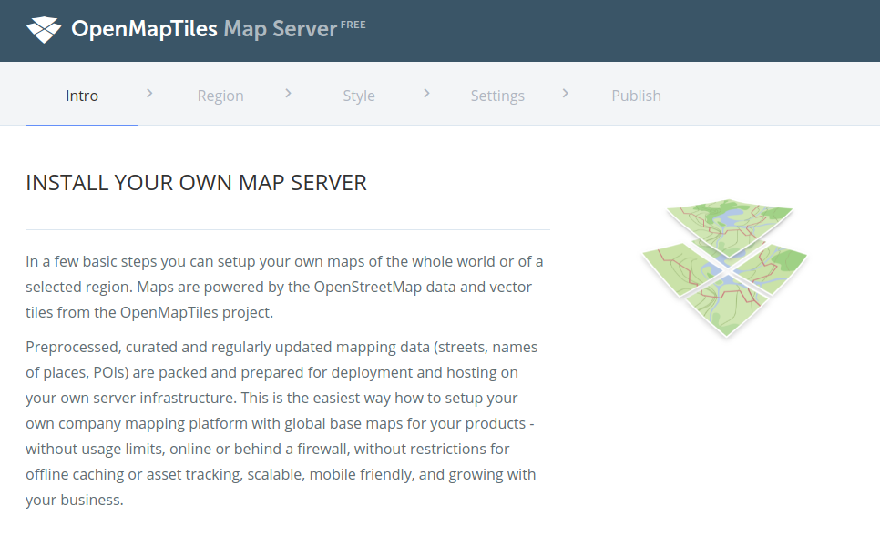

# Deploy on-premise map server with OpenCTI styles

## Introduction

The OpenStreetMap tiles for the planet will take 80GB. Here are the instructions to deploy a local OpenStreetMap server with the OpenCTI styles.

## Create directory for the data and upload planet data

When you will launch the map server container, it will be necessary to mount a volume with the planet tiles data. Just create the directory for the data.

```bash
mkdir /var/YOUR_DATA_DIR
```

We have hosted the free-to-use planet tiles, just download the [planet data](https://filigran.io/app/uploads/maptiler-osm-2020-02-10-v3.11-planet.mbtiles) from filigran.io.

```bash
wget https://filigran.io/app/uploads/maptiler-osm-2020-02-10-v3.11-planet.mbtiles
```

Put the file `maptiler-osm-2020-12-14-v3.11-planet.mbtiles` in the data directory:

```bash
cp maptiler-osm-2020-12-14-v3.11-planet.mbtiles /var/YOUR_DATA_DIR/
```

## Start Docker

Replace the port 80 by the port you would like to expose. Inside the Docker, the map server listen on the port 80.

```bash
docker run -d --restart always -v /var/YOUR_DATA_DIR:/data -p 80:80 klokantech/openmaptiles-server:latest 
```

## Configure

Download on your computer the OpenCTI JSON styles (you will have to upload it through the web UI later).

- [OpenCTI Map Dark mode style (filigran-dark2.json)](https://raw.githubusercontent.com/FiligranHQ/deployment-mapserver/main/styles/filigran-dark2.json)
- [OpenCTI Map Light mode style (filigran-light2.json)](https://raw.githubusercontent.com/FiligranHQ/deployment-mapserver/main/styles/filigran-light2.json)

Now, you can access to the map server, you should see the following page:



On the next page, you should see the existing data:


On the next page, click on "Advanced Options":


Upload the `filigran-dark2.json` and `filigran-light2.json` files:


Save and run the server with default parameters:


## OpenCTI Parameters

Once the server is running, you should see the list of available styles:


Click on "Viewer", and take the URL:

> 👉 http:/YOUR_URL/styles/{ID}/....

In the OpenCTI configuration, just put:

| Parameter                 | Environment variable       | Value                                                      | Description                                                      |
|:--------------------------|:---------------------------|:-----------------------------------------------------------|------------------------------------------------------------------|
| app:map_tile_server_dark  | APP__MAP_TILE_SERVER_DARK  | http://{YOUR_MAP_SERVER}/styles/{ID_DARK}/{z}/{x}/{y}.png  | The address of the OpenStreetMap provider with dark theme style  |
| app:map_tile_server_light | APP__MAP_TILE_SERVER_LIGHT | http://{YOUR_MAP_SERVER}/styles/{ID_LIGHT}/{z}/{x}/{y}.png | The address of the OpenStreetMap provider with light theme style |

You're good to go!