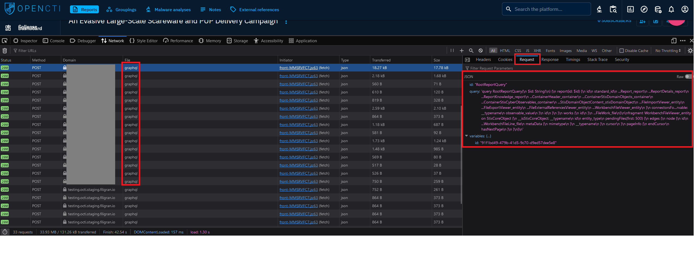

# GraphQL API

OpenCTI provides a comprehensive API based on GraphQL, allowing users to perform various actions programmatically. The API enables users to interact with OpenCTI's functionality and data, offering a powerful tool for automation, integration, and customization. All actions that can be performed through the platform's graphical interface are also achievable via the API.


## Authentication

Access to the OpenCTI API requires authentication using standard authentication mechanisms. Access rights to data via the API will be determined by the access privileges of the user associated with the API key. For authentication, users need to include the following headers in their API requests:

```html
Content-Type: application/json
Authorization: Bearer [API key]
```


## Documentation

The OpenCTI API consists of various endpoints corresponding to different functionalities and operations within the platform. These endpoints allow users to perform actions such as querying data, creating or updating entities, and more. Users can refer to the [Understand GraphQL](api.md#understand-graphql-section) section to understand how it works.

Documentation for the OpenCTI API, including schema definitions, the list of filters available and queryable fields, is available through the OpenCTI platform. It can be found on the [GraphQL playground](../development/api-usage.md). However, query examples and mutation examples are not yet available. In the meantime, users can explore the available endpoints and their functionality by inspecting network traffic in the browser's developer tools or by examining the source code of the [Python client](../development/python.md).




<a id="understand-graphql-section"></a>
## Understand GraphQL

GraphQL is a powerful query language for APIs that enables clients to request exactly the data they need. Unlike traditional REST APIs, which expose fixed endpoints and return predefined data structures, GraphQL APIs allow clients to specify the shape and structure of the data they require.

### Core concepts

#### Schema Definition Language (SDL)

GraphQL APIs are defined by a schema, which describes the types of data that can be queried and the relationships between them. The schema is written using the Schema Definition Language (SDL), which defines types, fields, and their relationships.

#### Query language

GraphQL uses a query language to request data from the server. Clients can specify exactly which fields they need and how they are related, enabling precise data retrieval without over-fetching or under-fetching.

**Example:**

```graphql
query IntrusionSets {
    intrusionSets (
        filters:
        {
            mode: and,
            filters: [
                {
                    key: "name",
                    values: ["Ajax Security Team"],
                    operator: eq,
                    mode: or,
                }
            ],
            filterGroups: [],
        }
    )
    {
        edges{
            node{
                id
                name
                description
                externalReferences{
                    edges{
                        node{
                            url
                            source_name
                        }
                    }
                }
            }
        }
    }
}
```

#### Resolvers

Resolvers are functions responsible for fetching the requested data. Each field in the GraphQL schema corresponds to a resolver function, which determines how to retrieve the data from the underlying data sources.

### How it Works

1. Schema definition: The API provider defines a GraphQL schema using SDL, specifying the types and fields available for querying.
2. Query execution: Clients send GraphQL queries to the server, specifying the data they need. The server processes the query, resolves each field, and constructs a response object with the requested data.
3. Validation and execution: The server validates the query against the schema to ensure it is syntactically and semantically correct. If validation passes, the server executes the query, invoking the appropriate resolver functions to fetch the requested data.
4. Data retrieval: Resolvers fetch data from the relevant data sources, such as databases, APIs, or other services. They transform the raw data into the shape specified in the query and return it to the client.
5. Response formation: Once all resolvers have completed, the server assembles the response object containing the requested data and sends it back to the client.

### External Resources

For a more in-depth understanding of GraphQL and its usage, consider exploring the following external resources:

- [GraphQL Official Documentation](https://graphql.org/learn/)
- [GraphQL query documentation](https://graphql.org/learn/queries/)
- [How to GraphQL](https://www.howtographql.com/)