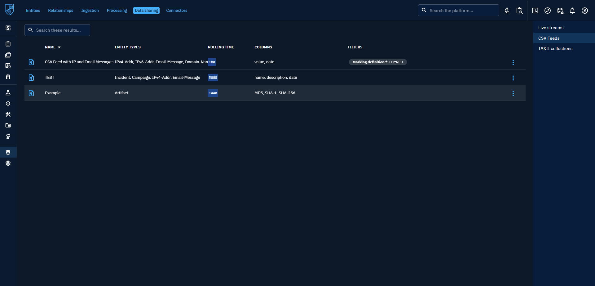

# CSV feeds
In OpenCTI, you can share data in the form of .CSV exports. This can be particularly useful if you don't wish to interconnect your OpenCTI instance with products dedicated to enrichment, dissemination or detection.

## Find the CSV Feeds feature

To find this feature in your instance, simply go to your platform's data area and Data sharing (Data → Data sharing → CSV Feeds).

On the right-hand side of your screen you'll see the three current possibilities for sharing data via Live streams, CSV Feeds or TAXII collections.

If you go to the CSV Feeds panel, you'll see all the CSV Feeds you've already created, along with a variety of information. You'll obviously find the name given to the CSV Feeds, the Entity Types supported by the functionality, the rolling time set by the feed creator, the names of the columns found in the .CSV file and, finally, the specific filters applied in the feed settings.

## Creating my feed

Clicking on the cross at bottom right opens the Create a feed panel.

Once you've given your feed a name and written a description, you can start defining the parameters.
### Distribution level

You can choose to make your feed public by checking the eponymous box. Once checked, this will make your feed public and therefore accessible to all.

If you wish to make it accessible only to a specific audience, you can also define who will be able to receive your feed; either one or several groups or organizations already defined in your platform.
### Rolling time

Rolling time is set in minutes. Its function is to return all objects corresponding to filters that have been updated within this range of minutes.

In concrete terms, this means that your .CSV document will contain only the data you require within the timeframe defined when the file was generated. If you set a rolling time of 24 hours, i.e. 1440 minutes, data dating back 1441 minutes or more will not appear in the file when it is generated.

### Base attribute

You must then choose the type of attribute to be taken into account by Rolling time. Either you choose to show only elements created in your Rolling time with the ‘Creation date’ attribute, or you choose to show only elements updated during this time with the ‘Update date’ attribute.

### Entity Types

Next, you need to define the entity type(s) you wish to follow. These are identical to those found elsewhere in the platform.

Once selected, you need to specify what you want to extract from the content of the defined entity types. To do this, you can add filters

In this example, we're looking inside the Artifact entities for the various hashes that have appeared, categorizing them according to several hashing methods over the last 1440 minutes (i.e. 24 hours).

Here we've also chosen to display the headers of each column, so that we can find in column A the MD5 hashes, in column B the SHA-1 hashes and in column C the SHA-256 hashes present in all the artifacts corresponding to the Rolling time.

### The final .CSV file

If the export has been properly configured, simply click on the CSV Feed that has just been created to open the file generation.

The resulting .CSV file will then contain all the MD5, SHA-1 and SHA-256 hashes in the columns defined with the separators that had been set.
