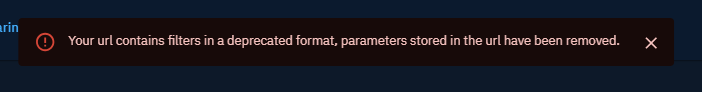

# Filters format migration for OpenCTI 5.12

The version 5.12 of OpenCTI introduces breaking changes to the [filters format](./filters.md) used in the API. This documentation describes how you can migrate your scripts or programs that call the OpenCTI API, when updating from a version of OpenCTI inferior to 5.12.


## Why this migration?

Before OpenCTI 5.12, it was not possible to construct complex filters combinations: we couldn't embed filters within filters, used different boolean modes (and/or), filter on all available attributes or relations for a given entity type, or even test for empty fields of any sort.

Legacy of years of development, the former format and filtering mechanics were not adapted for such task, and a profound refactoring was necessary to make it happen.

Here are the main pain points we identified beforehand:

- The filters frontend and backend formats were very different, requiring careful conversions.
- The filter were static lists of keys, depending on each given entity type and maintained by hands.
- The operator (`eq`, `not_eq`, etc.) was _inside_ the key (e.g. `entity_type_not_eq`), limiting operator combination and requiring error-prone parsing.
- The frontend format imposed a unique form of combination (`and` between filters, `or` between values inside each filter, and nothing else possible).
- The flat list structure made impossible filter imbrication by nature.
- Filters and query options were mixed in GQL queries for the same purpose (for instance, option `types` analog to a filter on key `entity_type`).

```ts
// filter formats in OpenCTI < 5.12

type Filter = {
    key: string, // a key in the list of the available filter keys for given the entity type
    values: string[],
    operator: string,
    filterMode: 'and' | 'or',
}

// "give me Reports labelled with labelX or labelY"
const filters = [
  { 
    "key": "entity_type",
    "values": ["Report"],
    "operator": "eq",
    "filterMode": "or"
  },
  { 
    "key": "labelledBy",
    "values": ["<id-for-labelX>", "<id-for-labelY>"],
    "operator": "eq",
    "filterMode": "or"
  },
]
```

The new format brings a lot of short-term benefits and is compatible with our long-term vision of the filtering capabilities in OpenCTI. We chose a simple recursive structure that allow complex combination of any sort with respect to basic boolean logic.

The list of operator is fixed and can be extended during future developments.

```ts
// filter formats in OpenCTI >= 5.12

type FilterGroup = {
  mode: 'and' | 'or'
  filters: Filter[]
  filterGroups: FilterGroup[] // recursive definition
}

type Filter  = {
  key: string[]
  values: string[]
  operator: 'eq' | 'not_eq' | 'gt' // ... and more
  mode: 'and' | 'or',
}

// "give me Reports and RFIs, not marked TLP:RED with labelX or no label"
const filters = {
  mode: 'and',
  filters: [
    { key: 'entity_type', values: ['Report', 'Case-Rfi'], operator: 'eq', mode: 'or', },
    { key: 'objectMarking', values: ['<id-for-TLP:RED>'], operator: 'not_eq', mode: 'or', },
  ],
  filterGroups: [{
    mode: 'or',
    filters: [
      { key: 'objectLabel', values: ["<id-for-labelX>"], operator: 'eq', mode: 'or', },
      { key: 'objectLabel', values: [], operator: 'nil', mode: 'or', },
    ],
    filterGroups: [],
  }],
};
```

Because changing filters format impacts almost everything in the platform, we decided to do a complete refactoring once and for all. We want this migration process to be clear and easy.

## What has been changed

The new filter implementation bring major changes in the way filters are processed and executed.

- We change the filters formats (see `FilterGroup` type above):

    - In the frontend, an operator and a mode are stored for each key.
    - The new format enables filters imbrication thanks to the new attribute 'filterGroups'.
    - The keys are of type string (no more static list of enums).
    - The 'values' attribute can no longer contain null values (use the `nil` operator instead).

- We also renamed some filter keys, to be consistent with the entities schema definitions.
- We implemented the handling of the different operators and modes in the backend.
- We introduced new void operators (`nil` / `not_nil`) to test the presence or absence of value in any field.


## How to migrate your own filters

We wrote a migration script to convert all [stored filters](filters.md#stored-filter-section) created prior to version 5.12. These filters will thus be migrated automatically when starting your updated platform.

However, you might have your own connectors, queries, or python scripts that use the graphql API or the python client. If this is the case, you must change the filter format if you want to run the code against OpenCTI >= 5.12.

### Filter conversion

To convert filters prior to version 5.12 in the new format:

1. update the `key` field if it has been changed in 5.12 (see the [conversion table](filters-migration.md#conversion-table-section) below),
2. rename the field `filterMode` in `mode`
3. if `values` contains `null`, see below for conversion.

Now you can build your new `FilterGroup` object with:

- `mode: 'and'`
- `filters` = array of converted filters (following previous steps),
- `filterGroups: []`

```ts
const oldFilter = {
    key: 'old_key',
    values: ['value1', 'value2'],
    operator: 'XX',
    filterMode: 'XX',
}

const convertedFilter = {
    key: 'converted_key_if_necessary',
    values: ['value1', 'value2'],
    operator: 'XX',
    mode: 'XX',
}

const newFilters = {
    mode: 'and',
    filters: [convertedFilter1, convertedFilter2...], // array with all converted filters
    filterGroups: [],
}
```

If `values` contains a `null` value, you need to convert the filter by using the new `nil` / `not_nil` operators. Here's the procedure:

1. Extract one filter dedicated to `null`

    - if operator was `'eq'`, switch to `operator: 'nil'` / if operator was `not_eq`, switch to `operator = 'not_nil'`
    - `values = []`

2. Extract another filter for all the other values.

```ts
// "Must have a label that is not Label1 or Label2"
const oldFilter = {
    key: 'labelledBy',
    values: [null, 'id-for-Label1', 'id-for-Label2'],
    operator: 'not_eq',
    filterMode: 'and',
}

const newFilters = {
    mode: 'and',
    filters: [
      {
        key: 'objectLabel',
        values: ['id-label-1', 'id-for-Label2'],
        operator: 'not_eq',
        mode: 'and',
      },
      {
        key: 'objectLabel',
        values: [],
        operator: 'not_nil',
        mode: 'and',
      },
    ],
    filterGroups: [],
}
```

!!! tip "Switch to nested filter to preserve logic"

    To preserve the logic of your old filter you might need to compose nested filter groups. This could happen for instance when using `eq` operator with `null` values for one filter, combined in `and` mode with other filters.


<a id="conversion-table-section"></a>
### Filter keys conversion table

Make sure you address all the filter keys that require conversion, following the map below:

```ts
// array of [oldKey, newKey] for the renamed keys
const keyConversion = [
    ['labelledBy', 'objectLabel'],
    ['markedBy', 'objectMarking'],
    ['objectContains', 'objects'],
    ['killChainPhase', 'killChainPhases'],
    ['assigneeTo', 'objectAssignee'],
    ['participant', 'objectParticipant'],
    ['creator', 'creator_id'],
    ['hasExternalReference', 'externalReferences'],
    ['hashes_MD5', 'hashes.MD5'],
    ['hashes_SHA1', 'hashes.SHA-1'],
    ['hashes_SHA256', 'hashes.SHA-256'],
    ['hashes_SHA512', 'hashes.SHA-512']
]
```

### Examples

#### Simple example

Let's start with a simple case:

> All Reports with label "label1" or "label2"
>
>  `(entity_type = Report) AND (label = label1 OR label2)`


```ts
const oldBackendFilter = [
  {
    key: 'entity_type',
    values: ['Report'],
    operator: 'eq',
    filterMode: 'or',
  },
  {
   key: 'labelledBy',
    values: [label1_id, label2_id],
    operator: 'eq',
    filterMode: 'or',
  },
];

const newFilters = {
  mode: 'and',
  filters: [
    {
      key: 'entity_type',
      values: ['Report'],
      operator: 'eq',
      mode: 'or',
    },
    {
      key: 'objectLabel',
      values: [label1_id, label2_id],
      operator: 'eq',
      mode: 'or',
    }
  ],
  filterGroups: [],
};
```

#### Complex example

Now let's see a more complex case involving filter group nesting:

> "All Reports that have either the label "label1" or "label2", or no label at all"
>
> `(entity_type = Report) AND (label = "No label" OR label1 OR label2)`


```ts
const oldBackendFilter = [
    {
      key: 'labelledBy',
      values: [label1_id, label2_id, null],
      operator: 'eq',
      filterMode: 'or',
    },
    {
      key: 'entity_type',
      values: ['Report'],
      operator: 'eq',
      filterMode: 'or',
    },
];

const newFilters = {
    mode: 'and',
    filters: [
      {
        key: 'entity_type',
        values: ['Report'],
        operator: 'eq',
        mode: 'or',
      },
    ],
    // the combination mode/operator in this case requires nested filter groups
    filterGroups: [
      {
        mode: 'or',
        filters: [
          {
            key: 'objectLabel',
            values: [label1_id, label2_id],
            operator: 'eq',
            mode: 'or',
          },
          {
            key: 'objectLabel',
            operator: 'nil',
            values: [], // empty, does not matter
            mode: 'or', // and/or, does not matter 
          },
        ],
        filterGroups: [],
      }
    ],
};
```

## Residual dynamic filters

Dynamic filters are not stored in the database, they enable to filter view in the UI, e.g. filters in entities list, investigations, knowledge graphs. They are saved as URL parameters, and can be saved in local storage.

These filters are not migrated automatically and are lost when moving to 5.12. This concerns the filters saved for each view, that are restored when coming back to the same view. You will need to reconstruct the filters by hand in the UI; these new filters will be properly saved and restored afterward.

Also, when going to an url with filters in the old format, OpenCTI will display a warning and remove the filter parameters. Only URLs built by OpenCTI 5.12 are compatible with it, so you will need to reconstruct the filters by hand and save / share your updated links.

