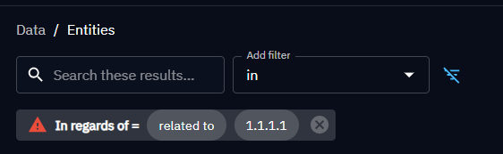

# Filter knowledge

In OpenCTI, you can filter data to target or view entities that have particular attributes.

## Filters usages

There are two types of filters that are used in many locations in the platform:

- in entities lists: to display only the entities matching the filters. If an export or a background task is generated, only the filtered data will be taken into account,
- in investigations and knowledge graphs: to display only the entities matching the filters,
- in dashboards: to create widget with only the entities matching the filters,
- in feeds, TAXII collections, triggers, streams, playbooks, background tasks: to process only the data or events matching the filters.

### Dynamic filters

Dynamic filters are not stored in the database, they enable to filter view in the UI, e.g. filters in entities list, investigations, knowledge graphs.

However, they are still persistent in the platform frontend side. The filters used in a view are saved as URL parameters, so you can save and share links of these filtered views.

Also, your web browser saves in local storage the filters that you are setting in various places of the platform, allowing to retrieve them when you come back to the same view. You can then keep working from where you left of.


<a id="stored-filter-section"></a>
### Stored filters

Stored filters are attributes of an entity, and are therefore stored in the database. They are stored as an attribute in the object itself, e.g. filters in dashboards, feeds, TAXII collections, triggers, streams, playbooks.


## Create a filter

To create a filter, add every key you need using the 'Add filter' select box. It will give you the possible attributes on which you can filter in the current view.

A grey box appears and allows to select:

1. the operator to use, and
2. the values to compare (if the operator is not "empty" or "not_empty").

You can add as many filters as you want, even use the same key twice with different operators and values.

The boolean modes (and/or) are either **global** (between every attribute filters) or **local** (between values inside a filter). Both can be switched with a single click, changing the logic of your filtering.


## Filters format

Since OpenCTI 5.12, the OpenCTI platform uses a new filter format called `FilterGroup`. The `FilterGroup` model enables to do complex filters imbrication with different boolean operators, which extends greatly the filtering capabilities in every part of the platform.

### Structure

The new format used internally by OpenCTI and exposed through its API, can be described as below:

```ts
// filter formats in OpenCTI >= 5.12

type FilterGroup = {
  mode: FilterMode // 'and' | 'or'
  filters: Filter[]
  filterGroups: FilterGroup[] // recursive definition
}

type Filter  = {
  key: string[] // or single string (input coercion)
  values: any[] // string[] except for the key 'regardingOf'
  operator: FilterOperator // 'eq' | 'not_eq' | 'gt' ... and more
  mode: FilterMode // 'and' | 'or',
}
```

#### Properties

In a given filter group, the `mode` (`and` or `or`) represents the boolean operation between the different `filters` and `filterGroups` arrays. The `filters` and `filterGroups` arrays are composed of objects of type Filter and FilterGroup.

The `Filter` has 4 properties:

- a `key`, representing the kind of data we want to target (example: `objectLabel` to filter on labels or `createdBy` to filter on the author),
- an array of `values`, representing the values we want to compare to,
- an `operator` representing the operation we want to apply between the `key` and the `values`,
- a `mode` (`and` or `or`) to apply between the values if there are several ones.

!!! note "Always use single-key filters"

    Multi-key filters are not supported across the platform and are reserved to specific, internal cases.


#### Operators

The available operators are:

| Value           | Meaning               | Limited to            |
|-----------------|-----------------------|-----------------------|
| eq              | equal                 |                       |
| not_eq          | different             |                       |
| nil             | empty / no value      |                       |
| not_nil         | non-empty / any value |                       |
| gt              | greater than          | numbers and dates     |
| gte             | greater than or equal | numbers and dates     |
| lt              | lower than            | numbers and dates     |
| lte             | lower than or equal   | numbers and dates     |
| within          | in a datetime range   | dates                 |
| starts_with     | starts with           | short string          |
| not_starts_with | doesn't start with    | short string          |
| ends_with       | ends with             | short string          |
| not_ends_with   | doesn't end with      | short string          |
| contains        | contains exactly      | short string          |
| not_contains    | doesn't contain       | short string          |
| search          | have occurences       | short and long string |

Precisions:

- The operators `nil` and `not_nil` don't require anything inside `values` (you should provide an empty array).

```ts
// Example: label is empty
filters = {
    mode: 'and',
    filters: [{
        key: 'objectLabel',
        values: [],
        operator: 'nil',
    }],
    filterGroups: [],
};
```

- There is a small difference between `search` and `contains`. `search` finds any occurrence of specified words regardless of their order, while `contains` specifically looks for the exact sequence of words you provide.

```ts
// Example: contains 'my test'
filters = {
    mode: 'and',
    filters: [{
        key: 'contains',
        values: ['my test'],
        operator: 'eq',
        mode: 'or',
    }],
    filterGroups: [],
};
```

- With the `within` operator you should provide exactly 2 strings in `values`: the 'from' and 'to' of the datetime range. The values can be either a datetime in the ISO 8601 format (and UTC timezone), either a relative date expression in date math format.

```ts
// Example: Reports with publication date within the last year
filters = {
    mode: 'and',
    filters: [
      {
        key: 'entity_type',
        values: ['Report'],
        operator: 'eq',
      },
      {
        key: 'published',
        values: ['now-1y', 'now'],
        operator: 'within',
      }
    ],
    filterGroups: [],
};
```

- If you use operators of comparisons (`gt`, `gte`, `lt`, `lte`), the values should be strings representing

  - a number for filters of type number,
  - a date in the ISO 8601 format (and UTC timezone) or a relative date expression in date math format for date filters.

```ts
// Example: confidence > 50
filters = {
    mode: 'and',
    filters: [
      {
        key: 'confidence',
        values: ['50'],
        operator: 'gt',
      },
    ],
    filterGroups: [],
};
```

```ts
// Example: publication date after January 1st 2020
filters = {
    mode: 'and',
    filters: [
      {
        key: 'published',
        values: ['2020-01-01T00:00:00Z'],
        operator: 'gt',
      },
    ],
    filterGroups: [],
};
```

```ts
// Example: platform creation date in the last 24 hours
filters = {
    mode: 'and',
    filters: [
      {
        key: 'created_at',
        values: ['now-24h'],
        operator: 'gt',
      },
    ],
    filterGroups: [],
};
```

#### Examples

**entity type = 'Report'**

```ts
filters = {
    mode: 'and',
    filters: [{
        key: 'entity_type',
        values: ['Report'],
        operator: 'eq',
        mode: 'or', // useless here because 'values' contains only one value
    }],
    filterGroups: [],
};
```

**(entity type = 'Report') AND (label = 'label1' OR 'label2')**

```ts
filters = {
    mode: 'and',
    filters: [
        {
            key: 'entity_type',
            values: ['Report'],
            operator: 'eq',
            mode: 'or',
        },
        {
            key: 'objectLabel',
            values: ['label1', 'label2'],
            operator: 'eq',
            mode: 'or',
        }
    ],
    filterGroups: [],
};
```

**(entity type = 'Report') AND (confidence > 50 OR marking is empty)**

```ts
filters = {
    mode: 'and',
    filters: [
        {
            key: 'entity_type',
            values: ['Report'],
            operator: 'eq',
            mode: 'or',
        }
    ],
    filterGroups: [
        {
            mode: 'or',
            filters: [
                {
                    key: 'confidence',
                    values: ['50'],
                    operator: 'gt',
                    mode: 'or',
                },
                {
                    key: 'objectMarking',
                    values: [],
                    operator: 'nil',
                    mode: 'or',
                },
            ],
            filterGroups: [],
        }
    ],
};
```

### Keys

#### Filter keys validation

Only a specific set of key can be used in the filters.

Automatic key checking prevents typing error when constructing filters via the API. If a user write an unhandled key (`object-label` instead of `objectLabel` for instance), the API will return an error instead of an empty list. Doing so, we make sure the platform do not provide misleading results.

#### Allowed filter keys for elastic filters

Query filters are used in a query fetching objects in the database. It concerns:

- dynamic filters (filtering a list of entities),
- some stored filters: filters of feeds, taxi collections and dashboard widgets.

The available filter keys for query filters are:

- the attributes registered in the schema definition (like 'published', 'name', 'confidence'...),
- the relations input name (like 'objectLabel', 'externalReferences'...),
- some special filter keys allowed in addition and that have a special behavior.

Here are some of the most useful keys as example. NB: X refers here to the filtered entities.

* ``objectLabel``: label applied on X,
* ``objectMarking``: marking applied on X,
* ``createdBy``: author of X,
* ``creator_id``: technical creator of X,
* ``created_at``: date of creation of X in the platform,
* ``confidence``: confidence of X,
* ``entity_type``: entity type of X ('Report', 'Stix-Cyber-Observable', ...),

Here are some of the most useful special filter keys:

* ``sightedBy``: entities to which X is linked via a STIX sighting relationship,
* ``workflow_id``: status id of the entities, or status template id of the status of the entities,
* ``representative``: representation of an entity (name for reports, value for some observables, composition of the source and target names for a relationship...),
* ``connectedToId``: the listened instances for an instance trigger.
* ``ids``: match any of the entity id, internal_id, standard_id or stix_ids
* ``computed_reliability``: reliability, or reliability of the author if no reliability
* ``source_reliability``: reliability of the author
* ``alias``: target both 'aliases' and 'x_opencti_aliases' attributes
* ``regardingOf``: exist relationship of the given relationship types for the given entities, see section below about this key

For some keys, negative equality filtering is not supported yet (`not_eq` operator). For instance, it is the case for:

- ``fromId`` (the instance in the "from" of a relationship)
- ``fromTypes`` (the entity type in the "from" of a relationship)
- ``toId`` (the instance in the "to" of a relationship)
- ``toTypes`` (the entity type in the "to" of a relationship)

#### The `regardingOf` filter key

The ``regardingOf`` filter key, displayed as `in regards of` in the UI, has a special format and enables to target the entities having a relationship of a certain type with certain entities.

Here is an example of filter to fetch the entities related to the entity X, regardless of the side of the relationship:

```ts
// Example: entities having a relationship of type 'related-to' with the entity X
filters = {
  mode: 'and',
  filters: [
    {
      key: 'regardingOf',
      values: [
        { key: 'id', values: ['id-of-X'] },
        { key: 'relationship_type', values: ['related-to'] },
      ],
    },
  ],
  filterGroups: [],
};
```


!!! warning "This filter may exclude some results for technical reasons"

    This filter is based on denormalized information for relationships.
    In a given entity, we directly store the id of the entities with which the entity has a relationship. 
    This significatively improves query speed.
    
    However, this approach might lead to ever-growing entities in database, with hundreds of thousands of ids stored in a given entity. 
    Take for example a very active Intrusion Set, related to thousands of observables. 
    The corresponding denormalization data in the Intrusion Set would represent a significant overhead, leading to dramatical performance drop when manipulating this object.
    For performance reasons, the denormalized information is thus not stored in the source entity for some relationships involving high data volumes.
    
    This impacts the ``regardingOf`` filter, that will only look at the denormalized data in search of exiting relationships. 
    The following relationships will not be detected: 
 
    - the relationships of type ``related_to`` with an ``Observable`` as source type,

        Example: given the relationship "Winscp.rnd (file observable) related to APT41 (intrusion set)" present in the platform

        APT41 would not be returned when using filter "In regards of" related to Winscp.rnd

        Winscp.rnd would be returned when using filter "In regards of" related to APT41

    - the relationships of type ``located_at`` with an ``Ipv4/Ipv6 Address`` or a ``City`` as source type, and a ``Region`` or ``Country`` as target type,

        Example: given the relationship "IP 1.1.1.1 (observable) located in France (Country)" present in the platform

        France would not be returned when using filter "In regard of" located at 1.1.1.1

        1.1.1.1 would be returned when using filter "In regard of" located at France


If a values combination may not return all the results because one of the above relationships is involved, a warning icon is displayed before the filter icon :




#### Limited support in stream events filtering

Filters that are run against the event stream are not using the complete schema definition in terms of filtering keys.

This concerns:

- Live streams,
- Triggers,
- Playbooks.

For filters used in this context, only some keys are supported for the moment:

- ``entity_type``
- ``workflow_id``
- ``confidence``
- ``objectAssignee``
- ``objects``
- ``objectLabel``
- ``objectMarking``
- ``creator_id``
- ``createdBy``
- ``indicator_types``
- ``pattern_type``
- ``report_types``
- ``response_types``
- ``information_types``
- ``takedown_types``
- ``note_types``
- ``incident_type``
- ``x_opencti_score``
- ``x_opencti_detection``
- ``x_opencti_main_observable_type``
- ``priority``
- ``severity``
- ``revoked``
- ``connectedToId`` (for the instance triggers)
- ``fromId`` (the instance in the "from" of a relationship)
- ``fromTypes`` (the entity type in the "from" of a relationship)
- ``toId`` (the instance in the "to" of a relationship)
- ``toTypes`` (the entity type in the "to" of a relationship)
- ``representative``
- ``x_opencti_cisa_kev``
- ``x_opencti_epss_score``
- ``x_opencti_epss_percentile``
- ``x_opencti_cvss_base_score``
- ``x_opencti_cvss_base_severity``