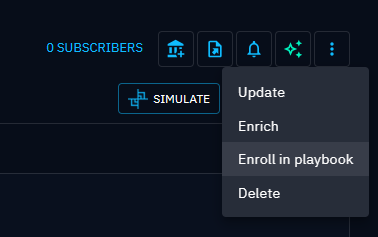

# Playbooks Automation

!!! tip "Enterprise edition"

    Playbooks automation is available under the "OpenCTI Enterprise Edition" license. Please read the [dedicated page](../administration/enterprise.md) to have all information.

OpenCTI playbooks are flexible automation scenarios that can be fully customized and enabled by platform administrators to enrich, filter and modify the data created or updated in the platform.

Playbook automation is accessible in the user interface under Data > Processing > Automation.

!!! note "Right needed"

    You need the "Manage Playbooks" [capability](../administration/users.md) to use the Playbooks automation, because you will be able to manipulate data simple users cannot access.

You will then be able to:

- add labels depending on enrichment results to be used in threat intelligence-driven detection feeds,
- create reports and cases based on various criteria,
- trigger enrichments or webhooks in given conditions,
- modify attributes such as first_seen and last_seen based on other pieces of knowledge,
- etc.

## Playbook philosophy

Consider Playbook as a STIX 2.1 bundle pipeline.

Initiating with a component listening to a data stream, each subsequent component in the playbook processes a received STIX bundle. These components have the ability to modify the bundle and subsequently transmit the altered result to connected components.

In this paradigm, components can send out the STIX 2.1 bundle to multiple components, enabling the development of multiple branches within your playbook.

A well-designed playbook end with a component executing an action based on the processed information. For instance, this may involve writing the STIX 2.1 bundle in a data stream.

!!! note "Validate ingestion"

    The STIX bundle processed by the playbook won't be written in the platform without specifying it using the appropriate component, i.e. "Send for ingestion".

## Create a playbook

### Manual creation

It is possible to create as many playbooks as needed, which run independently. You can give a name and description to each playbook.

The first step to define in the playbook is your event source.
To do so, click on the grey rectangle in the center of the workspace and select the input component that suits your needs.

### Duplicate a playbook

It is possible to duplicate a playbook, to easily replicate a playbook. You can do it directly by cliking on the burger menu (the 3 dots) at the end of the row and click on duplicate, or directly when you're inside a playbook.

### Import/Export a playbook

#### Export a playbook

If you need to share a playbook with a colleague that is not on the same platform than you (or if you need to troubleshoot a playbook issue), you can now export your playbook directly: by cliking on the burger menu (the 3 dots) at the end of the row and click on duplicate, or directly when you're inside a playbook.

#### Import a playbook

You can import a playbook in OpenCTI coming either from your own platform or another platform. Simply go to playbooks, click on import & select the playbook you want to import.

!!! warning "Verify your playbook"

    Imported playbooks may contain data that does not exist in your platform. For instance, the initial playbook could have listened on a specific label & applied a specific marking that does not exist in your platform. Therefore, when you import a playbook, always check all the boxes/steps to ensure your playbook will run smoothly.

**Applicable steps & data to verify:**

- Listen knowledge events/ Manual enrollment / Query knowledge on regular basis / Match knowledge / Reduce knowledge / Manipulate knowledge
  - Verify if any of the following data is correctly defined in your playbook, otherwise create it in your platform
    - Taxonomies: any not existing taxonomy will be shown as deleted (Labels, vocabularies...)
    - Specific instances (entity/observable): If your playbook was listening on a specific instance, verify that the instance exists in your platform
    - Marking: verify that the marking you're listening to exists in your platform
    - Author: verify that the identities in your platform exist
    - Creators: verify that you have existing users in your platform
- Enrich through connector
  - Verify if any of the following data is correctly define in your playbook, otherwise create it in your platform
    - Connector exists in your platform
- Container wrapper
  - Verify if any of the following data is correctly define in your playbook, otherwise create it in your platform
    - Task template exists in your platform.
- Send to notifier
  - Verify that the notifier exists in your platform
  - Verify that the target exsits in your platform

### Listen knowledge events

With this event source, the playbook will be triggered on any knowledge event (create, update or delete) that matches the selected filters.
Note that you are limited to a subset of filters available for stream events that contain STIX data objects.

### Listen PIR events

This event source is focused on listening to PIR events. It allows you to select the PIRs you want to monitor and choose the specific cases in which the playbook will be triggered using the corresponding toggles:

- A new entity becomes part of a selected PIR
- An entity is no longer part of a selected PIR
- An entity from a selected PIR is updated
- An entity is linked to an other entity that is part of a selected PIR

> Note: By default, if no PIR is selected, all available PIRs will be applied.

The PIR Score filter allows you to monitor events only for entities with a PIR score matching at least one of your selected PIRs.

#### A new entity is added to a selected PIR

Enable this toggle to trigger the playbook when an entity becomes of interest for at least one of the selected PIRs.

> Note: By default, if no PIR is selected, all available PIRs will be applied.

#### An entity is no longer part of a selected PIR

This toggle triggers the playbook when an entity is no longer part of at least one selected PIR.

> Note: By default, if no PIR is selected, all available PIRs will be applied.

#### An entity from a selected PIR is updated

This triggers the playbook when an entity that is part of at least one selected PIR is updated.

> Note: By default, if no PIR is selected, all available PIRs will be applied.

#### An entity is linked to an other entity that is part of a selected PIR

This toggle triggers the playbook when a new relationship is created between an entity and an other one that is part of at least one selected PIR.

> Note: By default, if no PIR is selected, all available PIRs will be applied.

### Query knowledge on a regular basis

With such event source, the playbook will query knowledge on a hourly / daily / weekly / monthly basis, according to filters you might have set.

If you check the option "Only last modified entities after the last run', then the playbook will exclude from each run the entities that have not changed since last run.

### Available for manual enrollment / trigger

Use this event source for setting up a playbook that will be triggered manually on specific entities.
You can configure filters in the component so that this playbook will be suggested for certain entities during the manual enrollment.
For more details about manual enrollment, see dedicated section below.

## Design your workflow

Then you have flexible choices for the next steps to:

- filter the initial knowledge,
- enrich data using external sources and internal rules,
- modify entities and relationships by applying patches,
- write the data, send notifications,
- etc.

... using the various playbook components at your disposal.

By clicking the burger button of a component, you can replace it by another one.

By clicking on the arrow icon in the bottom right corner of a component, you can develop a new branch at the same level.

By clicking the "+" button on a link between components, you can insert a component between the two.

Do not forget to start your Playbook when ready, with the Start option of the burger button placed near the name of your Playbook.

## Components of playbooks

### Log data in standard output

Will write the received STIX 2.1 bundle in platform logs with configurable log level and then send out the STIX 2.1 bundle unmodified.

### Send for ingestion

Will pass the STIX 2.1 bundle to be written in the data stream. This component has no output and should end a branch of your playbook.

### Filter Knowledge

Will allow you to define filter and apply it to the received STIX 2.1 bundle. The component has 2 output, one for data matching the filter and one for the remainder.

By default, filtering is applied to entities having triggered the playbook. You can toggle the corresponding option to apply it to all elements in the bundle (elements that might result from enrichment for example).

### Enrich through connector

Will send the received STIX 2.1 bundle to the stated enrichment connector and send out the modified bundle.

#### Specificities of the component

**Step will fail if a single entity does not match the connector scope**
Entities that are passed to this stage must be compatible with the enrichment connector being used, as otherwise the playbook may stop at this stage. 
The best approach is to use a first playbook that will **flag your data, by applying a specific label through manipulate knowledge step** and have another playbook listening to entities/observables being created or edited with this specific label to apply the correct enrichment connector through a decision tree. The *Reduce Knowledge* component can be used to filter out incompatible entities from being passed to this stage.

**Step will fail if an observable triggered by the enrichment is not found**
If the playbook stops from time to time at this step, it might be because the observable (or entity) is not found in the third-party system in charge of enriching the observable (or entity).

### Manipulate knowledge

Will add, replace, or remove compatible attributes of the entities contained in the received STIX 2.1 bundle and send out the modified bundle.

By default, modification is applied to entities having triggered the playbook. You can toggle the corresponding option to apply it to all elements in the bundle (elements that might result from enrichment for example).

#### Specificities of the component

**Remove & replace operations:**
These operations will only remove and & replace data that has been added in the context of this playbook. This step cannot be used to modify attributes of an entity (or observable) that has already been written in your platform. For instance, if an entity is ingested with a TLP:RED marking and a specific label, and your playbook listens to any entity created with this specific label, if you have a step to remove TLP:RED marking within your playbook, this step will not be executed because the TLP:RED marking would already be written in your platform.

**Routes:**

- Unmodified: because of the above reason, if none of your entities contained in your STIX bundle have been modified, then the STIX bundle will follow the **unmodified** route.
- Out: if at least one of the entity or observable of your STIX bundle has been successfully modified by the manipulate knowledge step, then the STIX bundle will follow the **Out** route.

### Container wrapper

Will modify the received STIX 2.1 bundle to include the entities into an container of the type you configured. 
By default, wrapping is applied to entities having triggered the playbook. You can toggle the corresponding option to apply it to all elements in the bundle (elements that might result from enrichment for example).

#### Specificities of the component

**Case Templates**
It is possible to add a case template to the container wrapper step. If you select a Case in the "container type", then the case template field will be enabled, allowing you to create a case with some tasks associated.

**Create a new container at each run**
You can decide whether you want to create a container each time this step is triggered: by default, this is disabled, so that you can consolidate information within the same container if some update occurs.

**Specific situation: wrap an incident into a case**
When the primary entity you listen to is an incident & then use the "Container Wrapper" step to create a case out of your incident, by default, your case will reuse some of the attributes of your incident:

- Author
- Labels
- Assignee
- Participant
- Title
- Marking
- Severity (only if the severity value of the incident exists in the severity value of the case. Make sure it exists by editing your openVocab within the [taxonomy page](https://docs.opencti.io/6.7.X/reference/taxonomy/) )

### Share with organizations

Will share every entity in the received STIX 2.1 bundle with Organizations you configured. Your platform needs to have declared a platform main organization in Settings/Parameters.

### Apply predefined rule

Will apply a complex automation built-in rule. This kind of rule might impact performance. Current rules are:

- First/Last seen computing extension from report publication date: will populate first seen and last seen date of entities contained in the report based on its publication date,
- Resolve indicators based on observables (add in bundle): will retrieve all indicators linked to the bundle's observables from the database,
- Resolve observables an indicator is based on (add in bundle): retrieve all observables linked to the bundle's indicator from the database,
- Resolve container references (add in bundle): will add to the bundle all the relationships and entities the container contains (if the entity having triggered the playbook is not a container, the output of this component will be empty),
- Resolve neighbors relations and entities (add in bundle): will add to the bundle all relations of the entity having triggered the playbook, as well as all entities at the end of these relations, i.e. the "first neighbors" (if the entity is a container, the output of this component will be empty).
- Resolve containers containing the entity (add in bundle): will add to the bundle all the containers containing the entity or observable that triggered the playbook.

#### Specificities of the component

**It is not possible to chain two rules to apply a second rule on the result of the first one:**
For instance, the following operation will not work within a playbook: listen to a report creation, add everything within a bundle, then apply another rule to resolve neighbor relations and entities (add in bundle) of all entities & observables of the container. As a result, your playbook will stop there.

**Routes:**

- Unmodified: because of the above reason, if none of your entities or observables contained in your STIX bundle have been impacted by the rule, then the STIX bundle will follow will follow the **unmodified** route.
- Out: if at least one of the entity or observable of your STIX bundle has been successfully impacted by the rule, then the STIX bundle will follow the **Out** route.

### Send to notifier

Will generate a Notification each time a STIX 2.1 bundle is received. Note that Notifier ends a branch but does not save any changes. Best practice is to create a branch next to the notifier using the button on the bottom right of the Notifier Component and add the send for ingestion in the same output branch.

### Promote observable to indicator

Will generate indicator based on observables contained in the received STIX 2.1 bundle. 

By default, it is applied to entities having triggered the playbook. You can toggle the corresponding option to apply it to all observables in the bundle (e.g. observables that might result from predefined rule).

You can also add all indicators and relationships generated by this component in the entity having triggered the playbook, if this entity is a container.

#### Specifities of the component

**Routes:**

- Unmodified: if none of your observables have triggered an indicator creation, then the STIX bundle will follow the **unmodified** route.
- Out: if at least one of your observables of your STIX bundle has triggered an indicator creation, then the STIX bundle will follow the **Out** route.

### Extract observables from indicator  

Will extract observables based on indicators contained in the received STIX 2.1 bundle. 

By default, it is applied to entities having triggered the playbook. You can toggle the corresponding option to apply it to all indicators in the bundle (e.g. indicators that might result from enrichment.

You can also add all observables and relationships generated by this component in the entity having triggered the playbook, if this entity is a container.

#### Specifities of the component

**Routes:**

- Unmodified: if none of your indicators have triggered an observable creation, then the STIX bundle will follow the **unmodified** route.
- Out: if at least one of your indicators of your STIX bundle has triggered an observable creation, then the STIX bundle will follow the **Out** route.

### Reduce Knowledge

Will filter out any entities in the current stage that do not match the filter conditions in the stage. 

#### Specificities of the component

**Reduce will not work if the result of your reduce knowledge step is different from the entity triggering your playbook:**

If the result of the reduce knowledge ends up not matching the initial entity triggering yur playbook, then the reduce step will fail. As an example: 
With a first step listening on: entity type = IPV4 OR Report AND label = test. And a step that reduces knowledge based on Entity type = IPV4. You will get the following results:

- Test 1: edit a report that does not contain IPV4
  - Result: the playbook took the route "unmatched" (since no IP in the bundle, because triggering entity is the Report) 
- Test 2: edit a report that contains an IPV4
  - Result: the playbook took the route "unmatched" (since the entity triggering the playbook is the Report and not the IPV4)
- Test 3: edit an IPV4
  - Result: the playbook took the route "out" (since only the triggering entity is the IPV4)

 **Routes:**

- Unmatched: if the bundle does not match the reduce condition, then the stix bundle will follow the **unmatch** route. In this case, the playbook will act as the route "umatch" of the "match" component.
- Out: if your bundle is effectively reduced, then the stix bundle will follow the **Out** route.

### Match knowledge

It will allow you to continue only if some specific conditions are met.

#### Specificities of the component

**Routes:**

- No-match: if none of the entity/observable contained in the bundle passes the matching condition, then the STIX bundle will follow the **no-match** route.
- Out: if at least one of the entity/observable contained in the bundle passes the matching condition, then the STIX bundle will follow the **out** route.

## Enroll manually an entity into a playbook

You can enroll individual entities in playbooks by using the action "Enroll in playbook" from the entity details view.

This will open a drawer where you can choose the playbook you want to trigger on this entity.

In this list, you will find:

- active playbooks that have set an "Available for manual enrollment / trigger" event source
- active playbooks with "Listen knowledge events" event source which filters match the entity

## Monitor playbook activity

At the top right of the interface, you can access execution trace of your playbook and consult the raw data after every step of your playbook execution.

### Useful for troublshooting

- Fewer steps than the number of steps of your playbook: If your playbook contains, for instance, 5 steps and only 4 steps are shown, it means that the playbook stopped at the 4th step.
- Data created/ingested by the playbook does not contain the right modifications applied in the manipulate step: verify that your step is present, and that the operations you wanted to apply are well applied (you need to see the operation type, the field & the value)
- Use the different routes to help troubleshoot your playbook: if you're using multiple components that involves mutliple routes, it is sometimes useful to test your playbook by adding a "manipulate knowledge" step to add a label for instance, to understand the route your bundle is taking if you feel that the data created by your playbook is not the one you expect.

