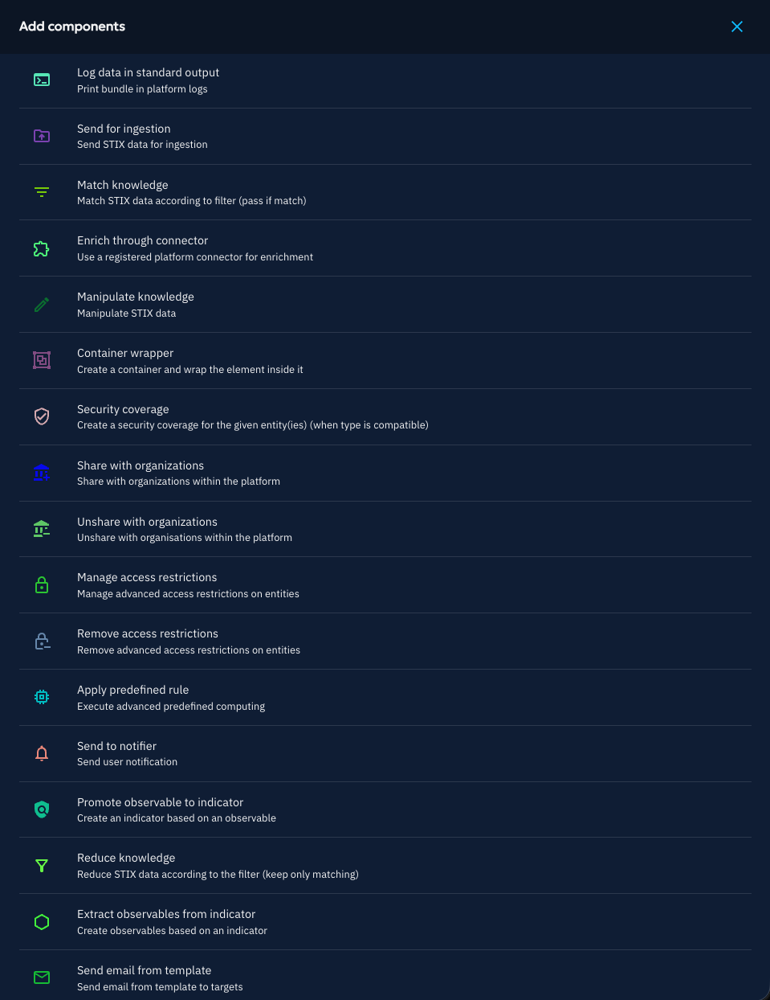
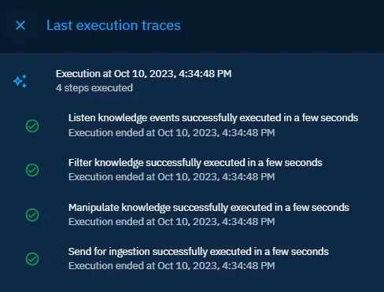

# Playbooks Automation

!!! tip "Enterprise edition"

    Playbooks automation is available under the "Filigran Entreprise Edition" license.

    [Please read the dedicated page to have all information](../administration/enterprise.md)

OpenCTI playbooks are flexible automation scenarios which can be fully customized and enabled by platform administrators to enrich, filter and modify the data created or updated in the platform. 

Playbook automation is accessible in the user interface under Data/Processing/Playbooks.

You need the "Manage credentials" [capability](../administration/users.md) to use the Playbooks automation, because you will be able to manipulate data simple users cannot access.

You will then be able to:

* add labels depending on enrichment results to be used in threat intelligence driven detection feeds ;
* create reports and cases based on various criteria ;
* trigger enrichments or webhooks in given conditions ;
* modify attributes such as first_seen and last_seen based on other pieces of knowledge ;
* etc.

### playbook philosophy

Consider Playbook as STIX 2.1 bundle pipeline. 

A playbook begins with a component listening to a data stream.

Then each component of the playbook will receive a STIX bundle and then:
* modify it and pass the result to connected components

Components can send out the STIX 2.1 bundle to multiple components, allowing to develop multiple branches in your playbook.

The playbook should end with a component making an action based on this, for example writing the STIX 2.1 bundle in a data stream.

### Create a Playbook

It is possible to create as many playbooks as needed which are running independently. You can give a name and description to each playbook.

The first step to define in the playbook is the “triggering event”, which can be any knowledge event (create, update or delete) with customizable filters. To do so, click on the grey rectangle in the center of the workspace and choose the component to "listen knowledge events". Configure it with adequate filters. You can use same filters as in other part of the platform.

Then you have flexible choices for the next steps to:

* filter the initial knowledge ;
* enrich data using external sources and internal rules ;
* modify entities and relationships by applying patches ;
* write the data, send notifications, etc.

Do not forget to start your Playbook when ready, with the Start option of the burger button placed near the name of your Playbook.

By clicking the burger button of a component, you can replace it by another one.

By clicking on the arrow icon on the bottom right corner of a component, you can develop a new branch at the same level.

By clicking the "+" button on a link between components, you can insert a component between the two.

### Components of playbooks

#### Log data in standard output
Will write the received STIX 2.1 bundle in platform logs with configurable log level and then send out the STIX 2.1 bundle unmodified.

#### Send for ingestion
Will pass the STIX 2.1 bundle to be written in the data stream. This component has no output and should end a branch of your playbook.

#### Filter Knowledge
Will allow you to define filter and apply it to the received STIX 2.1 bundle. The component has 2 output, one for data matching the filter and one for the remainder.
By default, filtering is applied to entities having triggered the playbook. You can toggle the corresponding option to apply it to all elements in the bundle (elements that might result from enrichment for example).

#### Enrich through connector
Will send the received STIX 2.1 bundle to a compatible enrichement connector and send out the modifed bundle.

#### Manipulate Knwoledge
Will add, replace or remove compatible attribute of the entities contains in the received STIX 2.1 bundle and send out the modified bundle.
By default, modification is applied to entities having triggered the playbook. You can toggle the corresponding option to apply it to all elements in the bundle (elements that might result from enrichment for example).

#### Container wrapper
Will modify the received STIX 2.1 bundle to include the entities into an container of the type you configured. 
By default, wrapping is applied to entities having triggered the playbook. You can toggle the corresponding option to apply it to all elements in the bundle (elements that might result from enrichment for example).

#### Manage sharing with organizations
Will share every entity in the received STIX 2.1 bundle with Organizations you configured. Your platform need to have declare a platform main organization in Settings/Parameters.

#### Apply predefined rule
Will apply a complex automation built-in rule. This kind of rule might impact performance. Current rules are:
* First/Last seen computing extension from report publication date: will populate first seen and last seen date of entities contained in the report based on its publication date.
* Resolve indicators based on observables (add in bundle)
* Resolve observables an indicator is based on (add in bundle)
* Resolve container references (add in bundle)

#### Send to notifier
Will generate a Notification each time a STIX 2.1 bundle is received.

#### Promote observable to indicator
Will generate indicator based on observables contained in the received STIX 2.1 bundle. 
By default, it is applied to entities having triggered the playbook. You can toggle the corresponding option to apply it to all observables in the bundle (observables that might result from enrichment for example).

#### Extract observables from indicator   
Will extract observables based on indicators contained in the received STIX 2.1 bundle. 
By default, it is applied to entities having triggered the playbook. You can toggle the corresponding option to apply it to all indicators in the bundle (indicators that might result from enrichment for example).

#### Reduce Knowledge
Will elagate the received STIX 2.1 bundle based on the configured filter.

### Monitor playbook activity

At the top right of the interface, you can access execution trace of your playbook and consult the raw data after every step of your playbook execution.

