# Case Autopilot

!!! tip "Enterprise edition"

    Case Autopilot is available under the "OpenCTI Enterprise Edition" license. Please read the [dedicated page](../administration/enterprise.md) for full details.

Case Autopilot investigates an incident, a case, an indicator or an observable for you. It reads what the case holds, checks what OpenCTI already knows, enriches through the enrichment connectors of your platform, follows the leads, weighs the competing hypotheses and writes a cited report. Everything it writes goes to a [draft](draftWorkspaces.md) that an analyst reviews and approves: nothing reaches your knowledge graph without that approval, unless the investigation policy allows it for low-risk objects.

Case Autopilot is the OpenCTI face of the XTM One investigation engine (Deep Investigation). OpenCTI keeps the investigation run, its policy, its budget, its draft, its approvals and every write; XTM One plans the investigation and queries its sources. XTM One never calls a vendor directly: every enrichment goes through the OpenCTI connectors, so markings, quotas and connector settings apply. See [How Case Autopilot works with XTM One](#how-case-autopilot-works-with-xtm-one).

## Requirements

- An Enterprise Edition license.
- XTM One connected to the platform (see the [XTM Suite configuration](../deployment/configuration.md#xtm-suite)), in a version that provides the investigation engine. When XTM One is not connected or does not run investigations, the Autopilot tab and the launch dialog say so and no investigation starts.
- To start or continue an investigation: the capability to update knowledge, and the capability to enrich knowledge when the policy of the investigation runs enrichments. Without the latter, the launch dialog explains why a policy with enrichments cannot be picked. An investigation started by a playbook or for a new request for information acts as the identity configured there, which needs the same capabilities. An investigation you start yourself acts as you, even when its policy names an identity for automatic investigations: it never reads more than you can.
- To manage investigation policies: the capability to manage customization. The users who can start an investigation see the name, description and allowed actions of each policy to pick one; its connectors, automatic approvals and identity are shown only to the users who manage customization.
- The investigated entity and its case must not be restricted to authorized members (see [Entities restricted to authorized members](#entities-restricted-to-authorized-members)).

## Run Case Autopilot

Open the **Ask AI** menu in the header of an incident, a case (incident response, request for information, request for takedown), an indicator or an observable, and choose **Run Case Autopilot**. On a case that was never investigated, the Autopilot tab offers the same action.

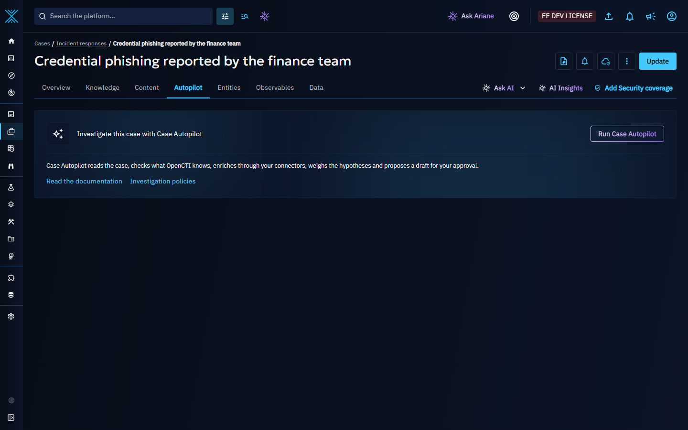

In the dialog:

- pick the **investigation policy** (the default policy is preselected);
- for an indicator or an observable, choose the **case of the investigation**: an existing case (the cases that contain the entity are listed first), or a new incident response case created in the investigation draft, when the investigation policy allows creating a case. The results of an investigation always live in the Autopilot tab of a case;
- choose whether the investigation graph opens when the investigation completes.

The dialog also lists the previous investigations of the entity, each with its state and when it started.

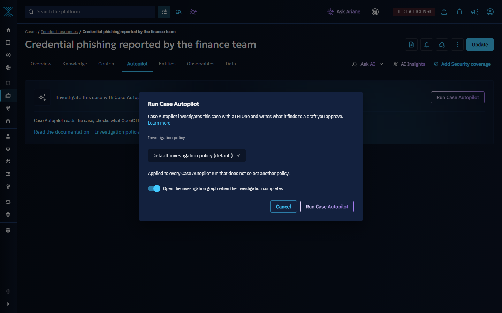

When the selected policy runs enrichments and your role does not allow enriching knowledge, the dialog says so under the policy and the launch waits until you pick a policy without enrichment.

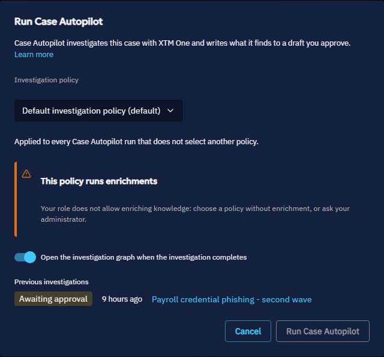

For an indicator or an observable, when you choose to create a new case and the selected policy does not allow creating a case, the dialog says so under the case choice and the launch waits until you select an existing case or another policy.

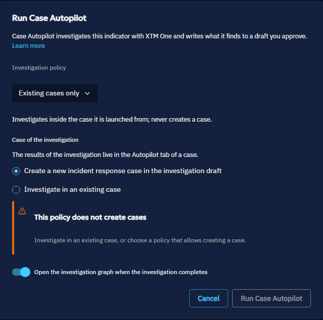

The overview of an indicator or an observable shows a compact **Latest investigation** link with the state of its latest investigation; it opens the Autopilot tab of the case of that investigation.

## The Autopilot tab

Incidents and cases have an **Autopilot** tab, after the Content tab. When several investigations exist, a selector lists them, newest first ("12 min ago - Awaiting approval"); the latest one is open and updates live.

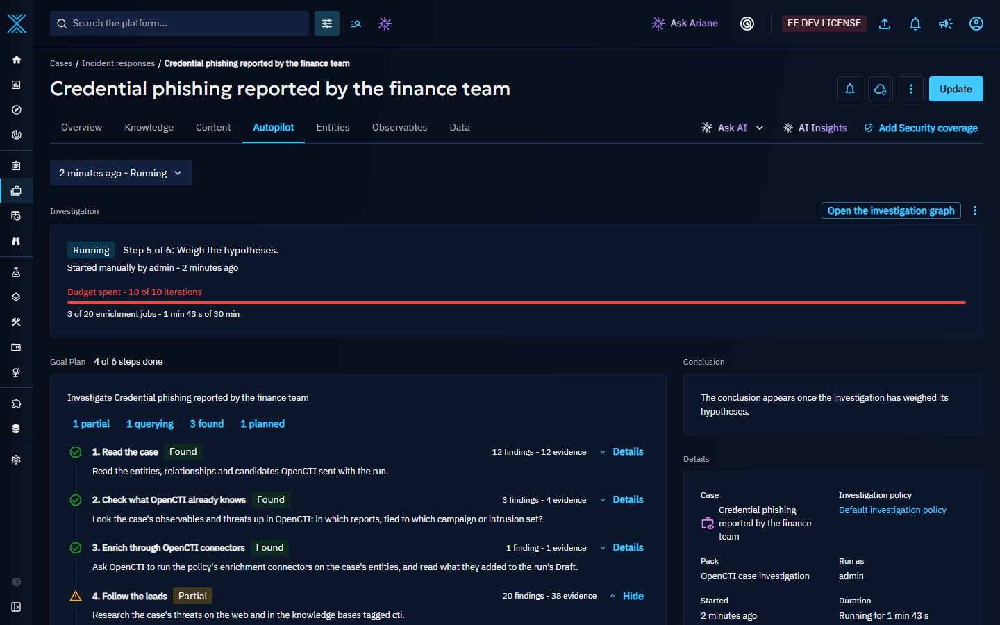

The tab shows, from top to bottom:

1. **Investigation**: the state of the investigation in one sentence ("Step 3 of 6: Enrich through OpenCTI connectors.", "12 changes are waiting for your review.", "Complete - 5 of 6 steps found evidence."), who or what started it and when, and the use of the budget: one bar for the iterations of the engine, then the enrichment jobs and the time. A spent budget is said in the caption ("Budget spent - 10 of 10 iterations"); the bar turns red only when the investigation failed. The primary action follows the state: **Review N changes** while the draft waits for approval, **Continue the investigation** when the engine stopped on its budget, **Open the report** once completed, **Retry** after a failure. The other actions (open the investigation graph, open the draft, cancel, delete) are under **More actions**; cancelling and deleting ask for a confirmation, and need the right to update knowledge (to delete it, for deleting). Once the approved changes are being written to the case, the investigation can no longer be cancelled: the header says so, and the investigation ends when every approved change is written. Deleting an investigation first finishes what stopping it left to do (the stop of its engine run in XTM One, and for an investigation stopped at an access boundary the deletion of its draft and investigation graph); while that cannot be done, the deletion is refused with the reason and can be tried again.
2. **Waiting for your approval**, right under the header whenever something waits for an analyst (see [Approvals](#approvals)).
3. **Goal plan**, beside a **Conclusion** card and a **Details** card on wide screens. The goal plan lists the actions of the investigation, "2 of 6 steps done", and a counter per state that filters the steps. Every action is expandable: its sources, the evidence each source found, and for the enrichment action the enrichment jobs with their entity, connector, state and duration. Each step has one of seven states: Planned step, Querying, Found, Nothing found, Partial, Failed, Not reached. Only a step that found something is a success. The **Conclusion** card shows the leading hypothesis with its confidence and the top recommendations; the **Details** card shows the case, the investigated entity, the policy, the pack, the identity the investigation acts as, when it started, how long it took and, once analysts decided, the analyst acceptance.
4. **Hypotheses**: an Analysis of Competing Hypotheses (ACH) matrix (see [Hypotheses](#hypotheses)).
5. **Recommendations**: the courses of action and tasks the investigation proposes, with their priority. Create a task or apply a course of action in one click; recommendations that change the severity, share, notify or close the case wait for an approval. Accept or reject each recommendation to give feedback.
6. **Evidence**: what the investigation cited - web pages, documents, tool results and OpenCTI objects - numbered like the citations of the report. OpenCTI objects that are still in the draft are marked as such. After a continuation, what earlier engine runs found is listed apart, without numbers.
7. **Report**: the cited report of the investigation and its numbered sources. The report is also written to the draft as a Report, with its numbered sources listed in the report text, so they carry the same markings and sharing as the report.

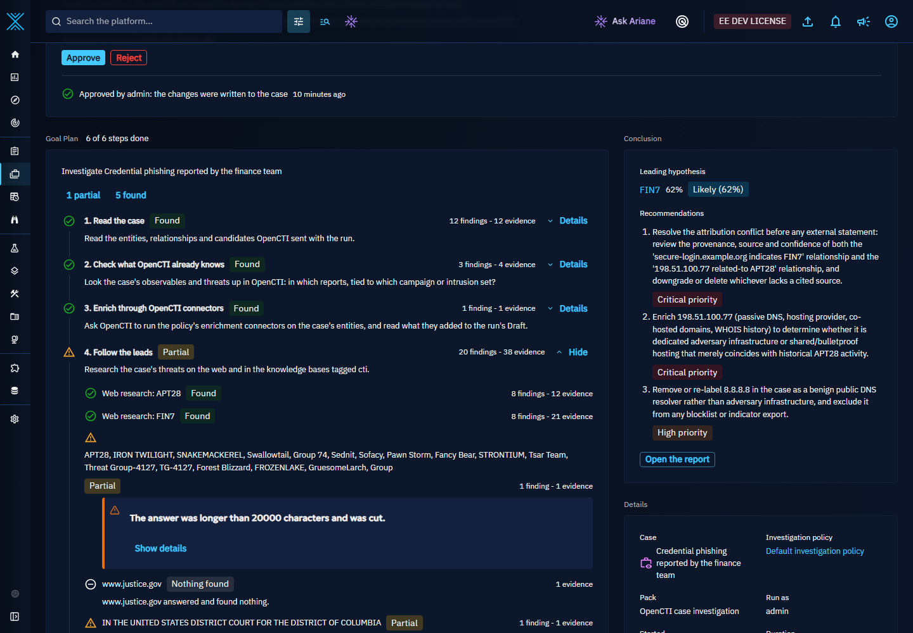

### When a step fails

A step that failed, found nothing, was cut or was never reached always says why and what to do next: "Web research: APT28 could not be queried." with **Run again**, "No enrichment connector of the policy accepts IPv4 address." with **Choose connectors in the policy**, "Stopped before this step: the budget of 10 iterations was used." with **Continue the investigation**, "No conclusion - 3 of 6 steps failed, too little evidence to weigh the hypotheses." with **Run again**. Every reason the engine reports has its own sentence; **Show details** gives the technical code for your administrator.

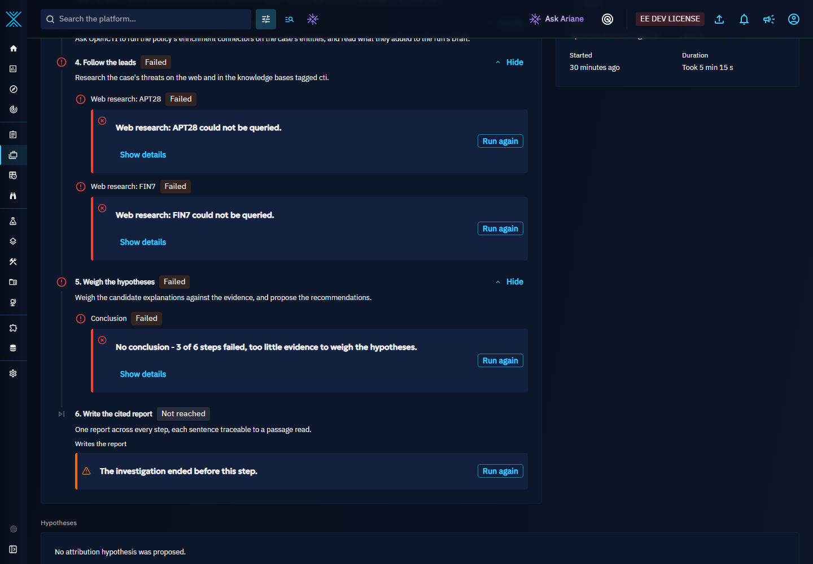

### Entities restricted to authorized members

An investigation carries the markings and the organization sharing of what it reads and cites, but not a member restriction. Case Autopilot therefore does not investigate an entity restricted to authorized members, and leaves the objects restricted to authorized members out of what it reads and cites.

Everything sent to the engine counts, as context or as the result of an enrichment, whether the engine cites it or not; an enrichment result linked to an entity the investigation may not read is not sent. The markings and the sharing it carries are those the investigated entity, its case, its context and the cited objects have now, not those they had when the draft of the investigation copied them: a marking added to one of them while the investigation runs applies to the investigation from its next update, and to what it writes in its draft.

When the investigated entity, its case, an object sent to the engine (as context or as an enrichment result, cited or not) or an object the engine cites becomes restricted to authorized members while the investigation runs (including while its approved draft is being validated) or waits for approval, or the identity of the investigation can no longer read the entity or its case (including when the account it runs as is deleted, locked or expired), the investigation stops before it records anything more: its engine run is stopped, what it had found (goal plan, evidence, hypotheses, recommendations with their approvals, summary and report) is withheld, the other approvals it was waiting for are rejected, its draft is deleted with what it wrote there and its investigation graph is deleted. From the moment the investigation stops, apart from users who bypass access restrictions, nobody can open or list them any more, even with a link saved earlier; both are then restricted the same way and deleted, nothing being deleted before that restriction succeeds, and if the restriction or the deletion fails, the investigation keeps the reference and Case Autopilot retries both, in that order, until the deletion succeeds. An investigation that fails for any other reason also rejects the approvals it was waiting for: nothing of an ended investigation can be approved any more, except the recommendations of a completed one.

What the investigation found is withheld as soon as the restriction applies, before the investigation stops, and also when the investigation had already ended: wherever it is shown (its tab, the latest investigation of a case, the list of investigations and the live updates of the tab), its name (which quotes the investigated entity), the references to its engine runs and the steps they ran, its findings, the analyst feedback on them and the reasons recorded with its approvals and enrichment requests are withheld, and no feedback, recommendation, approval, continuation or enrichment can act on them. The investigated entity and the case stay named only for a reader who can still read them. Cancelling or deleting the investigation remains possible. An investigation is never serialized as a STIX object (STIX exports, the refresh of an import workbench, playbooks, TAXII collections, streams): it is shown only through its own views, which apply these rules.

The same applies, for one user, when that user can no longer read the investigated entity, its case, an object sent to the engine (as context or as an enrichment result) or an object the investigation cites, for example after a marking was added to it or its sharing was narrowed once the investigation had read it: the investigation stays visible, its findings are withheld from that user only, and its sections say that an entity of the investigation is no longer accessible to them. Users who can still read every entity of the investigation see its findings as before.

When an entity became restricted to authorized members, the header of the investigation says what to do next: remove that entity from the case or ask an administrator for access, then **Retry**. The goal plan, the conclusion, the hypotheses, the recommendations and the evidence each say that their findings are withheld and why.

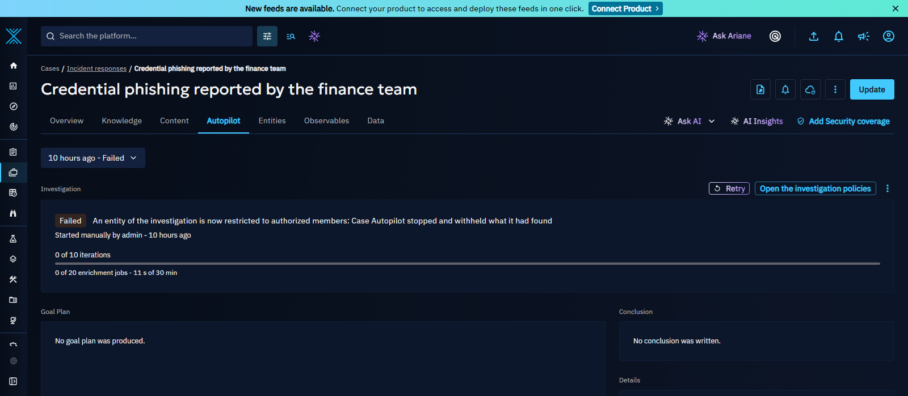

### Hypotheses

The engine proposes the candidates and links the evidence; OpenCTI scores them deterministically. Each evidence weighs by its category (infrastructure overlap, tooling, TTP overlap, victimology, temporal plausibility, source reliability, language and time zone), its reliability and how well it tells the hypotheses apart (high, medium or low diagnostic value, with the score in a tooltip). Each hypothesis gets a probability (an implicit "unknown actor" keeps part of it) and a confidence on a fixed estimative scale, from Remote to Almost certain; the leading one is marked **Leading**. A hypothesis that no evidence assessed shows **Not assessed**: its confidence is never invented. An attribution relationship is written to the draft only when the leading hypothesis reaches the minimum confidence of the policy. Accept or reject each hypothesis to give feedback.

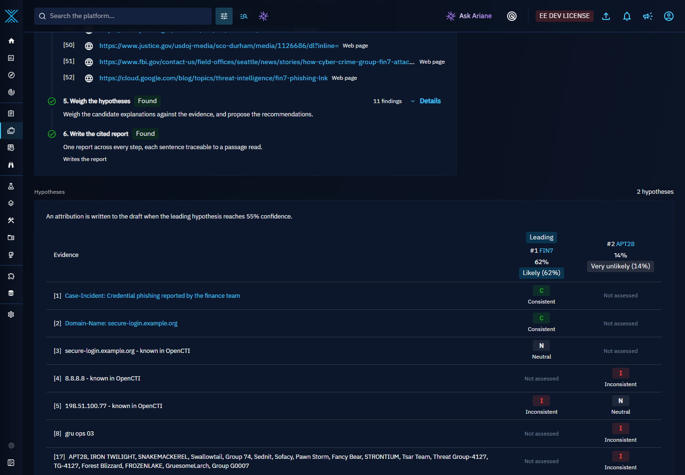

## Approvals

An investigation pauses and waits for an analyst when:

- the investigation draft is ready for review;
- an enrichment goes through a connector that the policy marks as needing an approval (paid or rate-limited services);
- a recommendation would change the severity of the incident, share knowledge, send a notification or close the case.

The **Waiting for your approval** card shows what each approval changes before you decide:

- for the draft, "Approve N changes to this case", a summary ("3 entities, 3 observables, 3 relationships, 3 containers") and the first changes with their operation (Create, Update, Delete), then **Show all N changes** and **Open the draft**;
- for an enrichment, "Run {connector} on {entity}", with **Approve once**, **Always approve {connector}** (approves every pending request of this connector in this investigation) and **Reject**;
- for a recommendation, what it changes and why.

**Review N changes** in the header moves to the first approval. A rejection takes an optional reason, which calibrates the next investigations of the platform. Once an analyst approved an enrichment the investigation held, **Continue the investigation** starts a new engine run on the same investigation, with the new knowledge.

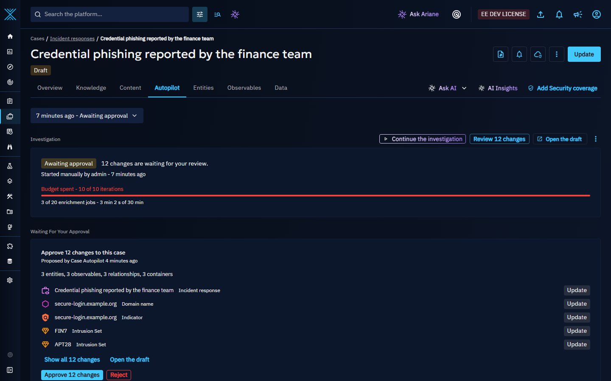

Once its draft is approved, by an analyst or automatically by the policy, the investigation completes only when the platform confirms that every approved change was written to the case. If the platform reports errors while writing them, or has not confirmed them after 30 minutes, the investigation ends as failed, the header says which and offers **Open the draft**: the draft keeps what was approved, read-only, so you can see what reached the case. The approvals still waiting when an investigation fails or stops are closed with it, and the Approvals card says so.

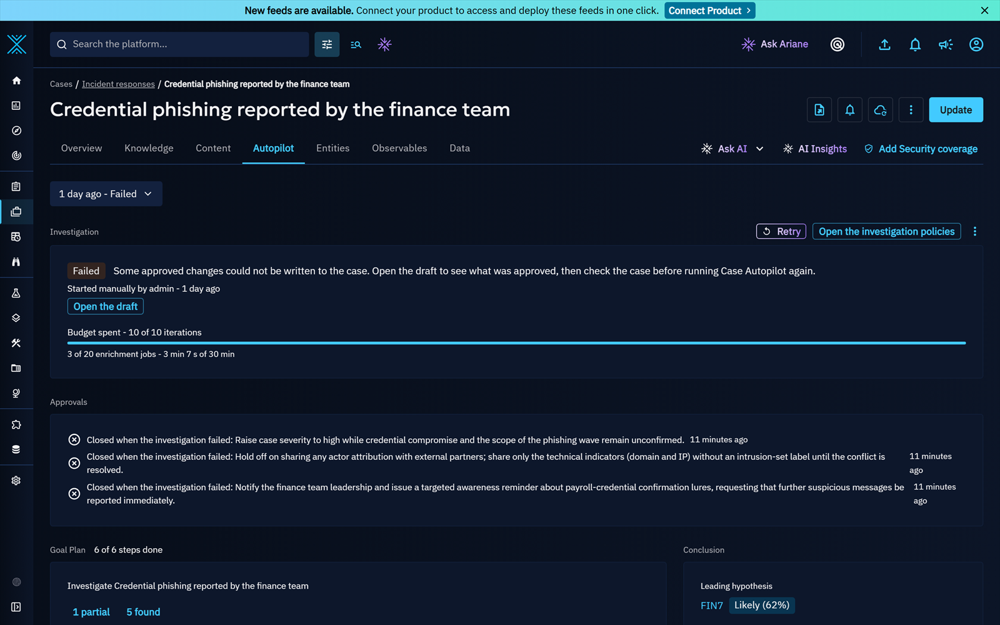

## Investigation policies

Investigation policies are managed in **Settings > Customization > Investigation policies**. A policy defines:

| Setting | Description |
|:--|:--|
| Investigation pack | The pack of the XTM One investigation engine. The picker lists the packs the connected XTM One offers, with the options of the selected pack. The default is the built-in "OpenCTI case investigation" pack. |
| Pinned agent | Optional XTM One agent; by default, the agent bound to the autonomous investigation intent. |
| Actions allowed without asking | What the investigation may do without an approval: run enrichment connectors, create a case, add evidence to the case, write the summary note, write the attribution relationship. |
| Enrichment connectors | The connectors the investigation may use (all when empty). |
| Connectors that need an approval | Connectors whose every enrichment waits for an analyst approval. |
| Low-risk automatic approval | Approve the draft automatically when it holds only notes and observed data and the leading hypothesis reaches the minimum confidence. A draft holding 500 entities or 500 relationships or more is always left to an analyst. |
| Minimum confidence to write an attribution | The attribution relationship is written to the draft only above this confidence. |
| Budget | Maximum iterations of the engine, maximum enrichment jobs and maximum duration. OpenCTI enforces the budget and cancels the engine run when the duration is exceeded. |
| Investigate every new request for information | Start an investigation automatically when a request for information is created. |
| Run automatic investigations as | The user automatic investigations act as; when empty, the platform administrator. |

The policy page also shows, per policy, the number of investigations and the share of hypotheses and recommendations analysts accepted.

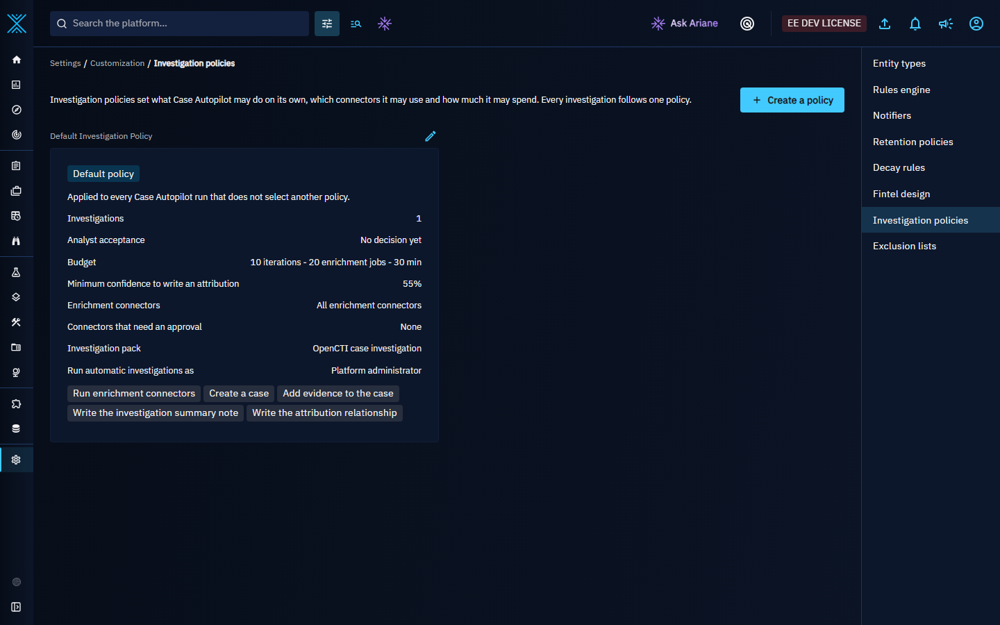

In the policy form, every field explains what it does, gives an example and its range, and says what happens at the limit or when it is left empty; **Learn more** at the top of the form opens this section.

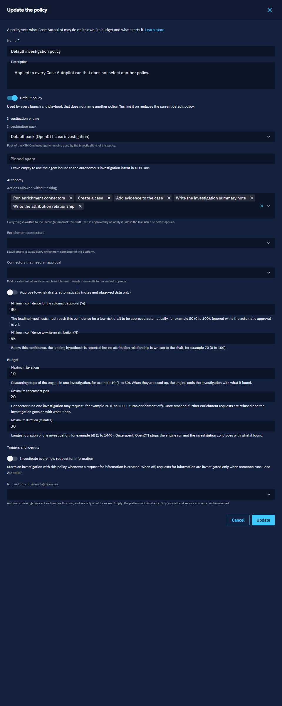

One policy is the default: it cannot be deleted, and promoting another policy to default replaces it. A policy used by investigations in progress cannot be deleted until they end; the investigations it already ran are kept. When the creation of an automatic investigation fails for a technical reason (for example the database is briefly unavailable), the request for information is investigated on the next attempt rather than skipped.

## Automate with playbooks

The playbook component **Run Case Autopilot** starts an investigation for each incident or case of the bundle, once per entity, with the policy you select. Combine it with a playbook listening to the incidents your incident connectors create (for example Microsoft Sentinel incidents, Microsoft Defender incidents or CrowdStrike) to investigate every new incident as it arrives. See [playbook components](playbook-components.md).

## Notifications

Live triggers and digests can listen to three investigation events, delivered on the case of the investigation: **Investigation awaiting approval**, **Investigation completed** and **Investigation failed**. Assignees and participants of a case receive them without any setup. A user receives an event only while they can read the case, the investigation and every source it cites, with the markings those sources carry now. See [notifications and alerting](notifications.md).

## Feedback and report template

Users allowed to update knowledge accept or reject each hypothesis (the **Your assessment** row) and each recommendation; other readers see the findings without these controls. Every accept or reject decision is stored on the investigation and sent to XTM One, which calibrates its later investigations of the platform. The built-in fintel template **Autonomous investigation summary** (Settings > Customization > Fintel design) generates a document from the investigation: executive summary, timeline, hypotheses, recommendations and indicators. The investigation carries the markings of everything it cites, together with the markings those entities carry now, so a marking added to one of them after the investigation is taken into account; when one of them is above your maximum shareable markings or the content marking limit chosen for the export, every section of the investigation is withheld from the document and replaced by a short notice.

## How Case Autopilot works with XTM One

Case Autopilot and the XTM One Deep Investigation share one engine and one vocabulary (investigation, pack, goal plan, step, evidence, hypotheses, recommendations, report, and the seven step states). Each side owns what it is good at:

| Capability | Owner | How the other side uses it |
|:--|:--|:--|
| Investigation run, policy, budget, draft, approvals, every write | OpenCTI | XTM One never writes into OpenCTI during a case investigation. |
| Reasoning: goal plan, steps, sources, conclusion, cited report | XTM One (Deep Investigation, pack "OpenCTI case investigation" by default) | OpenCTI starts one engine run per investigation and mirrors it. |
| Case context | OpenCTI | Sent when the run starts: the case entities, relationships, candidate threats, courses of action and PIRs the identity of the investigation can read. Objects restricted to authorized members are left out. |
| Enrichment | OpenCTI connectors | The engine asks OpenCTI for one enrichment wave; OpenCTI applies the policy allow-list, the budget and the approvals, and runs the connectors in the investigation draft. |
| ACH scoring | OpenCTI | The engine proposes candidates and links evidence; OpenCTI scores. |
| Analyst feedback | OpenCTI collects, XTM One stores | Calibrates the next conclusions of the platform. |

The sequence of an investigation:

1. An analyst, a playbook or a new request for information starts an investigation. OpenCTI creates the investigation run and its draft under the policy.
2. OpenCTI calls XTM One as the identity of the investigation: `POST /api/v1/platform/investigations` with the pack and its options, the budget, the connectors and allowed actions of the policy, the case context and the identifiers the engine may cite. XTM One answers immediately and runs the investigation in its worker.
3. When the engine reaches the enrichment action, it calls `investigationRunEnrichmentRequest` on OpenCTI, then reads the wave with `investigationRunEnrichmentWave` until it settles. Both are scoped to the investigation draft.
4. OpenCTI reads the engine run (`GET /api/v1/platform/investigations/{id}`) each time it changes and shows the goal plan, the steps and the evidence in the Autopilot tab.
5. When the engine completes, OpenCTI scores the hypotheses, writes the report, the evidence, the summary note, the recommendations and, above the policy confidence, the attribution into the draft, and asks for the approvals.
6. Analyst decisions go back to XTM One (`POST /api/v1/platform/investigations/feedback`).

XTM One keeps investigating on its own as well: the Deep Investigation of an XTM One chat is the same engine, without an OpenCTI case.

### Check the integration end to end

To check that a platform and its XTM One work together, run one investigation on a test case:

1. Connect XTM One (Enterprise Edition on, XTM One with its worker running), install at least one enrichment connector (for example Hygiene, which needs no external account) and keep the default investigation policy.
2. Create an incident response with a few observables (for example a phishing domain, the address it resolves to and a public DNS resolver such as `8.8.8.8`), an indicator of the domain that indicates one intrusion set, and the address related to another intrusion set.
3. Open the Autopilot tab and click **Run Case Autopilot**. Expect, in order: "Case Autopilot is preparing the goal plan.", then "Step N of 6" while the goal plan fills: **Read the case** and **Check what OpenCTI already knows** found, **Enrich through OpenCTI connectors** found (the connector's work appears under the step; Hygiene flags the public resolver), **Follow the leads** found or partial, **Weigh the hypotheses** found, **Write the cited report** found.
4. The investigation then waits for your review: the approval card lists the draft changes. The hypotheses rank the two intrusion sets, with the evidence that supports or contradicts each.
5. Approve the changes: the state becomes Completed and the report opens from the header. Accept or reject a hypothesis: the decision is recorded on the investigation and sent to XTM One.

If a step fails, its sentence names the cause: an XTM One without a language model, for example, ends with "No conclusion" and the web research steps "could not be queried".

Both products also test this contract automatically: OpenCTI drives an investigation through every state against a stand-in of the engine (`investigationRun-lifecycle-test.ts` in the backend integration tests), and XTM One drives a case investigation from its start to the calibration of the next one through its real routes and worker against a stand-in of OpenCTI (`test_case_investigation_lifecycle_postgres.py`).
