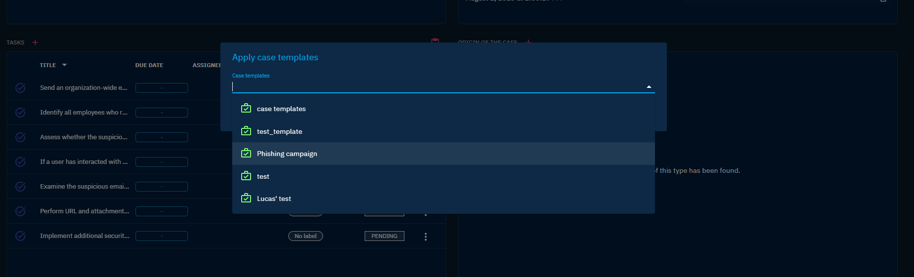

# Case management

## Why Case management?

Compiling CTI data in one place, deduplicate and correlate to transform it into Intelligence is very important. **But ultimately, you need to act based on this Intelligence**. Some situations will need to be taken care of, like cybersecurity incidents, requests for information or requests for takedown. Some actions will then need to be traced, to be coordinated and oversaw. Some actions will include feedback and content delivery.

OpenCTI includes [Cases](exploring-cases.md) to allow organizations to manage situations and organize their team's work. Better, **by doing Case management in OpenCTI, you handle your cases with all the context and Intelligence you need, at hand.**

## How to manage your Case in OpenCTI?

Multiple situations can be modelize in OpenCTI as a Case, either an Incident Response, a Request for Takedown or a Request for Information.

All Cases can contain any entities and relationships you need to represent the Intelligence context related to the situation. At the beginning of your case, you may find yourself with only some Observables sighted in a system. At the end, you may have Indicators, Threat Actor, impacted systems, attack patterns. All representing your findings, ready to be presented and exported as graph, pdf report, timeline, etc.

Some Cases may need some collaborative work and specific Tasks to be performed by people that have the skillset for. OpenCTI allows you to associate `Tasks` in your Cases and assign them to users in the platform. As some type of situation may need the same tasks to be done, it is also possible to pre-define lists of tasks to be applied on your case. You can define these lists by accessing the Settings/Taxonomies/Case templates panel. Then you just need to add it from the overview of your desire Case.

Tip: A user can have a custom dashboard showing him all the tasks that have been assigned to him.

As with other objects in OpenCTI, you can also leverage the `Notes` to add some investigation and analysis related comments, helping you shaping up the content of your case with unstructured data and trace all the work that have been done.

You can also use `Opinions` to collect how the Case has been handled, helping you to build Lessons Learned.

To trace the evolution of your Case and define specific resolution worflows, you can use the `Status` (that can be define in Settings/Taxonomies/Status templates).

At the end of your Case, you will certainly want to report on what have been done. OpenCTI allows you to export the content of the Case in a simple but customizable PDF (currently in refactor). But of course, your company have its own documents' templates, right? With OpenCTI, you will be able to include some nice graphics in it. For example, a Matrix view of the attacker attack pattern or even a graph display of how things are connected. 

Also, we are currently working a more meaningfull Timeline view that will be possible to export too.

## Use case example: A suspicious observable is sighted by a defense system. Is it important?
- Daily, your SIEM and EDR are feeded Indicators of Compromise from your OpenCTI instance. 
- Today, your SIEM have sighted the domain name "bad.com" matching one of them. Its alert has been transfered to OpenCTI and have created a `Sighting` relationship between your System "SIEM permiter A" and the Observable "bad.com". 
- You are alerted immediatly, because you have activated the inference rule creating a corresponding `Incident` in this situation, and you have created an alert based on new Incident that send you email `notification` and Teams message (webhook).
- In OpenCTI, you can clearly see the link between the alerting System, the sighted Observable and the corresponding Indicator. Better, you can also see all the context of the Indicator. It is linked to a notorious and recent phishing `campaign` targeting your activity `sector`. "bad.com" is clearly something to investigate ASAP.
- You quickly select all the context you have found, and add it to a new `Incident response`case. You position the priority to High, regarding the context, and the severity to Low, as you don't know yet if someone really interact with "bad.com"
- You also assign the case to one of your collegue, on duty for investigative work. To guide him, you also create a `Task` in your case for verifying if an actual interaction happened with "bad.com".

