# Incident and case timeline

## Overview

Every Incident, Incident Response, Request for Information and Request for Takedown has a timeline that tells the story of the case in time. OpenCTI assembles it automatically from the knowledge the container holds, keeps it current as the case evolves, and lets analysts add milestones, pin, hide and annotate events. The timeline is deterministic: it is computed from the platform data only, without any AI, and is available in the Community Edition.

The timeline answers questions that lists cannot: when did the adversary act, when was the activity first detected, when did the response start, when was the threat contained, and how long did it take to close the case.

## Where to find it

- **Timeline tab**: on the Incident, Incident Response, Request for Information and Request for Takedown pages, after the Content tab.
- **Overview strip**: a compact view on the overview of the same pages, with the case anchors and an **Open the timeline** link. It is a widget of the overview layout, which administrators can move, resize or hide (see [Overview layout](#overview-layout)).
- **Widget**: the **Incident and case timeline** visualization in custom dashboards and custom views (see [Dashboards and custom views](#dashboards-and-custom-views)).

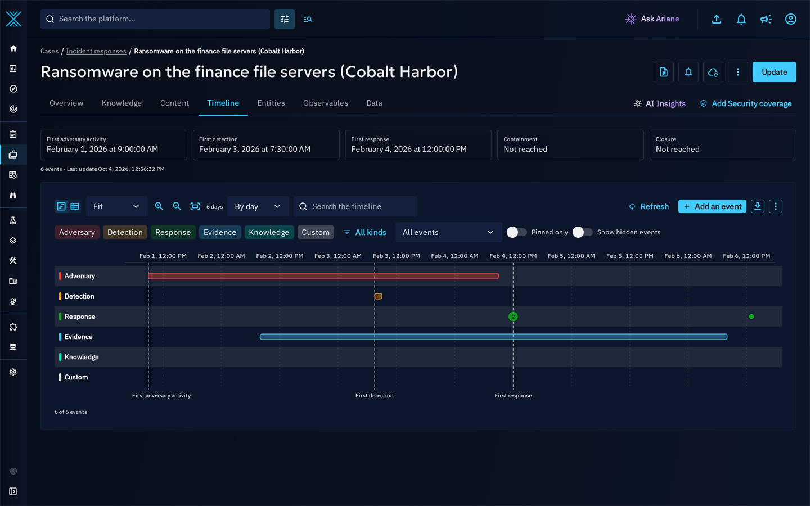

## What the timeline shows

### Lanes

Events are organized in lanes, from the adversary to the response:

| Lane | Content |
|:-----|:--------|
| Adversary | Techniques used (in kill chain order), first and last seen of malware, tools, infrastructures, threats and incidents, observation windows of observed data, sightings that are not from a security platform |
| Detection | Sightings from security platforms, security coverage results, hunt runs, indicator deployments, detection milestones |
| Response | Opening of the case, tasks created, due and completed, workflow status transitions, assignments, notes, opinions, investigation steps |
| Evidence | Indicators validity windows, reports and external references published, files uploaded, investigation findings about elements outside the case |
| Knowledge | Objects added to the case, relationships created, merges |
| Custom | Analyst milestones that do not belong to another lane |

### Derived events

Derived events are computed from the knowledge of the case by a set of derivation rules. They never modify the knowledge: the only data written are the timeline events, the timeline settings and the anchors of the container.

| Source | Events |
|:-------|:-------|
| Attack patterns in the case | One event per technique, with the exact window of its `uses` and `targets` relationships when they have start and stop times, otherwise placed in kill chain order with an approximate precision |
| Observed data | Observation window (first and last observed) |
| Sightings | Sighting window; sightings from a security platform land in the detection lane, the others in the adversary lane |
| Incidents, infrastructures, malware, tools, intrusion sets, threat actors, campaigns | First seen and last seen |
| Indicators | Validity window (valid from, valid until) |
| Reports and external references | Publication |
| Files of the container | Upload |
| Case | Opening |
| Tasks | Creation, due date and completion (a completed task labelled `containment` records the containment) |
| History of the container | Workflow status transitions, assignees and participants added, objects added, merges |
| Relationships between objects of the case | Creation |

The following sources are used when they exist on the platform, and are otherwise ignored:

| Source | Events |
|:-------|:-------|
| Security coverage results (OpenAEV) | Coverage results of the container, in the detection lane |
| Hunt runs | Runs of the hunts linked to the case, in the detection lane |
| Indicator deployments | Deployments of the indicators of the case on security platforms, in the detection lane |
| Case Autopilot investigation runs | One **Investigation step** per run (from start to completion) and one per goal plan action that found something, in the response lane; findings about elements outside the case appear in the evidence lane with an approximate precision |

### Precision

Each event carries a precision: **Exact**, **Hour**, **Day** or **Approximate**. Approximate events (for example techniques without dated relationships) are drawn with a dashed outline and flagged in the list view.

## Anchors

The timeline computes per-case anchors, displayed on the overview strip and at the top of the Timeline tab:

| Anchor | Definition |
|:-------|:-----------|
| First adversary activity | First event of the adversary lane |
| First detection | First event of the detection lane (security platform sightings, coverage results, hunts, deployments, detection milestones) |
| First response | First event of the response lane |
| Containment | First containment milestone, or completion of a task labelled containment |
| Closure | Last transition to the final workflow status, while the case stays closed |

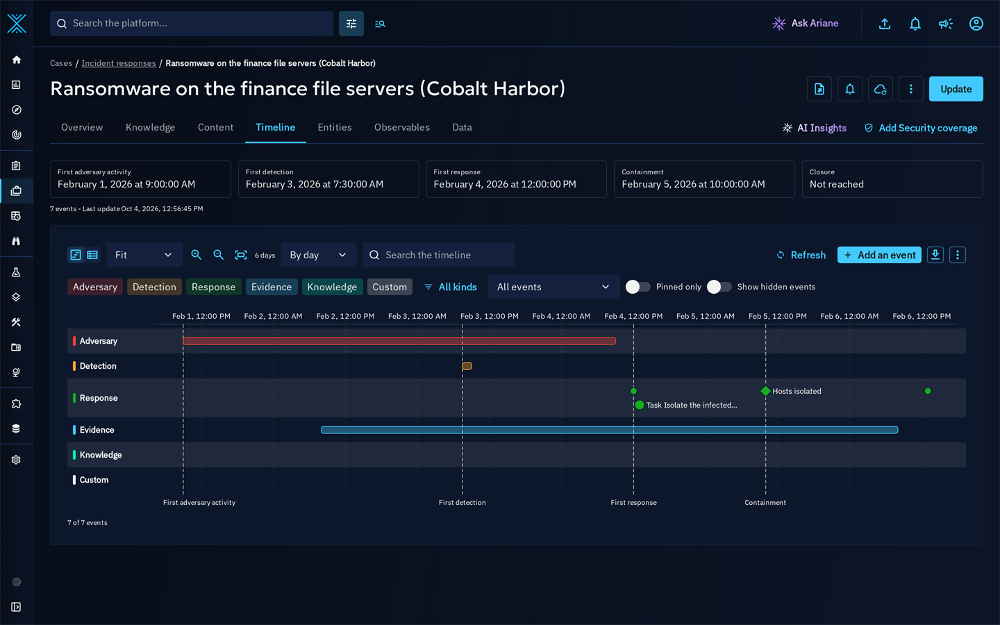

The overview of incidents and cases shows the same anchors with a miniature of the lanes:

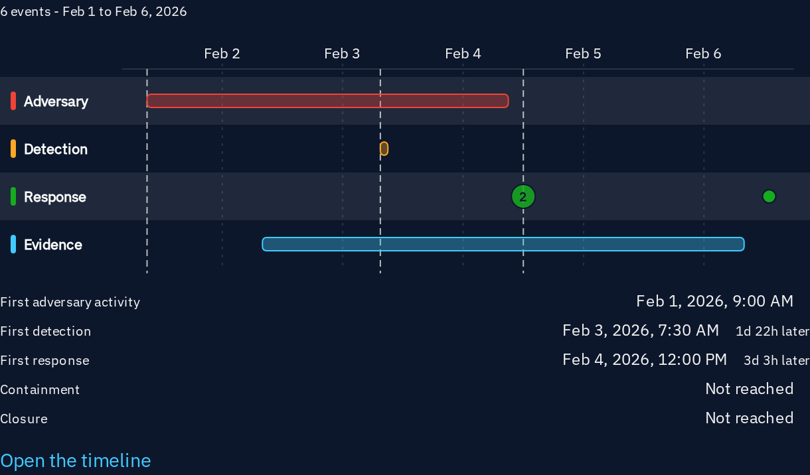

Hidden events never move an anchor. Every reader of the case sees the same anchors, so they are computed only from the events every reader can see: an event marked more strictly than the case, or about an element marked more strictly, restricted to authorized members or shared with fewer organizations than the case, never moves an anchor. Click an anchor to center the timeline on it.

The anchors are stored on the container in the `x_opencti_timeline_anchors` attribute, with two technical dates: `computed_at` (last computation) and `changed_at` (last change of one of the anchor values). They can be used to filter and sort the lists of incidents and cases (for example "Containment" before a date), and `changed_at` lets integrations fetch only the containers whose anchors changed since their last synchronization. OpenCTI does not aggregate them into metrics.

## Overview layout

On the overview of incidents and cases, the strip is the **Timeline** widget of the overview layout, a card like the other widgets of the overview. By default it takes half of the row, right after **Basic information**:

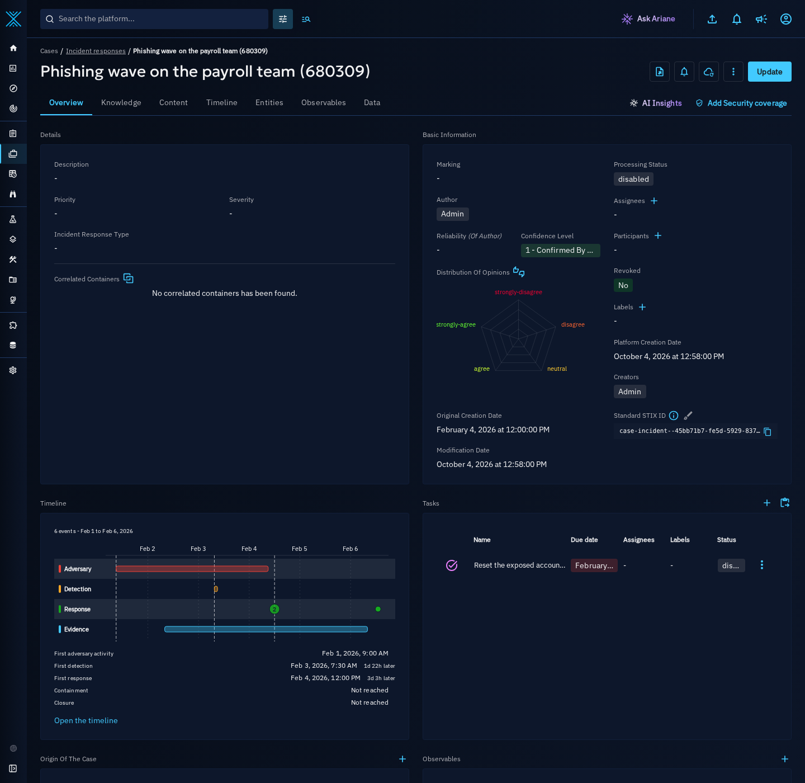

Administrators arrange it like the other widgets in **Settings > Customization > Entity types**, on the **Overview layout** tab of Incident, Incident Response, Request for Information or Request for Takedown:

- drag the **Timeline** row to move the strip among the other widgets;
- switch on **Full width** to give it the whole row;
- switch off **Displayed** to remove it from the overview, and switch it on again to bring it back at its default width, half of the row.

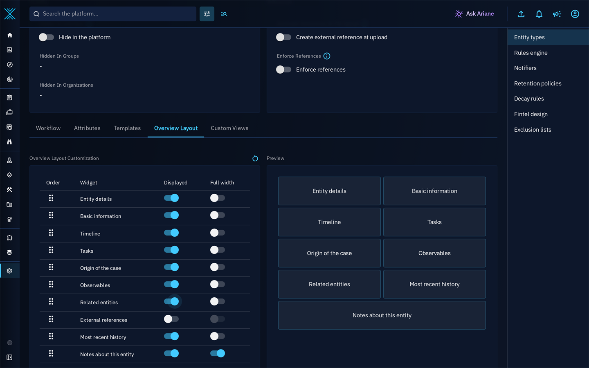

An overview layout customized before the timeline existed shows the strip right after **Basic information**, on half of the row, until an administrator moves, resizes or hides it.

The Timeline tab is the timeline of the case. The **Timeline** mode of the **Knowledge** tab is a different view: it places the relationships of the knowledge graph of the case on a time axis, and stays available unchanged next to the graph, correlation and matrix modes.

See [Overview layout customization](../administration/entities.md#overview-layout-customization) for the other widgets of the overview.

## Working with the timeline

### First use

When the case holds no dated knowledge yet, the Timeline tab explains what fills it (the knowledge of the case, Case Autopilot steps, hunt runs, deployments and the milestones you add) and offers **Add an event**, a link to this documentation and **Regenerate the timeline**. When filters hide every event, the tab says so and offers **Clear filters**.

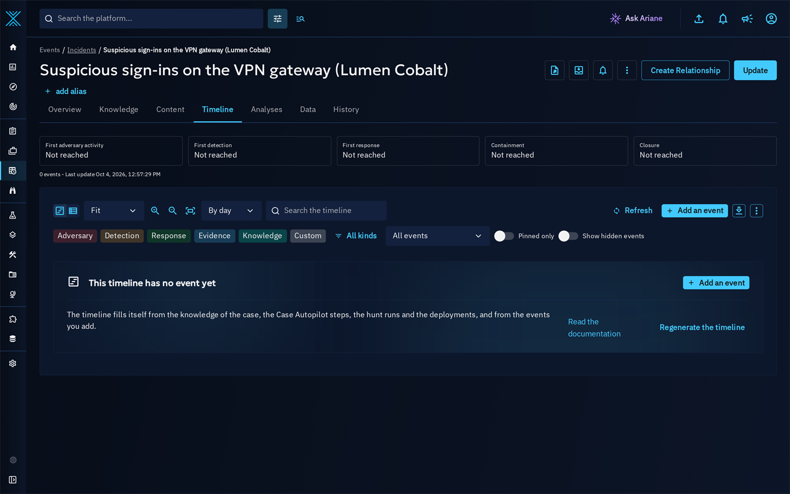

When the events cannot be loaded, the tab says so, suggests checking the connection, and offers **Retry**; the anchors and the toolbar stay available.

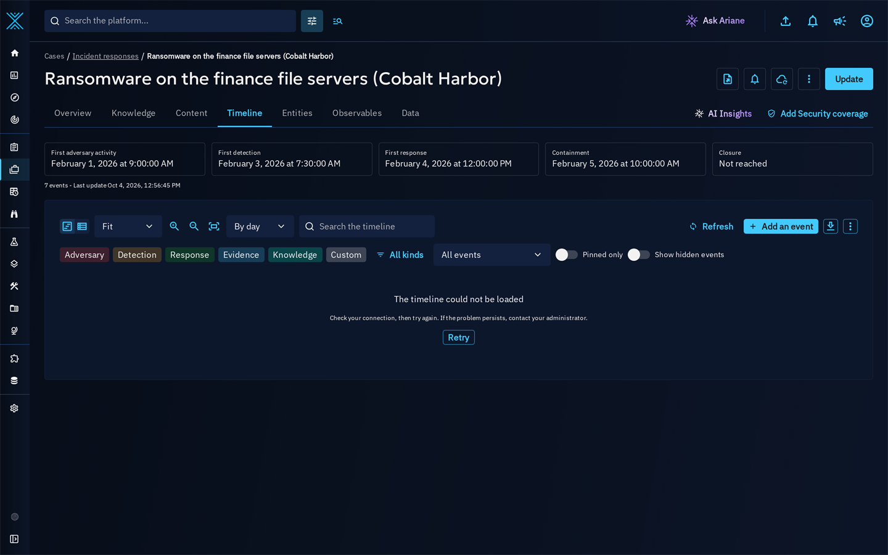

### Views and navigation

- **Lanes** and **List**: the view switch is always visible in the toolbar, next to the primary action **Add an event**. The list view is a vertical, accessible list of events.
- **Zoom window**: Fit, Day, Week, Month, Quarter or Year; the period currently displayed is shown next to the zoom controls. In the lanes view, use `+` and `-` to zoom, the left and right arrows to pan and `0` to fit. On long incidents, nearby events are grouped into a count bubble that zooms in on click.
- **Group by**: hour, day or week.
- **Search** and filters: lanes, event kinds, event source (all events, derived from the knowledge or analyst milestones), **Pinned only** and **Show hidden events**.
- The current view (filters, zoom, grouping, mode) is kept in the URL, so that a view can be shared with a link.
- The latest 500 events matching the filters are loaded first and displayed in chronological order; **Show earlier events** loads the previous ones. A link to an older event loads the earlier events until it is reached.
- In the list view, use the up and down arrows to move between events, `Enter` to open an event, `P` to pin and `H` to hide it.

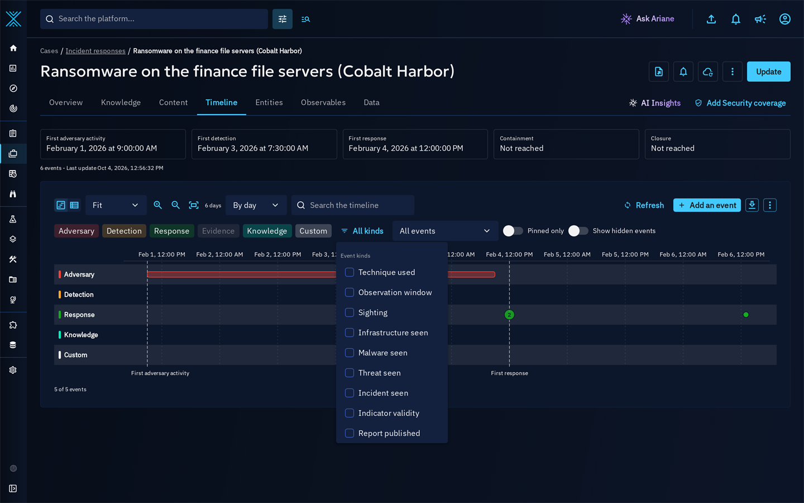

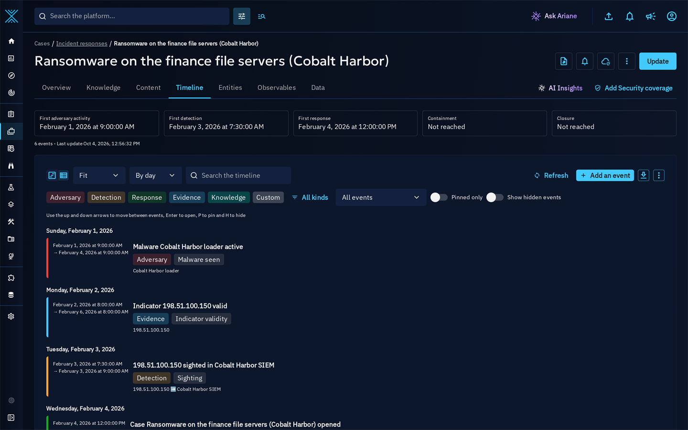

### Live updates

The timeline listens to the changes of the case. When events are added or updated while you are looking at it, a **New updates** badge appears in the toolbar: click **Refresh** to load them. The platform regenerates the timeline of a case a few seconds after any change of the case or of its objects. A nightly consistency pass also regenerates the timelines of the cases changed since the previous pass, and of those not regenerated for 30 days. After an upgrade, the first pass runs as soon as the platform starts and computes the timelines of the existing incidents and cases progressively, in the background. Users who can update the case can also use **Regenerate the timeline**.

### Event details

Click an event to open its details. The header shows the title of the event and its kind, with **Edit** (milestones) and **Pin**; centering the timeline on the event, hiding it and deleting a milestone (with a confirmation) are under **More actions**. The details list the time and precision, the lane, the source, the author, the confidence, the element the event comes from (open it to pivot) and the markings. An event without annotation offers **Add an annotation**.

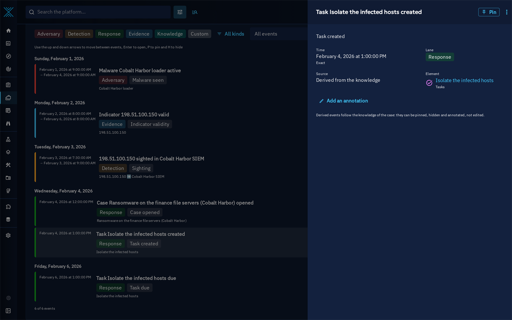

Events that come from an investigation step show its state with the seven step states of Case Autopilot investigations (Planned step, Querying, Found, Nothing found, Partial, Failed, Not reached), and open the run on that step in the **Autopilot** tab of the case. Hunt runs and indicator deployments appear on the timeline when those features are available on the platform; their verdicts and deployment states are shown with the labels of the feature they come from, and a state the platform does not know is never displayed as a raw value.

### Pin, hide and annotate

- **Pin** keeps an event highlighted and available through the **Pinned only** filter.
- **Hide** removes an event from the default view (use **Show hidden events** to see it again). Hidden events never move an anchor.
- **Annotate** adds the analyst context of an event.

Derived events follow the knowledge of the case: they can be pinned, hidden and annotated, but not edited or deleted. Pins, hidden flags and annotations survive every regeneration.

### Milestones

Use **Add an event** to record a milestone, what the knowledge cannot tell: "containment", "regulator notified", "recovery completed". A milestone has a title, a time, an optional end time, a precision, a lane, a kind (Milestone, Containment, Eradication, Recovery or Notification), a description and markings, and can be pinned at creation. A **Containment** milestone records the containment anchor.

Milestones can be edited and deleted by the users who can update the case.

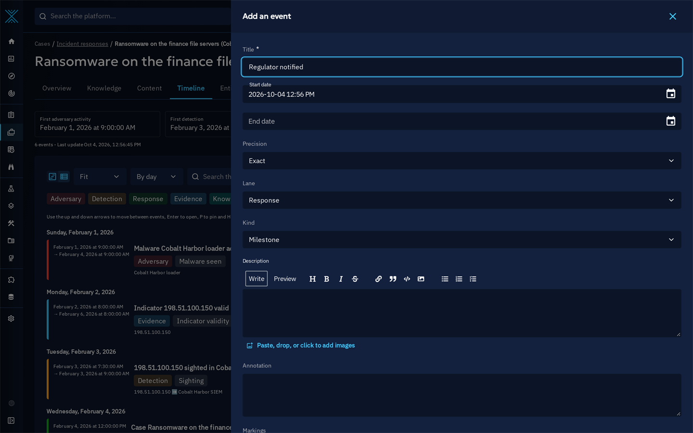

### Timeline settings

**Timeline settings** (under **More actions** in the toolbar of the tab, next to **Regenerate the timeline**) opens a drawer with the settings of the case timeline: enabled lanes, default grouping, default zoom window and kinds hidden by default. These settings apply to every user of the case timeline.

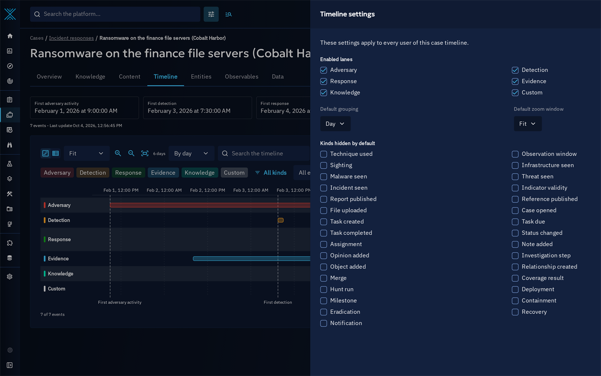

## Exports

- From the toolbar of the Timeline tab, **Export the timeline** downloads the current view as **CSV**, **PDF**, **SVG** or **PNG**.

    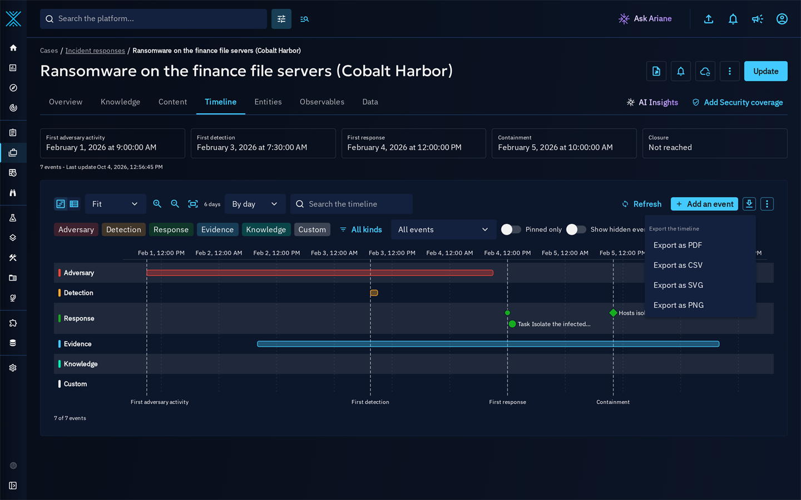

- From the export menu of the container, the **Incident and case timeline** export generates the timeline as PDF, CSV, PNG or SVG and stores it in the files of the entity, like the other exports (see [Manual export](export.md)).

The CSV contains one line per event with its time, end time, lane, kind, precision, title, element, source and annotation. The PDF contains the timeline drawing, the anchors and the list of events. The anchors of an export are computed from the exported events only, so an event left out by a filter or a marking ceiling never shows through an anchor.

What an export contains and how it is marked:

- An export only contains the events the exporting user can see, and leaves out the events marked above the user's max shareable markings, like every export of the platform.
- In the export menu of the container, the **Content max marking definitions** field sets a ceiling: the events marked above it, and the events about an element marked above it, are left out of the file.
- A file stored in the entity is never marked less strictly than what it contains: when the selected file markings are weaker than the markings of the exported events or of the elements they refer to, the platform raises them (highest marking per marking type) and the confirmation message names the markings added. The content of the file and its markings are computed together from the same events.

## Dashboards and custom views

The **Incident and case timeline** visualization is available in the widget catalog (see [Widget creation](widgets.md)):

- in custom dashboards, select the incident or case, the lanes to display (all when none is selected) and the time window;
- in the custom views of incidents and cases, the widget shows the timeline of the displayed entity.

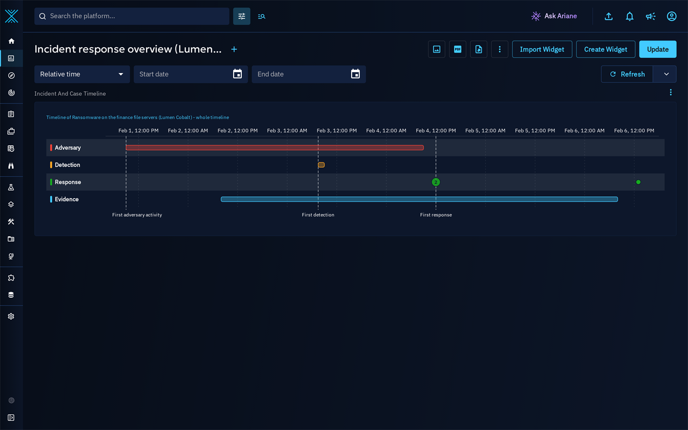

Incident and case timelines are not available in public dashboards.

## Notifications

Two event types are available in live triggers and digests (see [Notifications and alerting](notifications.md)):

- **Timeline anchor changed**: an anchor of an incident or case moved, for example when the containment is recorded or the case is closed.
- **Timeline milestone added**: an analyst or an integration added a milestone.

The trigger filters apply to the incident or case, and only users who can access it (and the milestone) are notified.

## Access and security

- Timeline events inherit the markings and authorized members of the container, and the markings of the element they come from or point to (a milestone linked to a marked element carries its markings). Users only see the events of the elements they can access, in the timeline, the widget and the exports.
- Reading the timeline requires access to the container. Adding milestones, pinning, hiding, annotating, changing the settings and regenerating require the capability to update knowledge and edit access to the container; milestones can only be edited or deleted by these users, and never inside a draft.

## Exchange and API

- **STIX**: the analyst contributions (milestones, pins, hidden flags, annotations) travel with the container in the `extension-definition--e1c8c28f-24a5-52b1-9c2e-f3b1ff208fdb` extension. Derived events are not exported: the receiving platform computes them from its own knowledge, and imports the contributions idempotently.
- **GraphQL API**: the queries `containerTimeline`, `containerTimelineSummary`, `containerTimelineExport` (with the `contentMaxMarkings` ceiling), `containerTimelineExportFile` (the content of a stored export together with the markings the file must carry), `timelineEvent`, `timelineAnchors` and `timelineRules` (the derivation rules, the event kinds they produce and whether their source is available on the platform); the mutations `timelineEventAdd` (with an `external_id` idempotency key), `timelineEventEdit`, `timelineEventDelete`, `timelineEventPin`, `timelineEventHide`, `timelineSettingsUpdate`, `timelineRegenerate`, `timelineImport` (imports the analyst contributions of a timeline STIX extension into a container, idempotently, never declassifying them) and `timelineViewed` (usage count of the Timeline tab, no data change); and the subscription `containerTimelineUpdated`.
- **Python client (pycti)**: `OpenCTIApiClient.timeline_event` with `create`, `update`, `delete`, `list`, `read`, `pin`, `hide`, `anchors`, `regenerate` and `import_extension` (calls `timelineImport` with a timeline STIX extension), so that connectors and incident importers can push milestones and contributions.

## Large cases

To protect the platform, the timeline of a case is built from a bounded number of objects, related elements and history entries, and keeps a bounded number of events. When a case reaches these limits, the Timeline tab displays a message and the derived events are kept by lane (adversary, detection, response, evidence, knowledge) then by time; analyst milestones are always kept. A case holds at most 1,000 analyst milestones by default: beyond it, adding a milestone is refused and imported milestones are skipped (updates of existing milestones always apply). The limits and the timeline manager can be tuned in the [configuration](../deployment/configuration.md) (`timeline_manager` section).
