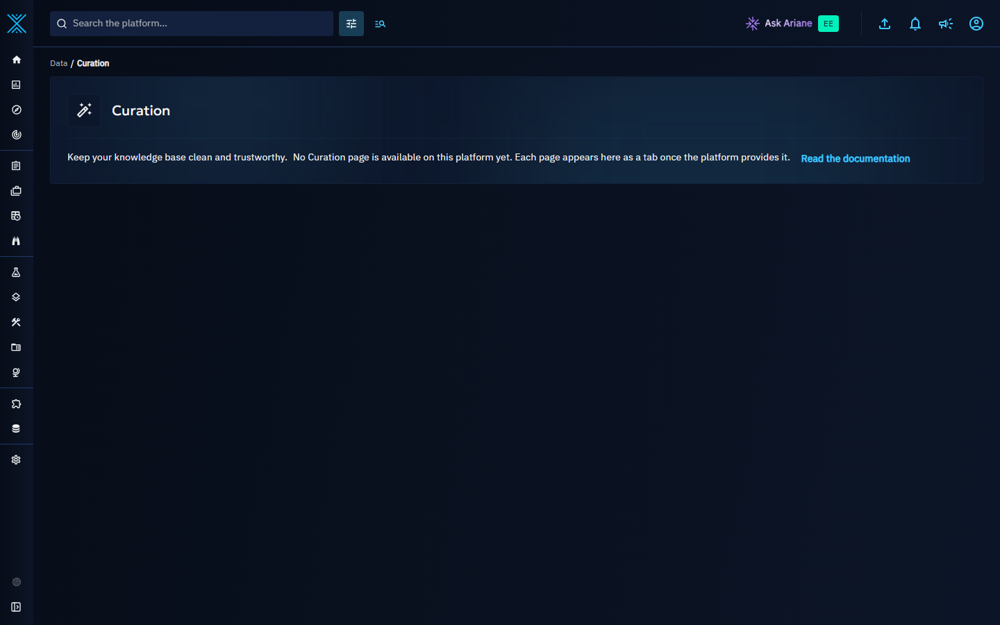
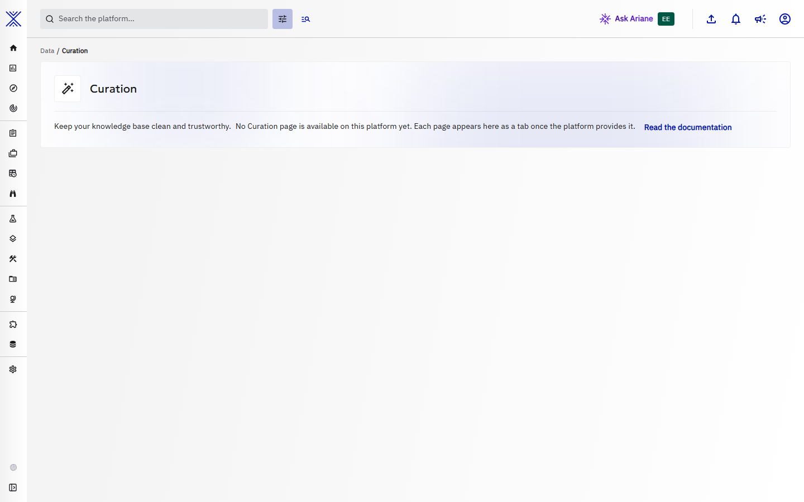
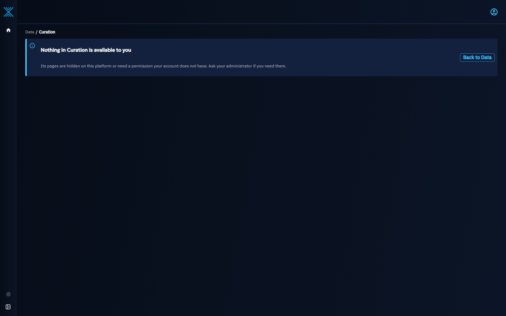

# Curation

**Data > Curation** is the data-quality home of your knowledge base. Instead of separate menu entries, the work that keeps the knowledge clean lives in one place, as tabs of one hub. The tabs are provided by the features that need them; each one joins the hub as a new tab, without a new menu entry.

## Before any tab is available

On a platform where no Curation tab is available yet, **Curation** appears in the **Data** menu, right after **Relationships**, and opens the landing page of the hub. The page names the hub, says what it is for and that its pages appear here as tabs once the platform provides them, and links to this documentation.

??? example "The same page in the light theme"

    

A link to an address below **Data > Curation** that no tab serves opens the same landing page.

## Once tabs are available

- Clicking **Curation** opens the first tab available to you. Each tab keeps its own address under `Data > Curation`, so a link to a tab can be bookmarked and shared.
- The breadcrumb `Data > Curation > <tab>` and the tab bar stay on screen while a tab loads, so switching tabs never blanks the page.
- A number next to a tab counts the work waiting for you there, and the **Curation** entry of the menu shows the sum of these numbers. They are never totals, and they disappear when nothing is waiting.
- A tab that has nothing to show yet says what it does and what feeds it, and offers its first action and a link to its documentation.

## Who sees Curation

- **Curation** requires access to the knowledge, from the menu and from a direct link alike, and is not offered inside a draft.
- Each tab then has its own permission check, and a tab whose platform feature is disabled is not listed. A tab you cannot use is not listed, and the hub opens the first tab you can use.
- When tabs exist but none of them is available to you, **Curation** is not listed in your menu, and a link to it shows a page that says so, with a way back to **Data**. Ask your administrator if you need these tabs.

## Related pages

- [Deduplication](deduplication.md): how OpenCTI avoids creating the same object twice.
- [Merge objects](merging.md): merging objects by hand.
- [Data consistency](dataSanityManager.md): consistency checks run by the platform.
