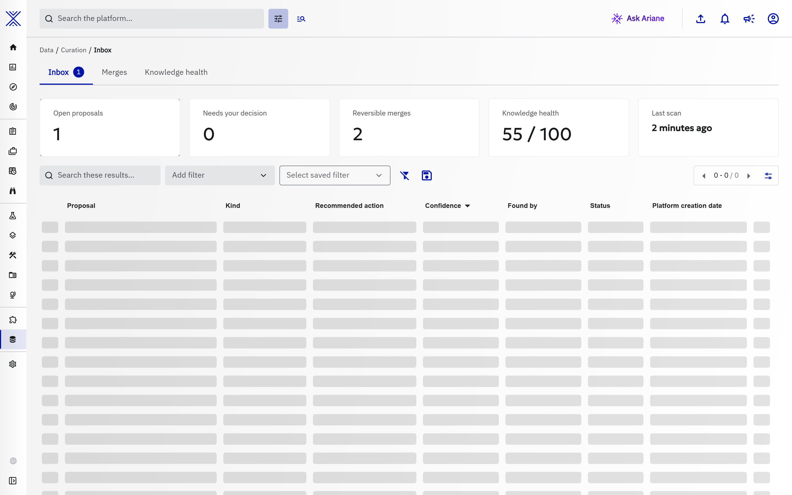

# Curation

**Data > Curation** is the data-quality home of your knowledge base. Instead of separate menu entries, the work that keeps the knowledge clean lives in one place, as tabs. The tabs available today come from [knowledge curation](knowledge-curation.md):

| Tab | What you do there |
| --- | --- |
| Inbox | Review what the curation engine proposes: possible duplicates, conflicting values, objects to merge ([details](knowledge-curation.md#work-the-curation-inbox)). |
| Merges | Follow the merges that were applied, and undo one when it was wrong ([details](knowledge-curation.md#reversible-merges-and-unmerge)). |
| Knowledge health | Measure the quality of the knowledge base over time ([details](knowledge-curation.md#read-the-knowledge-health-score)). |

Other data-quality pages join the hub as new tabs when they become available, without a new menu entry.

??? example "The same page in the light theme"

    

## When the entry is shown

- **Curation** appears in the **Data** menu, right after **Relationships**, as soon as one of its tabs is available on your platform.
- Each tab has its own permission check: a tab you are not allowed to use is not listed, and the hub opens the first tab you can use.
- Each tab keeps its own address under `Data > Curation`, so a link to a tab can be bookmarked and shared.

## Working in the hub

- The breadcrumb `Data > Curation > <tab>` and the tab bar stay on screen while a tab loads, so switching tabs never blanks the page.
- A number next to a tab counts the work waiting for you there: the proposals to review in the Inbox. The **Curation** entry of the menu shows the sum of these numbers. They are never totals, and they disappear when nothing is waiting.
- A tab that has nothing to show yet says what it does and what feeds it, and offers its first action and a link to its documentation.
- Opening a link to Curation when none of its tabs is available to you shows a page that says so, with a way back to **Data**. The tabs may be hidden on your platform or need a permission your account does not have: ask your administrator if you need them.

## Related pages

- [Knowledge curation](knowledge-curation.md): the detectors, proposals, reversible merges, policies and Knowledge health behind the Inbox, Merges and Knowledge health tabs.
- [Deduplication](deduplication.md): how OpenCTI avoids creating the same object twice.
- [Merge objects](merging.md): merging objects by hand.
- [Data consistency](dataSanityManager.md): consistency checks run by the platform.
