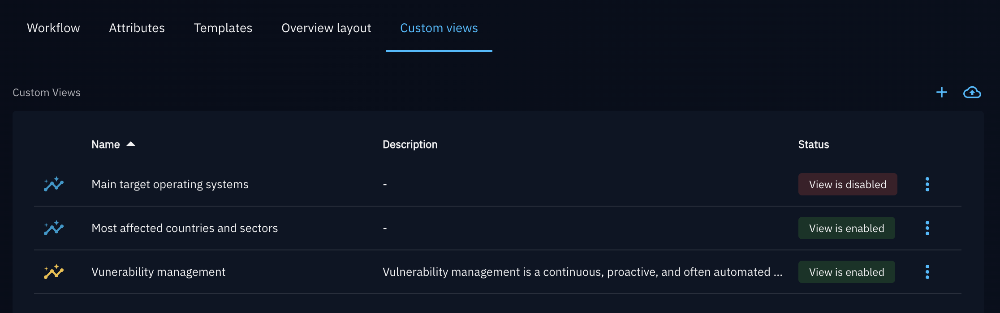
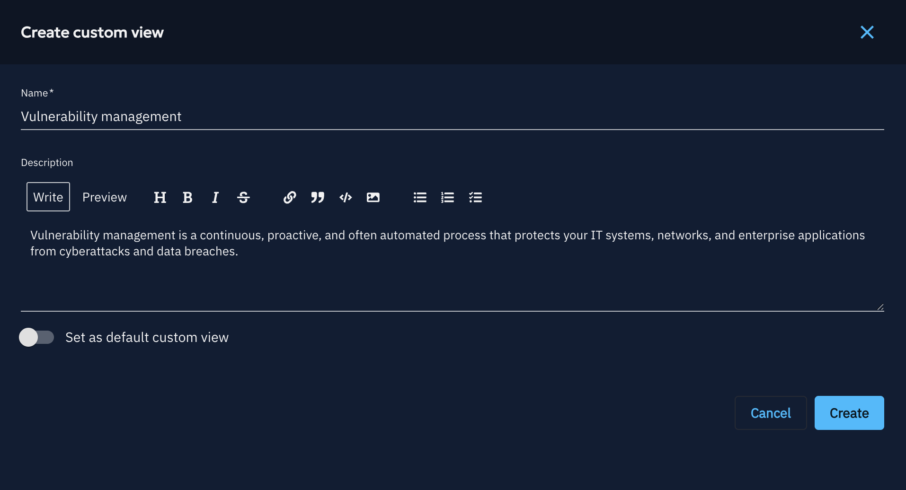
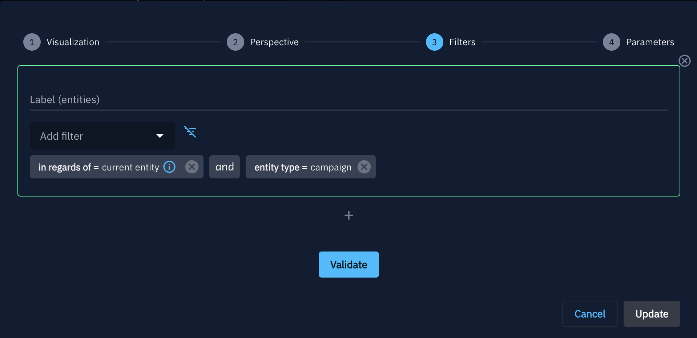

# Custom Views

## Overview

Custom Views allow platform administrators to create **widget-based dashboards scoped to a specific entity type** and surface them as additional tabs directly on entity detail pages. Instead of navigating to a separate dashboard, analysts see contextual intelligence panels embedded right where they work.

For example, a Custom View targeting `Malware` could display related campaigns, MITRE ATT&CK techniques, and victimology widgets — all appearing as a dedicated tab on every Malware entity page.

---

## Accessing Custom Views

Custom Views appear to users as additional tabs when navigating to an entity detail page.

* If multiple Custom Views are configured for that entity type, they are grouped under a single **"Custom Views"** tab.
* If only one Custom View exists for that entity type, the tab uses the view's own display name directly.

An administrator can mark a Custom View as **Default** — in that case, its tab is pinned in first position and becomes the landing page when opening any entity of that type.

## Managing Custom Views

Custom Views are managed from **Settings > Customization > Entity Type > Custom Views**.

The settings page lists all existing Custom Views with the following columns:

| Column | Description |
|---|---|
| **Name** | The display name of the Custom View |
| **Description** | Optional description |
| **Status** | Whether the view is currently enabled (i.e. shown to users) or not |

The default Custom View is displayed with a yellow icon.

!!! info
    Managing, creating and editing Custom Views is only available to users with the `Manage customization` capability.

---

## Creating a Custom View

1. Navigate to **Settings > Customization > Entity Type > Custom Views**.
2. Click the **+** button (Add a custom view).
3. Fill in the form: 
    - **Name** *(required)* — minimum 2 characters, shown as the tab label,  
    - **Description** *(optional)* — internal documentation for the view,  
    - **Set as default custom view** — toggle to set this view as the default landing tab for the selected entity type (replaces the standard Overview tab). 
4. Click **Create**.

Once created, the view opens in **edit mode** where you can add and configure widgets.

---

## Editing a Custom View

Custom Views use the same widget engine as [Custom Dashboards](dashboards.md). Refer to the [Widget creation](widgets.md) documentation for a full guide on available widget types and configuration options.

### Key difference: the pre-configured widget filters

When adding a widget to a Custom View, it comes pre-configured with a dynamic filter that automatically scopes the displayed data to the entity currently being viewed.

[Container entity types](containers/?h=container#types-of-container) come with the `contains = current entity` filter.
Other non-container entity types come with the following:

* `in regards of = current entity` when adding a widget set to the **Entities** perspective,
* `related entity = current entity` when adding a widget set to the **Relationships** or **Audits** perspectives.

This means widgets are immediately relevant out of the box. You can still layer additional filters on top to refine what each widget displays.

However, it is also possible for a user to select a different filter and still add the current entity, for example: `source entity = current entity`.

### Preview mode

While editing, a **Preview** toggle lets you see how the view will look when rendered on a real entity page, using sample data from an entity of the target type found in the platform.

### Enable / Disable a view

Use the { .off-glb } { .off-glb } toggle to show or hide a view from entity pages without deleting it. Disabled views remain in the settings list but are not visible to regular users.
This action is also accessible directly from the setting page list.

### Set a view as Default

Marking a Custom View as **Default** causes it to replace the standard *Overview* tab as the first tab users land on when opening an entity of that type. Only one Custom View per entity type can be the default at a time.

### Duplicate a view

Click the **Duplicate** action from the { .off-glb } menu on any Custom View to create a copy (including its widget configuration). The duplicate is created in a disabled state and can be renamed and modified independently.

### Delete a view

Click the **Delete** action from the { .off-glb } menu to permanently remove a Custom View and all its widget configuration. This action cannot be undone.
This action is also accessible directly from the setting page list.

---

## Import & Export

Custom Views can be shared across OpenCTI instances using JSON export/import.

### Export a Custom View

1. Open the Custom View in the settings list.
2. Click **Export configuration** (or use the action menu).
3. A `.json` file is downloaded containing the view name and its full widget manifest.

You can also export individual widgets from a Custom View using the **Export widget** action on each widget panel.

### Import a Custom View

1. Navigate to **Settings > Customization > Custom Views**.
2. Click **Import configuration**.
3. Upload the `.json` file previously exported from another instance.
4. The view is created in a **disabled** state. Review the configuration and enable it when ready.

!!! warning
    Imported views are always created as **disabled** and **non-default**. You must explicitly enable them after reviewing the configuration.

### Import a single widget into an existing Custom View

1. Open the Custom View in edit mode.
2. Use the **Import widget** action.
3. Upload a widget export file (`.json`).
4. The widget is added to the view's layout.

---

## Related pages

- [Custom dashboards](dashboards.md)
- [Widget creation](widgets.md)
- [Tips for widget creation](tips-widget-creation.md)
- [Entity types customization](../administration/entities.md)
