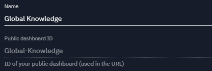
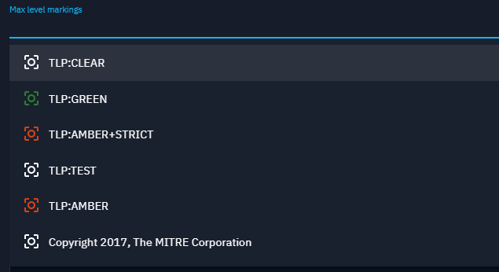

# Share custom dashboards

OpenCTI provides a simple way to share a visualisation of a custom dashboard to anyone,
even for people that are outside of the platform. We call those visualisations: public dashboards.

Public dashboards are a snapshot of a custom dashboard at a specific moment of time. 
By this way you can share a version of a custom dashboard, then modify you custom dashboard
without worrying about that it will affect the public dashboards you have created.

On the contrary, if you want that your public dashboard is updated with the last version of the
associated custom dashboard, you can do it with few clicks by recreating a public dashboard using
the same name of the one to update.

> To be able to share custom dashboards you need to have the associated capability.

## Create a Public dashboard

On the top right of your custom dashboard page you will find a button that will open a panel to
manage the public dashboards associated to this custom dashboard.

In this panel you will find two parts:
- At the top you have a form allowing you to create public dashboards,
- And below, the list of the public dashboards you have created.

### Form to create a new public dashboard

First you need to specify a name for your public dashboard. This name will be displayed
on the public dashboard. The name is also used to generate an ID for your public dashboard
that will be used in the URL to access the dashboard.

The ID is generated as follow: replace all spaces with symbol `-` and remove special characters.
This ID also needs to be unique in the platform as it is used in the URL to access the dashboard.

Then you can choose if the public dashboard is enabled or not. A disabled dashboard means that
you cannot access the public dashboard through the custom URL. You can still manage it from this
panel.

Finally you choose the max level of marking definitions for the data to be displayed in the
public dashboard. For example if you choose `TLP:AMBER` then the data fetched by the widgets
inside the public dashboard will be at maximum AMBER, you won't retrieved data with RED marking.

Also note that the list of marking definitions you can see is based on your current marking
access on the platform **and the maximum sharable marking definitions defined by the admin** of
the platform.

## List of the Public dashboards

When you have created a Public dashboard, it will appear in the list below the form.

In this list each item represents a Public dashboard you have created. For each you can see its
name, path of the URL, max marking definitions set, the date of creation, the status to know if
the dashboard is enabled or not and some actions.

The possible actions are: copy the link of the Public dashboard, disable or enable the dashboard
and delete the dashboard.

To share a Public dashboard just copy the link and give the URL to the person you want to share
with. The dashboard will be visible even if the person is not connected to OpenCTI.