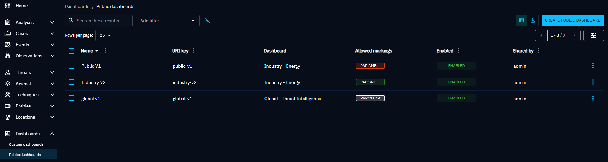
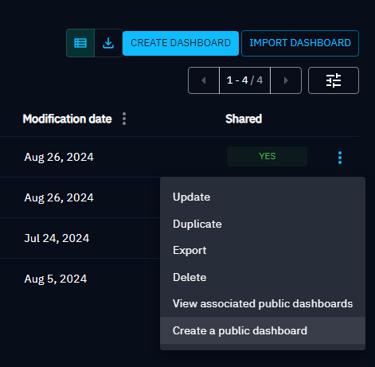
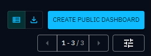

# Public dashboards

OpenCTI provides a simple way to share a visualisation of a custom dashboard to anyone,
even for people that are outside of the platform. We call those visualisations: public dashboards.

Public dashboards are a snapshot of a custom dashboard at a specific moment of time. 
By this way you can share a version of a custom dashboard, then modify your custom dashboard
without worrying about the impact on public dashboards you have created.

On the contrary, if you want that your public dashboard is updated with the last version of the
associated custom dashboard, you can do it with few clicks by recreating a public dashboard using
the same name of the one to update.

> To be able to share custom dashboards you need to have the [Manage data sharing & ingestion](../administration/users.md) capability.

## List of public dashboards page

From the left menu, you can choose the public dashboard option to see all the public dashboards you have created, as well as those you have access to (for example, 'can view,' 'can edit,' or 'can manage').

**Actions panel**

You can realise actions on a public dashboard using the button located at the end of each line::

- got to the original dashboard
- disable the public link
- copy the public link
- delete

**Massive operations delete**

You can do mass deletion operations using the checkbox:

- **Select each** public dashboard individually to delete
- **Select all** public dashboards displayed on the page to delete

## Create a public dashboard

You can create a public dashboard either from the list of public dashboards or from the original custom dashboard.

- In your list of custom dashboard page, you'll find a button that opens a panel to create the public dashboard associated with this custom dashboard.

- On the top right of the public dashboard list page, you'll find a button "Create public dashboard"

- On the top right of your custom dashboard page, you'll find a button that will opens this same panel.

In this panel you will find two parts:
- At the top you have a form allowing you to create public dashboards,
- And below, the list of the public dashboards you have created.

### Form to create a new public dashboard

If you created the public dashboard from the list of public dashboards, you must first select the associated custom dashboard.

You need to specify a name for your public dashboard. This name will be displayed
on the dashboard page. The name is also used to generate an ID for your public dashboard
that will be used in the URL to access the dashboard.

The ID is generated as follow: replace all spaces with symbol `-` and remove special characters.
This ID also needs to be unique in the platform as it is used in the URL to access the dashboard.

Then you can choose if the public dashboard is enabled or not. A disabled dashboard means that
you cannot access the public dashboard through the custom URL. But you can still manage it from this
panel.

Finally you choose the max level of marking definitions for the data to be displayed in the
public dashboard. For example if you choose `TLP:AMBER` then the data fetched by the widgets
inside the public dashboard will be at maximum AMBER, you won't retrieved data with RED
marking definition.

Also note that the list of marking definitions you can see is based on your current marking
access on the platform **and the maximum sharable marking definitions** defined in your groups.

!!! note "Define maximum shareable markings in groups"

    As a platform administrator, you can define, for each group and for each type of marking definition, [Maximum marking definitions shareable](../administration/segregation.md) to be 
    shared through Public Dashboard, regardless of the definition set by users in their public dashboard.

### List of the public dashboards in panel

When you have created a public dashboard, it will appear in the list below the form.

In this list each item represents a public dashboard you have created. For each you can see its
name, path of the URL, max marking definitions, the date of creation, the status to know if
the dashboard is enabled or not and some actions.

The possible actions are: copy the link of the public dashboard, disable or enable the dashboard
and delete the dashboard.

To share a public dashboard just copy the link and give the URL to the person you want to share
with. The dashboard will be visible even if the person is not connected to OpenCTI.
