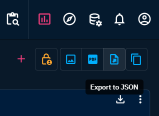
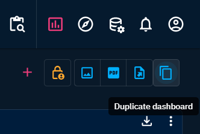
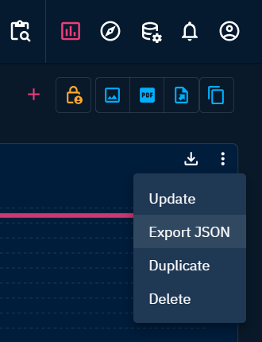
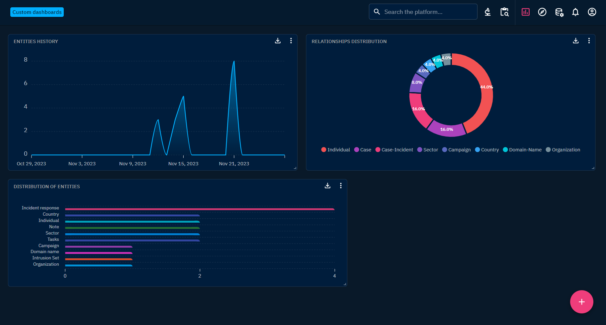

# Custom dashboards

## Sharing and access restriction

`Organizations`, `groups`, or `users` who have access to a dashboard can have 3 levels of access: 
- `admin` read, write, access management
- `edit` read and write
- `view` read-only

When a user creates a custom dashboard, it is only visible to themselves and becomes the admin of it. They can then define who can access it and with what level of rights via the `Manage access` button at the top right of the dashboard page.


  
*Manage access button*

They can give access to organizations, groups, users, but also to all users on the platform (`everyone`).

  
*Manage access window*

It is important to note that a dashboard must have at least one user with `admin` access level.

## Exporting dashboards configuration

Users can export a dashboard from:
- custom dashboards list
- dashboard view

Your configuration will be saved as a JSON file.

Its title will be formatted like this:  `<date: year month day>_octi_dashboard_<dashboard title>`

### Attributes of an export
Here is the expected configuration file content:

```JSON
{
  "openCTI_version": "5.12.0",
  "type": "dashboard",
  "configuration": {
    "manifest": "eyJ3aWRn(...)bmZpZyI6e319",
    "name": "Hello Dashboard From Import"
  }
}
```

When exporting a dashboard / widget configuration, all filters will be exported as are.
Instance filters are based on your platform entities (internal ids).
This means that after importing a configuration from another user's platform, you will have to manually edit the filters.

Our team is currently working to manage instance filters.

#### Access

The user importing the dashboard becomes the only one that has access to it. Then, access can be managed as usual.
On widget configuration import, the dashboard access management is unchanged from prior this import.

### Exporting from custom dashboards list

Click the burger menu button at the end of the dashboard line.
Select `Export` and save your dashboard configuration.

  
*Export to JSON option*

### Exporting from dashboard view

The button with the file and the upward right arrow allows the users to export the current dashboard configuration.

  
*Export to JSON button*

## Importing configurations

Note that only JSON files with the required properties will be accepted:
- `openCTI_version` with `5.12.0` version and more
- `type`, here `dashboard` will be the only valid type
- `configuration`

This applies to both dashboards and widgets configurations. 

## Importing dashboards configuration

Users can import a dashboard from:
- custom dashboards list
- dashboard view

### Importing from custom dashboards list

Hover the `Add` button (+) in the right bottom corner. 
Click on the `Import dashboard` button (cloud with an upward arrow).
Select your file.

  
*Import dashboard option*

The user is redirected to the imported dashboard view.

## Duplicating from dashboard view

The button with two files allows the users to duplicate the current dashboard configuration.
On duplication success, a message is displayed for a short amount of time to confirm it. And, a link allows the user to navigate to the imported dashboard view.

  
*Duplicate dashboard button*

You can select the `Duplicate` option in the burger menu next to the dashboard title.

  
*Duplicate dashboard option*

  
*Duplicate dashboard message confirmation*

The new dashboard can be found in the dashboards list.

## Exporting widgets configuration

Users can export a widget from the dashboard view.
Click on the burger menu in the top right corner of the widget. Select the `Export JSON` option and save your widget configuration.

  
*Export JSON option for widgets*

## Importing widgets configuration

Users can import a widget from the dashboard view.
Click on the burger menu in the top right corner of the widget. Select the `Export JSON` option and save your widget configuration.

Hover the `Add` button (+) in the right bottom corner.
Click on the `Import dashboard` button (cloud with an upward arrow).
Select your file.

  
*Import JSON option for widgets*

Due to the imported widget dimensions, you may have to manually place it.
This way, pre-existing widgets will get back to their position.
  
*Imported widget*