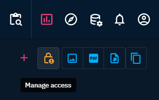

# Custom dashboards

## Sharing and access restriction

`Organizations`, `groups`, or `users` who have access to a dashboard can have 3 levels of access: 
- `admin` read, write, access management
- `edit` read and write
- `view` read-only

When a user creates a custom dashboard, it is only visible to themselves. They then have `admin` access. They can then define who can access it and with what level of rights via the `Manage access` button at the top right of the dashboard page.

  
*Manage access button*

They can give access to organizations, groups, users, but also to all users on the platform (`everyone`).

  
*Manage access window*

It is important to note that a dashboard must have at least one user with `admin` access level.
