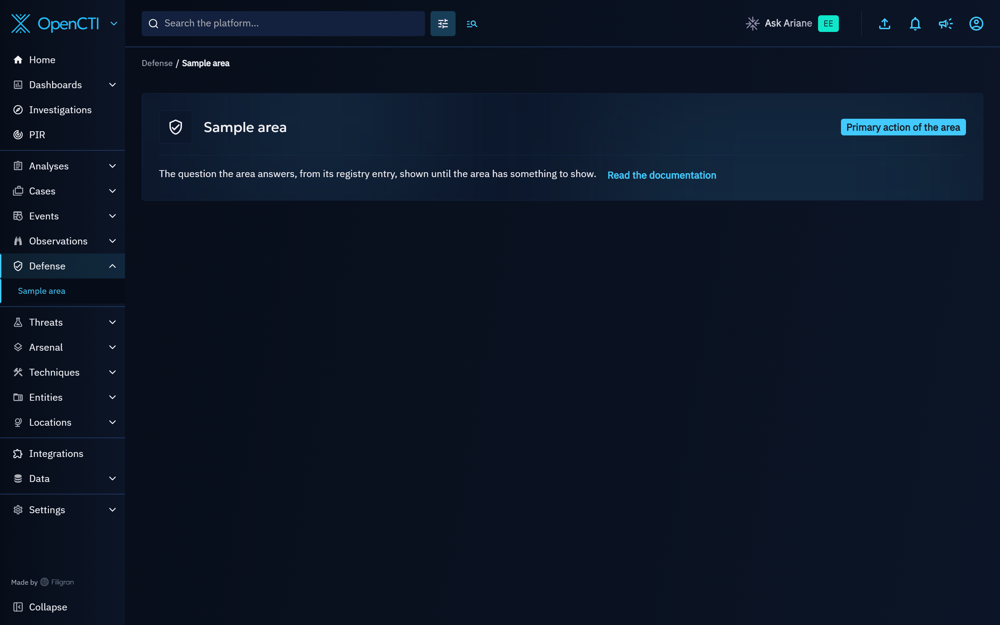
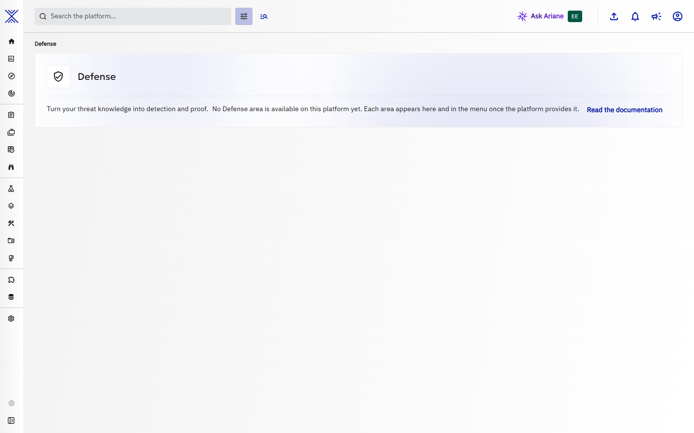
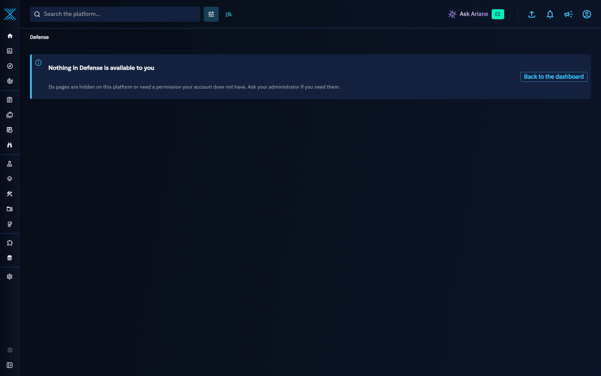

# Defense

The **Defense** entry of the left menu, right after **Observations**, is where threat knowledge turns into detection and proof. It is a hub: it groups areas, each one answering a question about how well your security platforms defend against the threats you know. The areas are provided by the features that need them; each one joins the hub as a sub-entry of **Defense**, without a new top-level menu entry.

## Before any area is available

On a platform where no Defense area is available yet, **Defense** is a single menu entry that opens the landing page of the hub. The page names the hub, says what it is for and that its areas appear here and in the menu once the platform provides them, and links to this documentation.

??? example "The same page in the light theme"

    

A link to an address below **Defense** that no area serves, for example a bookmark to an area that is not available on this platform, opens the same landing page.

## Once areas are available

- **Defense** lists its areas as sub-entries in the menu, and clicking **Defense** opens the first area available to you. Each area keeps its own address, so a link to an area can be bookmarked and shared.
- Every area opens under the same header: the breadcrumb `Defense > <area>`, followed by the open page when an area has several of them, which are then shown as tabs. The header stays on screen while an area loads. The page of a single object keeps its own header and tabs.
- A number next to an area in the menu counts the work waiting for you there. It is never a total, and it disappears when nothing is waiting.
- An area that has nothing to show yet says what it does and what feeds it, and offers its first action and a link to its documentation.

## Who sees Defense

- Like the other knowledge sections, **Defense** requires access to the knowledge, from the menu and from a direct link alike.
- Each area then has its own permission check, and an area tied to an entity type disappears when that type is hidden in **Settings > Customization > Entity types** (see [Entity types](../administration/entities.md)). An area you cannot use is not listed.
- When areas exist but none of them is available to you, **Defense** is not listed in your menu, and a link to it shows a page that says so, with a way back to the dashboard, instead of sending you elsewhere without a word. Ask your administrator if you need these areas.

## Related pages

- [Security Coverage](security-coverage.md): the coverage of a security platform against the techniques and threats you know.
- [Indicators lifecycle](indicators-lifecycle.md): how indicators are created, scored and decayed before they reach your security platforms.
- [Playbook automation](playbook-automation.md): automate what happens when your platforms detect something.
