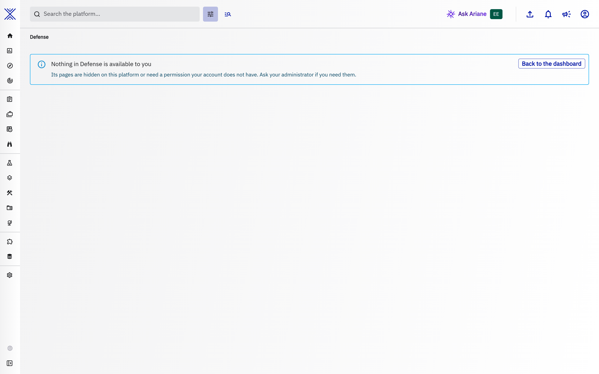

# Defense

The **Defense** entry of the left menu, right after **Observations**, is where intelligence turns into detection and proof. It is built to group the areas that answer three questions about your threat knowledge. These areas are planned and none of them ships with this version yet, so the Defense entry is not shown (see [When the entry is shown](#when-the-entry-is-shown)):

| Area | Question it answers | Path | Status |
| --- | --- | --- | --- |
| Hunts | Is this threat already in my environment? | `Defense > Hunts` | Planned |
| Defense matrix | Which techniques do my security platforms detect, and which ones were validated? | `Defense > Defense matrix` | Planned |
| Dissemination assurance | Did the indicators I shared actually reach my security platforms, and do they still work there? | `Defense > Dissemination assurance` | Planned |

## When the entry is shown

- The entry appears as soon as at least one of its areas is available on your platform. A platform where none of them is available shows no Defense entry at all, so the menu never offers an empty page.
- An area whose entity type is hidden in **Settings > Customization > Entity types** (for example the Hunt entity type) disappears from the menu, and the Defense entry disappears with it when it was the last one.
- Like the other knowledge sections, the entry requires access to the knowledge, and so does a direct link to one of its areas. Each area then has its own permission check: an area you are not allowed to use is not listed.

## Navigating

- Clicking **Defense** opens its first available area; each area keeps its own address, so a link to an area can be bookmarked and shared.
- The areas keep their order in the menu: Hunts, Defense matrix, Dissemination assurance.
- Every area opens under the same header: the breadcrumb `Defense > <area>`, followed by the open page when an area has several of them, which are then shown as tabs. The header stays on screen while an area loads. The page of a single object, such as a hunt, keeps its own header and tabs.
- A number next to an area in the menu counts the work waiting for you there, for example hunt results to triage. It is never a total, and it disappears when nothing is waiting.
- An area that has nothing to show yet says what it does and what feeds it, and offers its first action and a link to its documentation.

## If nothing is available to you

Opening a link to Defense when none of its areas is available to you shows a page that says so, with a way back to the dashboard, instead of sending you elsewhere without a word. The areas may be hidden on your platform or need a permission your account does not have: ask your administrator if you need them.

??? example "The same page in the light theme"

    

## Related pages

- [Security Coverage](security-coverage.md): the coverage of a security platform, also shown on the platform itself.
- [Indicators lifecycle](indicators-lifecycle.md): how indicators are created, scored and decayed before they are disseminated.
- [Playbook automation](playbook-automation.md): automate what happens when a hunt finds something.
