# Defense matrix

The defense matrix answers three questions for every MITRE ATT&CK technique, on every security platform you operate: can you **see** it, can you **detect** it, and did you **prove** it? It compares the answer with the techniques used by the threats you care about, and turns the difference into a prioritized backlog.

The matrix is computed by OpenCTI from knowledge you already have. It is deterministic: every level is explained by the evidences that produced it, and nothing is deployed automatically.

The defense matrix is available in the Community Edition, under **Defense > Defense matrix**. It is also reachable from **Techniques > Attack patterns** with the **Open in Defense matrix** button.

## Defense levels

Each technique gets one level per security platform, and one aggregated level over all platforms.

| Level | Name | Evidence |
|:------|:-----|:---------|
| 0 | None | Nothing is known about this technique. |
| 1 | Telemetry | A security platform `provides` a data component that `detects` the technique. |
| 2 | Detection available | A detection rule (an Indicator with a rule pattern type such as Sigma, YARA, Snort, Suricata, SPL, EQL, ES\|QL, KQL, Kibana query, Lucene, YARA-L or CrowdStrike custom IOA) `indicates` the technique. Its deployment is unknown. |
| 3 | Detection deployed | The rule is `deployed-on` the security platform, with a deployed or active status. |
| 4 | Validated | OpenAEV proved the detection or the prevention of the technique on the platform. |

A failed latest validation caps the level at 2: the detection is deployed, but it was proven ineffective. A technique is considered **covered** from level 3.

!!! note "Deployment records"

    Level 3 is read from the deployment records of a rule: the `deployed-on` relationship to a security platform and its deployment status. This version of OpenCTI does not record rule deployments, so no technique reaches level 3: a rule known in OpenCTI counts as **Detection available** (level 2) with the next action **Deploy the rule**, and a technique is covered once OpenAEV proves its detection or its prevention (level 4). The telemetry inferred from running rules, the deployment statuses and the deployed figures described below apply to the platforms that record deployments.

Mitigations (courses of action that `mitigate` the technique) are shown as a separate marker: they do not change the level.

!!! note "Access to evidences"

    Levels are recomputed for each reader from the evidences this reader can access (markings and organizations). A rule, a data component or a validation result you cannot see never contributes to the levels displayed to you, in the matrix, the backlog, the widgets and the notifications alike. The levels are therefore not attributes of the attack patterns: they cannot be used in the filters of lists or knowledge widgets. A change of your groups, organizations or markings applies to the next page you load.

Revoked techniques leave the matrix: their stored levels and gaps are removed at the next computation, and come back if the technique is no longer revoked.
A revoked data component is no telemetry evidence either: the telemetry it detects or that a system provides on it no longer counts, and no new log source declaration targets it. A revoked course of action no longer counts as a mitigation.

## Declare the telemetry of a security platform

A security platform, or a system, declares the MITRE data components it collects with the `provides` relationship.

* On a **Security platform**, open the **Coverage** tab. The **Provided telemetry** card lists the data components and lets you add one with the relationship creation, or declare log sources: describe them with the Sigma taxonomy (category, product, service; one of the three is enough) and OpenCTI turns them into data components through the telemetry mappings. A declaration holds at most 200 log sources: declare them, then add the others. Declaring the same log sources again creates nothing: the result tells how many data components were newly declared and how many were already declared. Below, the tab shows the matrix restricted to this platform, with **View the gaps of this platform** and **Validate the gaps**.
* On a **System**, create the `provides` relationship to a data component from the knowledge view, like any other relationship.

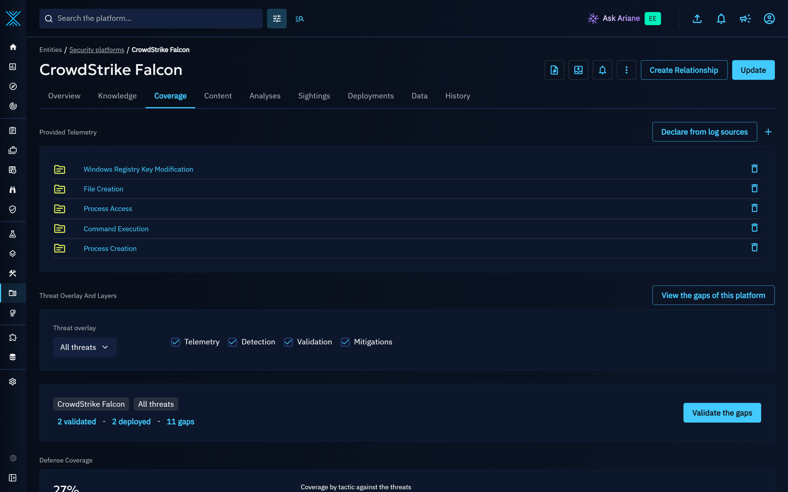

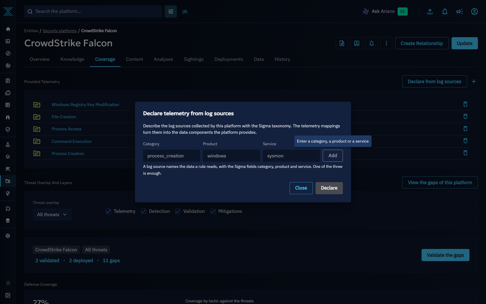

With deployment records (see **Deployment records** above), telemetry is also inferred from the log sources of the rules running on a platform (deployment status deployed or active): a pending, failed, removed or expired deployment does not prove that the platform collects the log source. An inferred telemetry counts for a reader only if this reader can access the rule, its deployment and the `indicates` relationship linking the rule to the technique.

### Telemetry mappings

The mapping from log sources to MITRE data components is managed in **Settings > Customization > Telemetry mappings**. A mapping links a log source, described by its category (what the events describe, for example `process_creation`), its product (the system the events come from, for example `windows`) and its service (the tool or channel that collects them, for example `sysmon`), to the data components it feeds. It applies to every log source matching all the fields it defines.

OpenCTI ships built-in mappings covering the Sigma taxonomy, which you can edit or deactivate. Until you add a mapping of your own, the page opens with an explanation and an **Add a mapping** action. **Restore built-in mappings** gives the built-in entries back their shipped data components and reactivates them; custom mappings are kept, including a custom mapping of the same log source as a built-in entry shipped by a later release, which keeps its place.

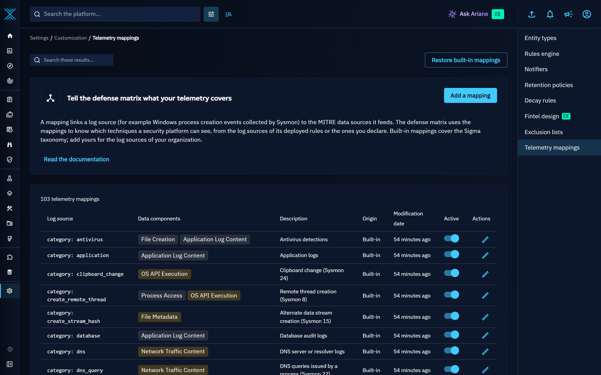

## Detection rules

Detection rules are Indicators whose pattern type is a rule language. The rule metadata is stored on the Indicator and normalized (trimmed, lower case): status, level and log source (category, product, service).

Connectors import public rule repositories (SigmaHQ, Valhalla, ...) and the rules deployed in your SIEM and EDR (Splunk saved searches, Elastic, Microsoft Sentinel, CrowdStrike custom IOA rules, Google SecOps YARA-L rules). An imported rule counts as **Detection available**; with deployment records, the rules deployed on a platform are linked to it with the `deployed-on` relationship and its deployment status.

A rule whose detection logic is not its query alone is imported with the whole logic as pattern, so that a change of any part of it is a new rule: Elastic threshold, new terms and indicator match rules (`elastic-rule`), Microsoft Sentinel scheduled rules, whose lookback and trigger are part of their logic (`sentinel-rule`), and Splunk saved searches with a trigger condition (`splunk-rule`) carry the canonical JSON of their query and conditions.

## Matrix

The **Matrix** section displays the ATT&CK matrix with the defense level of each technique. The level is written in every colored technique, so it never depends on the color alone.

As long as the platform holds no ATT&CK technique, the section explains what the matrix answers and offers **Import MITRE ATT&CK**, which opens the connector catalog.

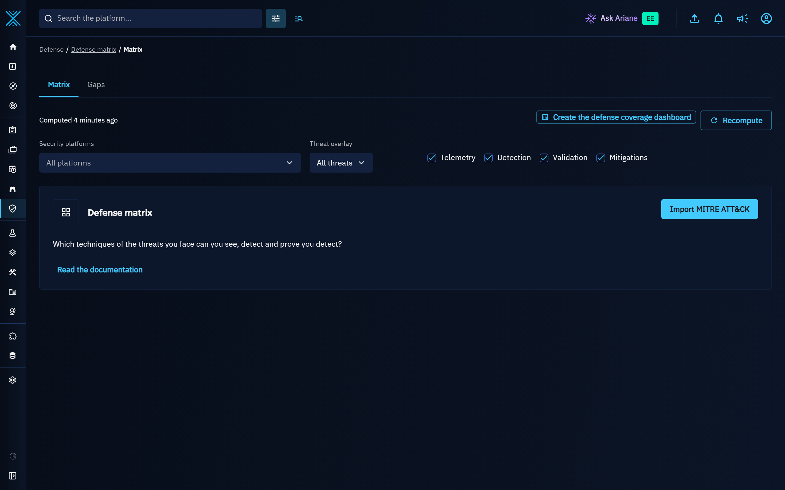

A header sums the scope up: the selected security platforms and threats, and the number of techniques **validated**, **deployed** and left as **gaps** (levels 0 to 2). Click a number to show only these techniques in the matrix, click it again to show them all. When an OpenAEV platform is connected (an enrichment connector for security coverages is running), **Validate the gaps** opens the validation of the techniques used by the selected threats (every technique without threat overlay) that no validation proved yet, the most used first.

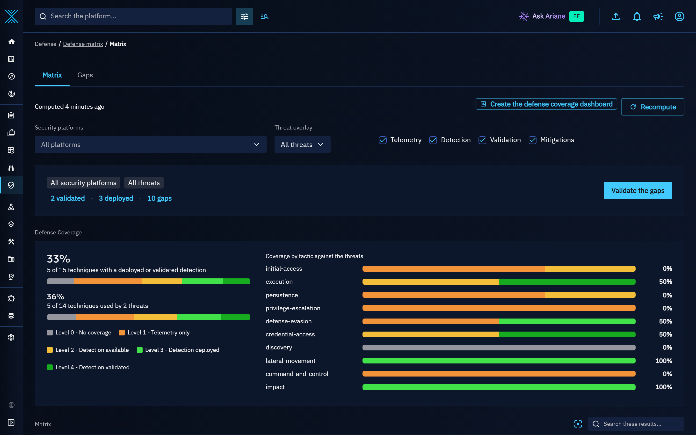

* **Security platforms**: select one or several platforms to restrict the levels, or keep all of them.
* **Threats**: choose the threats to compare with: all threats, selected threats, threats matching a filter, or none. Techniques used by these threats are outlined, with the number of threats using them.
* **Layers**: show or hide telemetry, detection, validation and mitigations.
* The coverage summary and the coverage by tactic give the share of techniques at each level, over all techniques and over the techniques used by the selected threats. Each tactic column shows the share of its techniques with a deployed detection (**% covered**). In every one of these figures, a technique counts once. Over all techniques, it counts at the best level of the technique and its sub-techniques. Over the techniques used by the selected threats, it counts at the best level of the technique itself and of the sub-techniques these threats use: the coverage of a sub-technique they do not use never counts for a sibling they use.

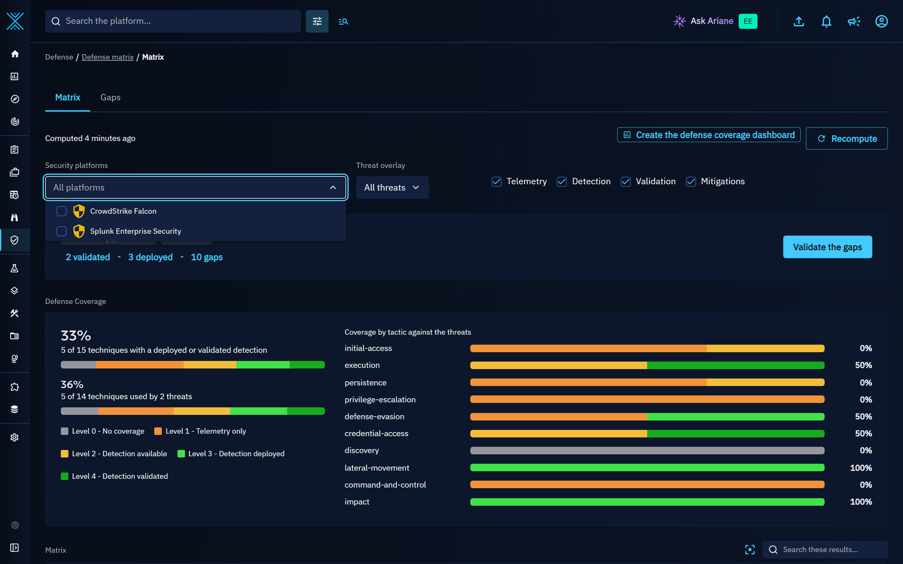

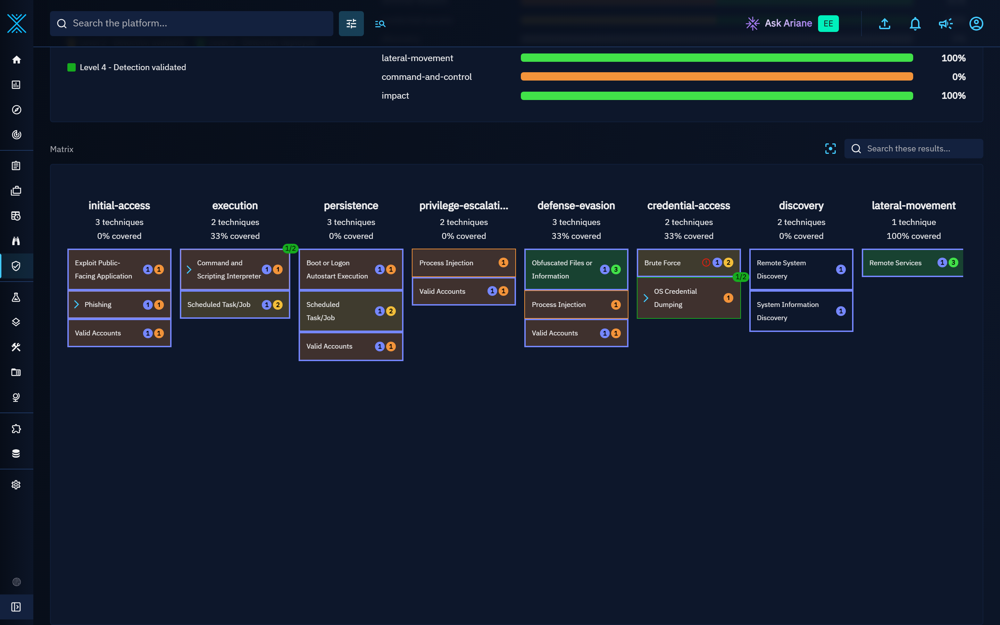

When the selected threats or the threat filters match no threat, the threat overlay stays on and says so: the coverage summary reads "No threat matches this scope: change the selected threats or the filters." instead of a figure, and **Validate the gaps** stays disabled. When the threats of the scope match but use no technique of the matrix, the summary says that instead. A selection without any threat, or a threat filter without any filter, means no threat overlay. Whenever **Validate the gaps** is disabled, the reason is written below it: no threat matches the scope, the threats of the scope use no technique, or every technique of the scope is already validated. In the Gaps section, **Only techniques used by threats** gives the same explanation when no threat matches the scope.

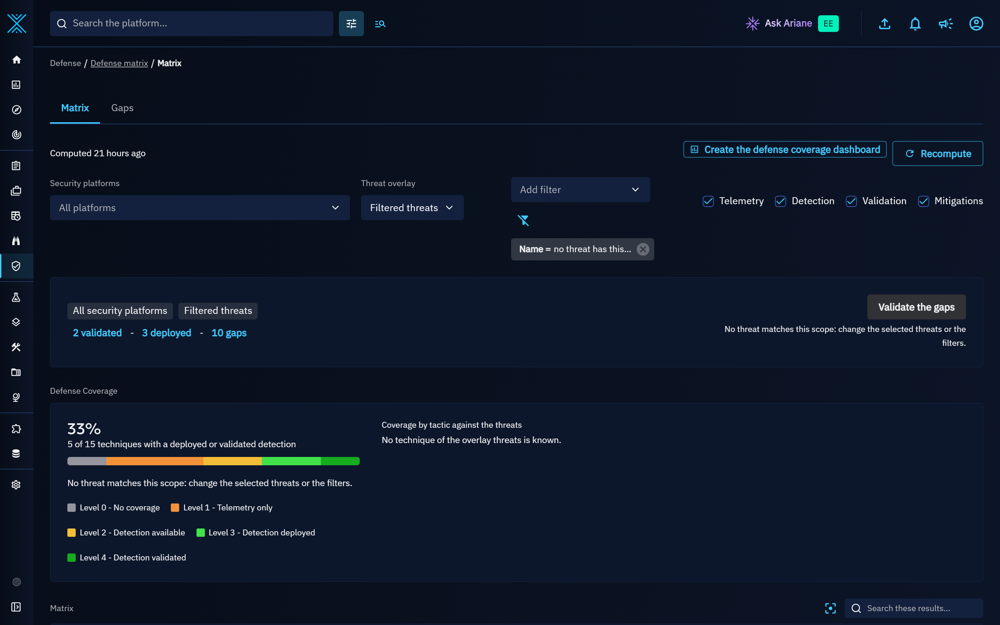

The selected platforms and threats are remembered per user, in the browser, and shared by the Matrix and Gaps sections. Every level and every threat count only uses the knowledge you can access: a change of the `uses` relationships or of the markings and organizations of a threat is reflected at the next refresh. All threats counts every threat you can access, and a threat scope defined by filters every matching threat, including the threats that use no technique yet. A sub-technique is grouped under its parent only if you can access the parent and the relationship between them.

Click a technique to open its drawer. It starts with the level and one sentence explaining it from its evidences, for example "2 detection rules are available, deployed on no security platform yet.", and the next action of the level:

| Level | Next action |
|:------|:------------|
| No coverage | **Map telemetry**: the telemetry mappings, or the security platforms to declare their telemetry |
| Telemetry only | **Find a detection rule**: the indicators of the technique |
| Detection available | **Deploy the rule**: the rule and its deployments |
| Detection deployed | **Validate in OpenAEV** |
| Failed validation | **Open the validation**: the security coverage of the failed validation |

Below, the drawer lists the evidences per platform: the data components and the platforms providing them, the detection rules and their deployments, the OpenAEV results behind the displayed level (those of the selected platforms), the mitigations, the threats using the technique and the validation requests already sent.

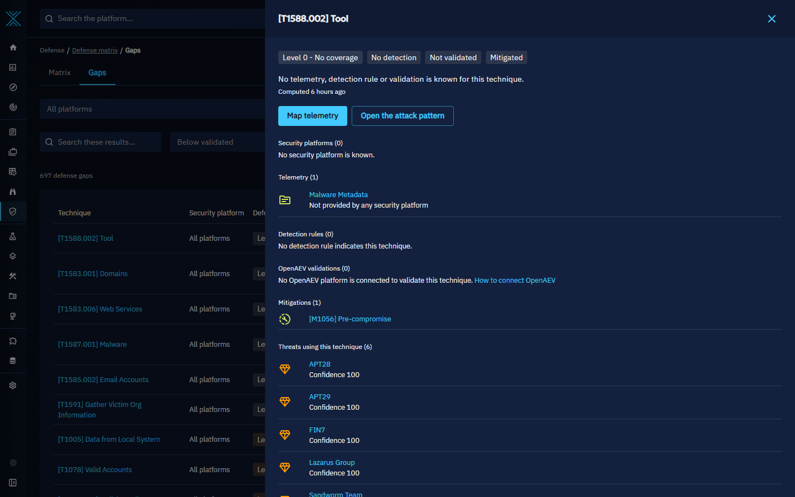

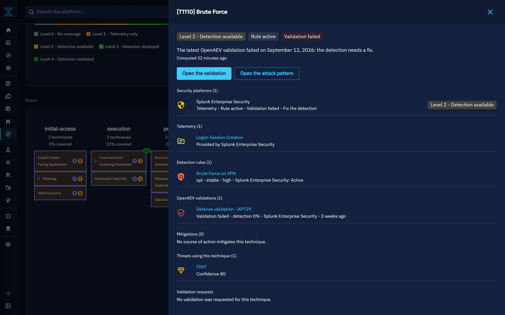

The coverage is computed in the background by the defense coverage manager: a full computation every night and an incremental computation when the knowledge changes. The header shows when it was computed (the exact date on hover). Users allowed to customize the platform can request a full computation with **Recompute**; the header shows the request until the computation is done.

## Gaps

The **Gaps** section lists every technique and platform pair below level 4, with:

* its level and the **recommended action**: add telemetry, import a rule, deploy a rule, activate a rule, validate, or fix the detection after a failed validation. Unlike the next action of the drawer, which follows the level of the technique, the recommended action follows the evidences of the platform: a platform that does not collect the telemetry of the technique gets **add telemetry** even when a rule is available (level 2), as the rule cannot detect anything there before;
* its **priority**, based on the threats using the technique (weighted by the confidence of their relationships) and on its level;
* the **rule candidates**: rules indicating the technique that are not deployed yet, ranked by the compatibility of their log source with the telemetry of the platform.

Without a selected security platform, each technique has one **All platforms** row: its missing telemetry is the telemetry that no platform provides, and its rule candidates are the rules deployed on no platform.

The backlog shares the scope of the matrix (platforms and threats). It can be filtered (levels, recommended actions, techniques used by the threats only, search), sorted, and exported to CSV with **Export CSV** (shown to the users whose role has the capability `Can use web interface export functions`): the export holds the filtered backlog, in its order, up to 10,000 gaps. When the backlog holds more, a message says so after the download: narrow the filters to export the others.

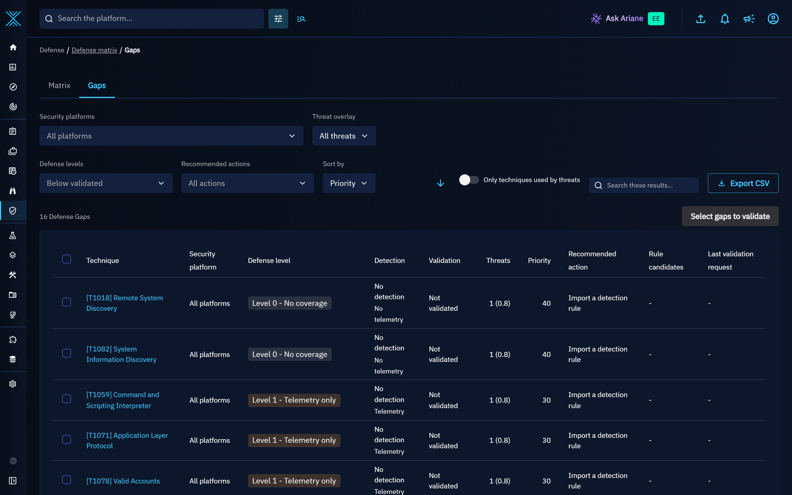

## Validate in OpenAEV

Validation needs OpenAEV connected to the platform: an OpenAEV platform reads the security coverages of this platform through its collector, and the OpenCTI account of that collector needs the Connector role (see [Security coverage](security-coverage.md) for the setup). The validation actions (**Validate the gaps** in the matrix header, the gap selection of the Gaps section, **Validate in OpenAEV** in a technique drawer) are offered only while an OpenAEV connector is active, and a request sent without one is refused with an explanation, before anything is created. Without one, the **OpenAEV validations** section of a technique drawer says that no OpenAEV platform is connected and links to this section. Select gaps in the Gaps section, open a technique drawer, or click **Validate the gaps** in the matrix header. The validation dialog previews what will be validated: each technique with the security platforms whose gaps track the request, and the scenario (target type, platforms, threat to emulate). Confirm with **Validate N techniques**: OpenCTI creates a grouping holding the techniques, the threat to emulate (if any) and these security platforms, and a [security coverage](security-coverage.md) of this grouping, so that OpenAEV generates a scenario restricted to these techniques. The request is tracked on the gaps: the selected technique and platform pairs exactly (a gap of technique A on platform P1 and a gap of technique B on platform P2 never track B on P1), and the aggregated gap of each technique. If the tracking cannot be written when the request is created, the platform writes it at the next run of the defense coverage manager (every 5 minutes by default), so a request never needs to be sent twice.

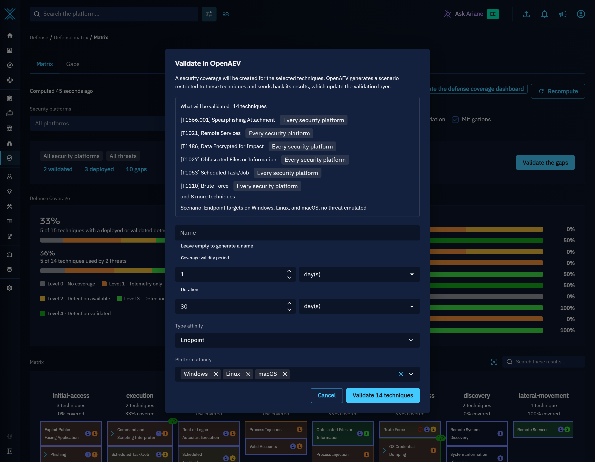

A validation request holds at most 200 techniques. In the Gaps section, a selection of more techniques (one by one or with **Select all**) disables the validation button and says why above the list: unselect some of them to validate. From the matrix header, **Validate the gaps** takes the 200 techniques used by the most threats first, and the dialog says how many techniques of the scope the request leaves out, with a link to the Gaps section to validate them next.

A request is also tracked on at most 2,000 gaps: each technique on all platforms and on every security platform of the request, plus the technique and platform pairs selected in the Gaps section. Every platform multiplies the gaps of a request (200 techniques on ten security platforms are 2,200 gaps), so above this limit the dialog says how many gaps the request would be tracked on and disables the validation: validate fewer techniques, or fewer security platforms at a time.

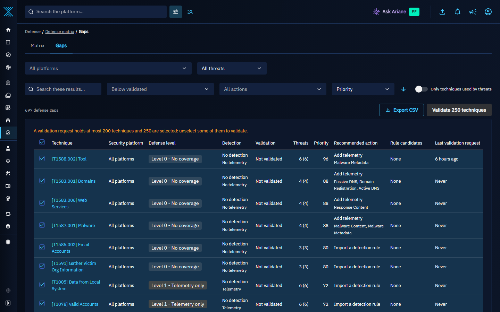

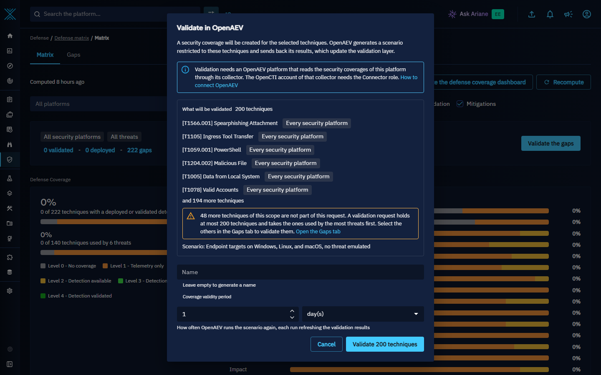

Each request listed in the technique drawer tells where OpenAEV stands: **Waiting for OpenAEV** while no OpenAEV platform has read its security coverage, then **Read by OpenAEV, waiting for the first results** until the scenario sends results.

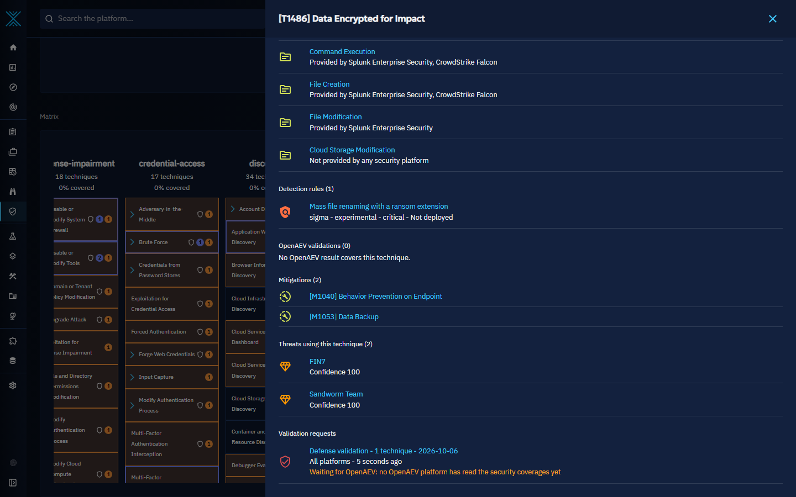

When OpenAEV sends the results back, they update the validation layer. Only results that hold count: a revoked result, a result whose validity period has not started, or an expired one is no validation evidence, and the nightly computation lowers the levels that relied on a result as soon as it expires. OpenAEV runs the scenario on endpoints, not on a security platform: every platform watching these endpoints reports through its own collector, and OpenAEV attributes each result to the security platform that produced it. The level of a technique on a platform only counts the results of that platform, so a selected platform that reports nothing keeps its gap open, and the results of a platform you did not select still update the levels of that platform.

Applications requesting a validation through the API (`defenseGapsValidate` mutation) can pass an `external_reference_url`, an http or https link to what asked for the validation (a risk scenario, a ticket). It is stored as an external reference of the security coverage, named after the host of the link.

## Notifications

A [live trigger](notifications.md#triggers) can listen to two defense events in addition to creation, modification and deletion:

| Event | Sent when |
|:------|:----------|
| **Defense level decreased** | The aggregated defense level of a technique, as the recipient sees it, goes down: for example the last rule indicating it is deleted, a platform stops providing a data component or the latest OpenAEV validation failed. |
| **Defense level increased** | The aggregated defense level of a technique, as the recipient sees it, goes up: for example a rule indicating it is imported or a validation succeeds. |

The notification names the technique and both levels, for example "defense level decreased from 4 (validated) to 2 (detection available)". Use the trigger filters to restrict it, for example to attack patterns with a given kill chain phase or label. The level changes of a computation are kept until they are delivered: if the notifications cannot be sent, the defense coverage manager sends them at its next run, and a trigger notified before the failure is told the next change of the technique from the level it was notified of. A change is only reported up to the level actually stored, so a computation that could not be saved notifies nothing.

Each recipient is told about the level they see: both levels are computed from the evidences the recipient can access, so a change caused only by a rule, a relationship or a result they cannot see sends them nothing, and a change they can see is reported even when other evidences keep the overall level unchanged. An evidence deleted since the previous computation counts with the markings and organizations it had, as kept in the [trash](delete-restore.md#trash); once it is no longer in the trash, it no longer counts for anyone but the users who bypass access restrictions. A recipient is only notified about techniques they can access. The first computation of the matrix sets the levels without notifying, and a recomputation that leaves a level unchanged notifies nobody. Digests built on these triggers collect the events like any other live notification.

## Dashboards

Three widgets are available in custom dashboards: **Defense coverage by tactic**, **Top uncovered techniques used by threats** (the techniques without a deployed detection, highest priority first) and **Techniques by defense level** (the number of techniques with a deployed detection, of validated techniques, and the techniques per level). Like the matrix, they show the levels computed from the evidences the reader can access.

Click **Create the defense coverage dashboard** next to **Recompute** in the defense matrix to create a custom dashboard from the built-in template: coverage by tactic, uncovered techniques used by threats, techniques by defense level, and detection rules by pattern type with the latest ones. The same template is offered on the custom dashboards page: click **Create from template** and choose **Defense coverage**.

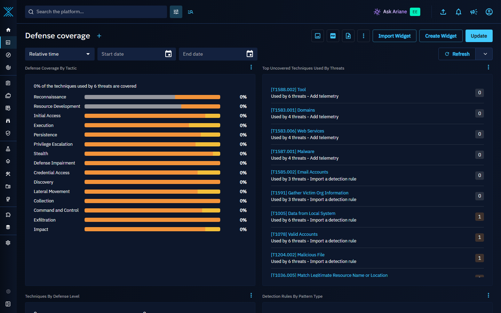

The defense widgets are not available in public dashboards and in the custom views of entities.
