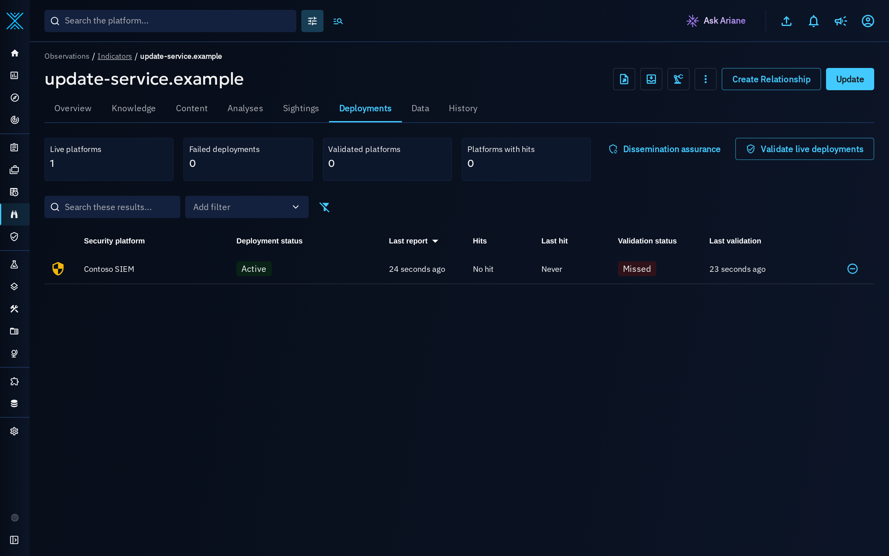
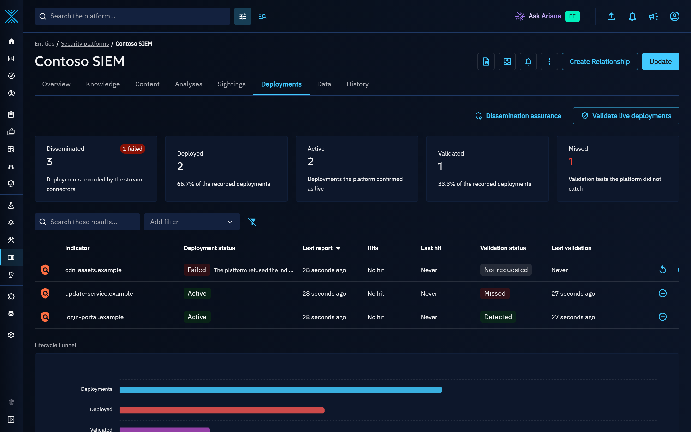
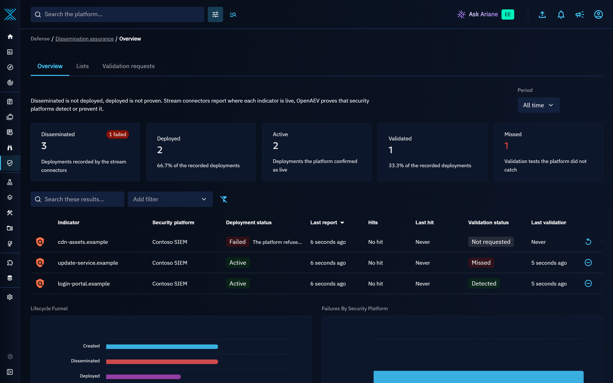
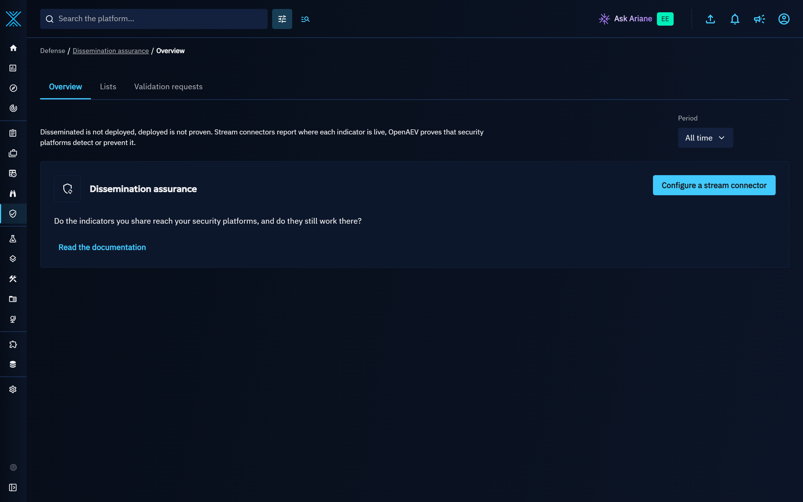
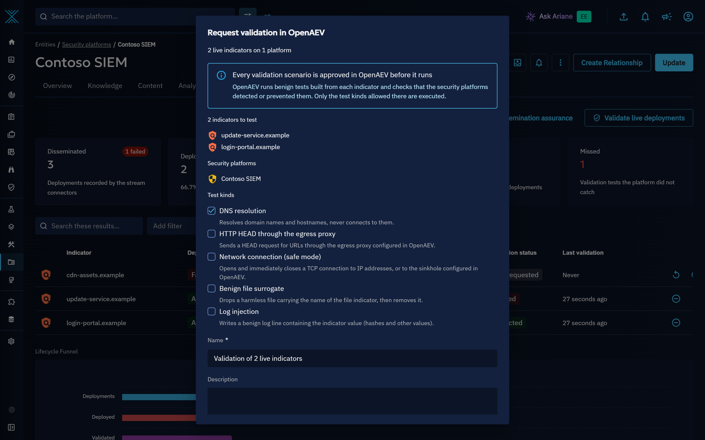
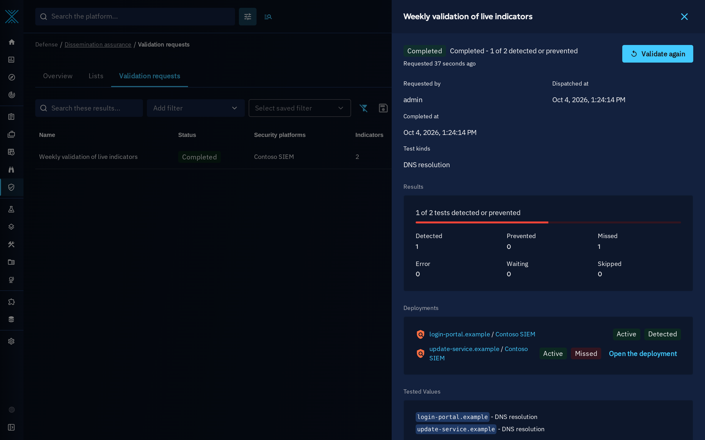

# Dissemination assurance

Sharing an indicator with a security platform does not prove that the platform uses it. Dissemination assurance
closes the loop: the stream connectors report where each indicator is actually deployed, the platforms report the
hits they observe, and OpenAEV can prove with benign tests that a deployed indicator is detected or prevented.

Dissemination assurance is available in every edition and uses no AI: every status and counter is computed
deterministically from what the connectors and OpenAEV report.

## Deployments

When a stream connector pushes an indicator to a security platform, it reports the result to OpenCTI. Each report
creates or updates a `deployed-on` relationship from the indicator to the security platform. The relationship
carries the lifecycle of the indicator on that platform:

| Attribute            | Description                                                                 |
|:---------------------|:----------------------------------------------------------------------------|
| Deployment status    | `pending`, `deployed`, `active`, `failed`, `removed` or `expired`.          |
| External id          | The identifier of the indicator in the security platform.                  |
| Deployed at          | When the platform first accepted the indicator.                             |
| Last synchronization | When the connector last reported on the indicator.                          |
| Removed at           | When the platform confirmed the removal.                                    |
| Hit count            | The number of hits the platform reported for the indicator.                 |
| First hit            | When the earliest hit the platform reported happened.                      |
| Last hit             | When the platform last reported a hit.                                      |
| Validation status    | `not_requested`, `requested`, `detected`, `prevented`, `missed` or `error`. |
| Last validation      | When the last validation result was received.                               |
| Deployment error     | The error the platform returned, when the deployment failed.                |

Reports are idempotent: a connector can report the same state again without creating a new relationship. A
`deployed` report never downgrades an `active` deployment, and a `pending` report never downgrades a live
(`deployed` or `active`) one. A report carries the time the connector synchronized with the platform (last
synchronization): a report older than the last one applied describes a state the platform has already left and
changes nothing, so a delayed report never moves a deployment back. A report without that time, or with a time ahead
of the OpenCTI clock, takes the time OpenCTI receives it. Otherwise a `failed` or `removed` report always takes
effect. Only the platform manager sets the `expired` status.

Hits reported by a security platform are also recorded as a sighting of the indicator by the platform, so they show
up with the other sightings of the indicator. The deployment is the reference record of the hits: the sighting is
rebuilt from its hit count, first hit and last hit on every report, so a sighting left behind by an interrupted
report, or deleted by mistake, is repaired by the next report of the platform without counting any hit twice. What
the hits sighting records (count, first and last seen, negative flag, description) is written by the hit reports of
connector accounts, or by administrators: no one else creates a sighting carrying its identifier, and its identifier
cannot be removed from it. Analysts can still label it, add notes and references to it.
Every hit report carries the time of its most recent hit, as the security platform recorded it: a report whose last
hit is not after the last hit already known is a retry and adds nothing, so a report sent again after a lost answer
is never counted twice. An integration that can send several reports ending at the same time (for example with
timestamps rounded to the second) gives each report its own report identifier: a report ending at the last known hit
is then counted when its identifier is new, and a retry, which carries the same identifier, still adds nothing.

### Supported connectors

The following stream connectors report deployments, and hits when the security platform exposes its detections
(see the README of each connector):

- Microsoft Sentinel Intel
- Microsoft Defender Intel
- CrowdStrike Endpoint Security
- Splunk
- Elastic Security Intel
- Google SecOps SIEM
- SentinelOne Intel
- Palo Alto Cortex XDR Intel
- Zscaler
- Cloudflare Rules List

### Indicator counters

Each indicator carries derived counters, refreshed automatically from its deployments. They can be used in
filters, lists and dashboards:

| Counter                    | Description                                                     |
|:---------------------------|:----------------------------------------------------------------|
| Deployments count          | The number of platforms where a stream connector reported the indicator, whatever the status: the evidence that the indicator was disseminated. A deployment recorded by hand stays out of it until its connector reports it. |
| Deployment platforms count | The number of platforms where the indicator is deployed or active. |
| Deployment failed count    | The number of platforms where the deployment failed.            |
| Expired deployments count  | The number of platforms where the deployment was flagged expired because its removal was never confirmed. |
| Validated platforms count  | The number of platforms where a validation proved a detection or a prevention. |
| Hit platforms count        | The number of platforms that reported at least one hit.         |

The counters are kept up to date from the deployment events. Deleting or merging a security platform removes its
deployments without individual events, so the platform manager then recomputes the counters of every indicator
with deployments; it also rechecks them continuously in bounded batches.

A deployment, its hits sighting and its validation results carry the markings of both the indicator and the
security platform, so only the users who can read both can read them: for every marking type the indicator or the
security platform carries (TLP, PAP, statements...), they carry the highest marking of that type among the two.
Creating or importing a `deployed-on` relationship without these markings is refused, and so is a sighting created
under the identifier of a hits sighting or of a validation result, or an edit that removes one of them or replaces it
with a lower one; raising a marking or adding a marking of another type stays possible. These rules apply to
administrators too.
When a marking of the indicator or of the security platform is added or raised, its deployments, hits sightings and
validation results follow at once, and the counters follow every change of markings, sharing, authorized members or
author of either end. A marking stricter than those of the indicator and of the security platform is kept when an end
lowers or removes its own, as it may have been set on the deployment on purpose: an editor can lower it to the level of
the indicator and of the security platform. An indicator has one deployment per security
platform: a `deployed-on` relationship has no start or stop time (its dates are the deployment, synchronization and
removal dates), so creating or importing it again updates the existing one. The counters stored on an indicator are visible to every
reader of the indicator: they only count the deployments that carry no marking beyond the indicator's own, are
shared with every organization the indicator is shared with and have no authorized members, so they never reveal a
deployment a reader of the indicator cannot read.
Indicators and security platforms cannot be restricted to authorized members: these relationships and the validation
requests carry the markings and organizations of their ends only, and one involving an element restricted to authorized
members is refused.
On a platform with organization segregation, these relationships are shared with the organizations that both the
indicator and the security platform are shared with, never with the other organizations of the connector account,
and they follow every later sharing change of either end. This holds whoever creates the deployment or its hits and
validation result sightings: one created by hand or imported in a bundle gets the same organizations, whatever
organizations the request names. Since the users of an individual read what this individual authored, whatever its
organizations, these relationships are never authored by an individual: creating, importing or editing one with an
individual as author is refused (an organization or a system can author them). A connector account outside the
platform organization reports only on the pairs it can read back: the indicator and the security platform must both
be shared with one of its organizations.

## Viewing deployments

- On an indicator, the **Deployments** tab lists the security platforms the indicator is deployed on, with the
  status, hits and validation of each deployment.
- On a security platform, the **Deployments** tab lists the indicators deployed on the platform, with the same
  information and the assurance metrics of the platform.

From both tabs, an analyst with the *Update knowledge* capability can:

- **Deploy again**: available on a failed, removed or expired deployment. The connector deploys the indicator
  again.
- **Remove from this platform**: withdraws the indicator from this platform only, after a confirmation naming the
  indicator and the platform. The connector removes it and reports it as removed. If the removal is not confirmed
  within the grace period, the deployment is flagged as expired. The grace period starts at the withdrawal, at the
  revocation of the indicator or at the end of its validity; later edits of the indicator or of the deployment never
  restart it.

## Dissemination assurance pages

Go to **Defense > Dissemination assurance**.

- **Overview** starts with the key figures: disseminated, deployed, active, validated and missed. They count the
  deployments (one per indicator and security platform) first recorded in the selected period and reported by a
  connector, so a pending deployment recorded by hand is not counted until its connector reports it, and each one filters the
  list of deployments shown under it, so a figure always equals the number of deployments its list shows. Below,
  the lifecycle funnel follows the indicators created in the period from created to disseminated, deployed,
  validated and hit, with the indicators that expired but are still deployed, next to the deployment and validation
  statuses. An indicator counts as disseminated once a stream connector recorded it on a security platform, whatever
  the outcome (pending, deployed, failed, removed or expired): the detection flag of an indicator is not evidence of
  dissemination.
- **Lists** gives ready-made lists of the indicators that need attention: disseminated but not deployed (recorded
  by a connector but live on no platform), deployed but never validated, and expired but still deployed (revoked or
  past their validity while still live on a platform, or flagged expired because their removal was never confirmed).
- **Validation requests** lists the IOC validation requests sent to OpenAEV and their results.

Until a stream connector reports its first deployment, the overview shows the question the area answers, with a
link to configure a stream connector and to this page:

## Validating deployments with OpenAEV

An IOC validation request asks OpenAEV to prove that deployed indicators are detected or prevented by the
security platforms. Use the **Validate live deployments** button on the deployments of an indicator or a platform:
the request covers the live deployments, up to 200 indicators, never validated first (deployments without proof, or
whose last validation missed or failed, then the proven ones). Deployments already waiting for the results of
another request are left out. The dialog shows what will be tested (the indicators, the security platforms and the
test kinds) before you send the request. It is delivered to OpenAEV by the IOC validation connector. A deployment
that starts waiting for another request in the meantime is skipped, and listed with the reason in the new request.

When the IOC validation connector is not running, the request waits and is sent as soon as the connector is back.
The request page then tells what to do: configure OpenCTI in OpenAEV and start its IOC validation connector, or ask an
administrator when you cannot manage connectors. The request also waits while the OpenCTI account of the connector
misses the "Update knowledge" or "Connectors API usage" capability of the Connector role, and names the missing one.
Before it is sent, every deployment is checked again: a deployment that is no longer live, whose removal was
requested, or that no longer waits for this request is left out, listed with the reason, and can be validated again by
another request; the indicators and platforms without any deployment left are not sent. A deployment whose indicator,
security platform or relationship the OpenAEV service account can no longer read (a marking or a sharing changed
while the request waited) is left out the same way, so the request never waits for a test that was not sent; when
none is readable any more, the request fails with that reason. Deleting a request releases
its deployments that are still waiting for results and deletes the sightings that recorded its results; a request
being sent is deleted once the sending is recorded.

A request describes all its indicators and security platforms (its name, description, status messages and OpenAEV
run), so only the users who can read every one of them can see, list or delete it: it carries the markings of all of
them (the highest of each type) and, on a platform with organization segregation, is shared with the organizations all
of them are shared with. It follows every later change of their markings or sharing; once one of them is deleted, a
change of the others can only make the request stricter, never looser. Within a request, each user only
sees the indicators, results and deployments they can read. The OpenAEV IOC validation connector keeps reporting on the
requests sent to it, whatever its account can read.

OpenAEV never runs anything without an explicit approval by one of its operators, and only runs the benign test
kinds allowed in its settings. By default, the validation never contacts adversary infrastructure: DNS resolution
does not connect to the resolved address, network tests can be sent to a sinkhole, and HTTP tests require an
egress proxy. A URL indicator is only validated by an HTTP test of the URL itself: a DNS resolution of its host would
only prove that the domain is detected, so while HTTP tests are not allowed the URL indicator is listed as skipped with
its reason. See the [OpenAEV documentation](https://docs.openaev.io/latest/usage/build/scenario/ioc-validation/)
for the approval workflow and the safety settings.

When OpenAEV sends the results, the validation status of each deployment is updated to `detected`, `prevented`,
`missed` or `error`, and the request shows the outcome of every indicator and platform pair. A missed indicator
links to its deployment, and a completed request can be validated again in one action. A request where at least one
test ends in `error` is shown as partially completed, with the number of tests that could not run. Each request keeps
the outcome it got: validating the same deployment again updates the deployment, not the results of the earlier requests.
OpenCTI sends a request to OpenAEV once: a request whose sending was interrupted is never sent again, and it
expires after the validation timeout with a message asking to request the validation again. The message queue may
deliver a message twice; OpenAEV records each request once, under its identifier, so it still makes one validation.

A request without results after the timeout (`ioc_validation:timeout_days`) expires, and its deployments still waiting
get the `error` status. A result that a security platform reports later for the same request replaces that timeout
error, never a result already recorded.

## Dashboard template

To build a dashboard of the dissemination assurance metrics, go to **Dashboards > Custom dashboards**, click
**Create from template** and choose **Dissemination assurance**. The dashboard shows the deployments by status,
the validations by outcome (each in the week of its last validation), the live deployments and missed validations by security platform, the latest failed
deployments, and the indicators that are deployed but never validated, disseminated but not deployed, or expired
but still deployed (revoked while live, or flagged expired). It is a regular custom dashboard: its widgets can be
edited, moved and shared.

## Notifications

Create live triggers in **Notifications** to be told when a deployment needs attention:

| Event                       | Entity type     | Filters                                                        |
|:----------------------------|:----------------|:---------------------------------------------------------------|
| Deployment failed           | Deployed on     | Deployment status = `failed`                                   |
| Validation missed           | Deployed on     | Validation status = `missed`                                   |
| Removal never confirmed     | Deployed on     | Deployment status = `expired`                                  |
| Expired but still deployed  | Indicator       | Revoked = `true` and Deployment platforms count greater than 0 |

The **Removal never confirmed** trigger fires when the platform manager flags a deployment as expired, once the
removal grace period has passed without confirmation from the connector.

The **Expired but still deployed** trigger fires when an indicator live on a platform is revoked, including right after
its first deployment, and when a deployment is reported for an indicator that is already revoked.

## Configuration

The platform manager that flags expired deployments and keeps the counters up to date can be configured with the
following parameters:

| Parameter                                           | Environment variable                                 | Default value | Description                                                     |
|:----------------------------------------------------|:-----------------------------------------------------|:--------------|:----------------------------------------------------------------|
| indicator_deployment_manager:enabled                | INDICATOR_DEPLOYMENT_MANAGER__ENABLED                | true          | Enable the indicator deployment manager: expiry of deployments, counters, maintenance of validation requests, and the markings and sharing of deployments and validation requests after a change of markings, sharing, authorized members or author of their indicator or security platform. Keep it enabled. |
| indicator_deployment_manager:interval               | INDICATOR_DEPLOYMENT_MANAGER__INTERVAL               | 60000         | Interval between two runs of the manager, in milliseconds.      |
| indicator_deployment_manager:removal_grace_period   | INDICATOR_DEPLOYMENT_MANAGER__REMOVAL_GRACE_PERIOD   | 86400000      | Time given to a connector to confirm a removal, in milliseconds. |
| indicator_deployment_manager:reconciliation_max_pages | INDICATOR_DEPLOYMENT_MANAGER__RECONCILIATION_MAX_PAGES | 1000        | Pages of 1,000 indicators whose counters are recomputed right after a security platform is deleted or merged. |
| indicator_deployment:report_rate_limit              | INDICATOR_DEPLOYMENT__REPORT_RATE_LIMIT              | 200           | Maximum deployment reports per second for one account, on each API node. |
| indicator_deployment:batch_rate_limit               | INDICATOR_DEPLOYMENT__BATCH_RATE_LIMIT               | 20            | Maximum batch deployment reports per second for one account, on each API node. |
| indicator_deployment:hits_rate_limit                | INDICATOR_DEPLOYMENT__HITS_RATE_LIMIT                | 200           | Maximum hit reports per second for one account, on each API node. |
| ioc_validation:timeout_days                         | IOC_VALIDATION__TIMEOUT_DAYS                         | 7             | Days after which an unanswered IOC validation request times out. |

The three rate limits are counted by each API node, as the other rate limits of the platform: they protect the node
that receives the reports, and a platform whose requests are spread over several API nodes accepts up to the limit on
each of them. Set them for one node.

## API

Connectors use the following GraphQL mutations, also available in the Python client (`pycti`):

- `indicatorReportDeployment`: reports the deployment status of one indicator on one platform.
- `indicatorReportDeployments`: reports the deployment status of a batch of indicators on one platform. The reports
  of one indicator are applied in the order of the batch, so the last one decides.
- `indicatorReportHits`: reports the hits of one indicator on one platform; `lastHit`, the time of the most recent
  hit, is required and makes a retried report harmless; the optional `reportId` tells apart distinct reports ending
  at the same time. A `lastHit` more than 5 minutes ahead of the platform clock is refused: it would make every
  later report ending before it look like a retry. The hit count of a deployment and of its hits sighting stops at
  2,147,483,647; later reports still move their last hit forward.

These mutations require both the "Update knowledge" and the "Connectors API usage" (`CONNECTORAPI`) capabilities, as
granted by the default *Connector* role: the account of a stream connector or of any other integration writing the
deployments back (for example a SIEM add-on) must have that role, or a role with both capabilities.

The deployment state (deployment status, external id, deployed at, last synchronization, removed at, hit count, first
hit, last hit, deployment error) is written the same way everywhere else. Creating, importing or editing a `deployed-on`
relationship with these values set is reserved to connector accounts (bundle imports, platform synchronization) and
administrators. Any other account can still create a `deployed-on` relationship, which then starts in its default
state (`pending`, no hit, validation not requested), but cannot set or reset the state of an existing one, including
through a creation that updates an existing relationship. The `expired` status stays reserved to the platform manager
and administrators on every path: a connector account cannot set it by creation, import or edition either. The analyst
actions of the Deployments tabs (retry, remove) stay available with the "Update knowledge" capability.

A security platform able to prove a validation test from its own data (for example a SIEM that searched for the
benign test of a request) reports the outcome with `iocValidationReportResults(id, platformId, results)`: each result
gives an indicator, `detected`, `prevented` or `missed`, and optionally the observation date, a hit count and the
evidence. A report gives one result per indicator: one naming an indicator twice, by any of its identifiers, is refused
before anything is written. Only the pairs of the request on that platform still waiting for an answer, or closed by the timeout of the
request, are updated, so a result already received is never overwritten. Each result is recorded as a sighting of the indicator by the platform,
negative for a miss. The identifier of that sighting is reserved to its request: only the results reported for that
request (by its IOC validation connector or the account recording the deployment) create it and change what it
records, even after a newer request took the pair over; administrators aside, nothing else does, and the identifier
cannot be removed from the sighting. No edit gives that identifier, or the one of a hits sighting, to an existing
sighting, administrators included: those sightings are created with the markings and the sharing of their pair.

A validation result is proof attributed to the platform, so it is accepted only from the connector account that
recorded the deployments of the pairs on that platform (the integration reporting its deployment statuses), from the
OpenAEV connector the request was sent to, or from an administrator. Any other account, even with the "Update
knowledge" capability, is refused, including an account that only edited or re-created a deployment (for example to
add a description): editing a relationship lists you among its creators, but does not make you speak for the
platform. The same rule protects every other way to write the validation fields of a deployment
(validation status, last validation, validation run): editing the relationship, or creating it again with these
fields so that the existing relationship is updated, requires one of these accounts, resets to "not requested"
included, and creating or importing a deployment that already carries a validation outcome is reserved to an OpenAEV
IOC validation connector or an administrator.
