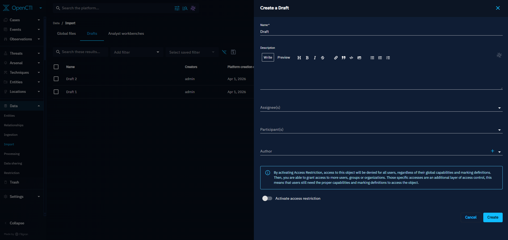
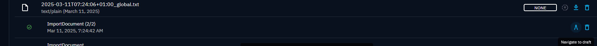
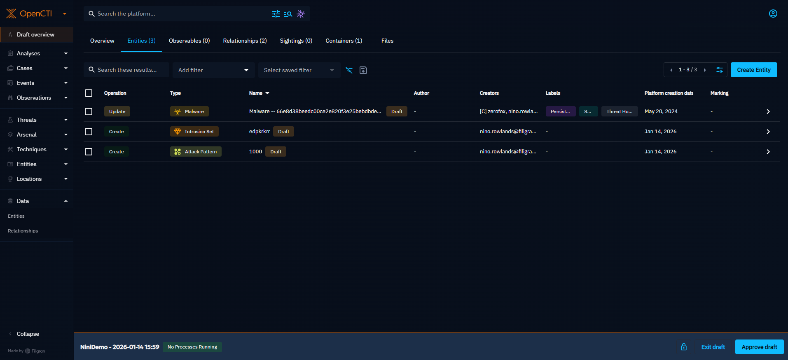
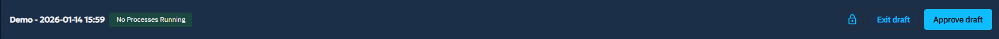

# Draft workspaces

Drafts are powerful tools that enable analysts to create and manipulate data in a separate workspace, without impacting the main knowledge base of the platform. Most of the feature available in the platform are also compatible in draft.

## Draft creation

Drafts can be created in two major ways.

The first way to create a draft is to manually create one, in the Drafts page. When created this way, the draft will be initialized without any data modified in it.

The second way drafts can be created is when files are imported in the platform. Depending on the platform and connector configuration, uploading a file can automatically generate an import of that file. This automatic import can generate a draft where the result of the file import is available. We have created a variable to let you choose your import (either workbench or draft): [Configuration](../deployment/configuration.md).

In addition, files can be manually imported. When that is the case, an option is available to decide the validation mode to use. When the draft validation mode is selected, a draft will be automatically created and the result of the file import will be available in it.

!!! warning "Import data without update"

    When importing data that already exists in the platform, if this data is not updated by the import, the data contained in the file will not be present in your draft.
    As an example: importing an email "test@test.com" and validating your draft, then re-importing the same email "test@test.com" will not appear in the newly created draft since it is not edited. However, if another user imports it, the email "test@test.com" will be in your draft, given that the "creator" will be updated with the new user who imported it.

For more detailed information on file import, see the import documentation page here: [Import from files](import-files.md).

To quickly move into the draft and see the result of a file import, a Navigate to draft icon is available.

Otherwise, a draft can be accessed by clicking on it in the draft list.

## Draft overview

When entering a draft, the landing page will be the overview of the modifications contained in the draft

This overview is separated into different tabs: entities, observables, relationships, sightings and containers. Each tab contains the list of the modifications applied to an item of this type.

### Operation types

There are 5 types of draft operations that can be applied to items. 3 operations are modifications that directly impact the data:

- CREATE: this means that the item was newly created in the draft, and that it does not exist in the main knowledge base
- UPDATE: this means that the item existed in the main knowledge base, but was modified in the draft
- DELETE: this means that the item existed in the main knowledge base, but was marked for deletion in the draft

2 operations are modifications that were not directly asked on the item, but that resulted from the modification of linked items:

- UPDATE_LINKED: this means that the item existed in the main knowledge base and wasn’t directly modified, but has been impacted by a modification to a linked entity. This can happen when a relationship is created targeting this entity, when this entity is added in a container etc…
- DELETE_LINKED: this means that the item existed in the main knowledge base and wasn’t directly marked for deletion, but that it still be deleted as a result of the deletion of a linked entity

### Files in a draft

In addition to these lists of entities modified, a file tab is also available.

In this tab, additional files can uploaded and imported within the draft workspace without impact the main knowledge base. These files will only be visible in the current draft.

### Top bar actions

When in a draft, the top bar is modified as a reminder that everything done in the platform will only impact the current draft.

Clicking on the draft name can be used a quick way to navigate back to the draft overview, and see the recap of all the modifcations.

Exiting a draft and going back to the main knowledge base of the platform can be done with the Exit draft button.

Approving a draft and ingesting it back into the main knowledge base can be done with the Approve draft button.

An icon and a number count will be visible when there are ongoing processes in the draft (enrichment connector works, background tasks…). Clicking on this icon will open up the full list of ongoing processes, with more details available.

### Draft approve

Once the content of the draft is deemed acceptable, the draft can be approved. Doing so will send the content of the draft for ingestion into the main knowledge base. The draft status will also be updated: the draft will no longer be considered opened, but validated.

Drafts can be approved even if there are ongoing processes still ongoing, but please note that the modifications that would have been applied by these processess will be lost.

Depending on the draft operation of the data, the ingestion process will be sightly different. Only Create, Update and Delete operations are sent for ingestion. Created entities will be fully sent for ingestion. But updated entities will not be fully sent for ingestion and upserted: instead, only the updates applied in the draft will be applied on the main knowledge version. For deletions, only deleted entities will have a delete action applied, and not deletion linked entities

### Data segregation & RBAC in draft

Given that in draft you can see your platform, it is important to highlight that:

- [Capabilities](../administration/users.md) will apply in draft: a user without the ability to create or update knwoledge won't be able to create or update knowledge in draft. additionnally, this user won't be able to approve a draft either.
- [Confidence level](reliability-confidence.md) applies in draft: confidence level will apply in draft, in the exact same way that they are enforced in the platform.
- [Markings](../administration/segregation.md) will apply in draft: if you are not able to view a data in the platform, then you won't be able to see it in draft either.
- [Data segregation](../administration/organization-segregation.md): if you have enabled data segregation and an entity has not been shared with you, when accessing a draft, this entity will remain not accessible to you. Additionally, if in the meantime, this entity has been shared to you, this entity will remain hidden from you in draft, since the draft has been created before the access has been granted to you.

## Draft read only view

Once the draft has been approved and that it is now in a validated status, it is no longer possible to enter this draft and apply modifications in it.

However, it is still possible to see the modifications that existed when the draft was approved

When opening a validated draft, the same draft overview will be avaible to see all of the draft changes.

In addition, the progress of the ingestion of the draft approval is visible on top of the data lists.

## Features not available in draft

Even though drafts try to provide as many actions as possible in the platform, some actions either do not make sense or have not been implemented yet to work in draft mode. Among them:

- playbooks
- inference rules
- sharing to org
- apply authorized members
- downloading knowledge
- disseminate a file
- merge entities
