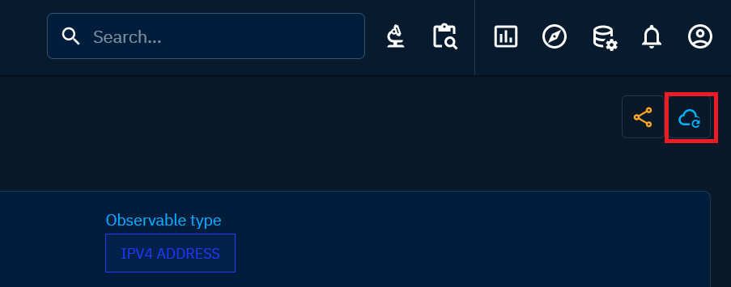

# Enrichment connectors

Enriching the data within the OpenCTI platform is made seamlessly through the integration of enrichment connectors. These connectors facilitate the retrieval of additional data from external sources or portals.

### Automatic enrichment

Enrichment can be conducted automatically in two distinct modes:

- Upon data arrival: Configuring the connector to run automatically when data arrives in OpenCTI ensures a real-time enrichment process, supplementing the platform's data. However, it's advisable to avoid automatic enrichment for quota-based connectors to paid sources to prevent quickly depleting all quotas. Additionally, this automatic enrichment contributes to increased data volume. On a large scale, with hundreds of thousands of objects, the disk space occupied by this data can be substantial, and it should be considered, especially if disk space is a concern. The automatic execution is configured at the connector level using the "auto: true|false" parameter.
- Targeted enrichment via playbooks: Enrichment can also be performed in a more targeted manner using [playbooks](automation.md). This approach allows for a customized enrichment strategy, focusing on specific objects and optimizing the relevance of the retrieved data.

### Manual enrichment

Manually initiating the enrichment process is straightforward. Simply locate the button with the cloud icon at the top right of an entity. 

Clicking on this icon unveils a side panel displaying a list of available connectors that can be activated for the given object. If no connectors appear in the panel, it indicates that no enrichment connectors are available for the specific type of object in focus.

Activation of an enrichment connector triggers a contact with the designated remote source, importing a set of data into OpenCTI to enrich the selected object. Each enrichment connector operates uniquely, focusing on a specific set of object types it can enrich and a distinct set of data it imports. Depending on the connectors, they may, establish relationships, add external references, or complete object information, thereby contributing to the comprehensiveness of information within the platform.

The list of available connectors can be found in our [connectors catalog](https://www.notion.site/OpenCTI-Ecosystem-868329e9fb734fca89692b2ed6087e76). In addition, further documentation on connectors is available on [the dedicated documentation page](../deployment/connectors.md).

!!! note "Impact of the max confidence level"

  The maximum confidence level per user can have an impact on enrichment connectors, not being able to update data in the platform. To understand the concept and the potential issues you could face, please navigate to this [page](reliability-confidence.md) to understand.
