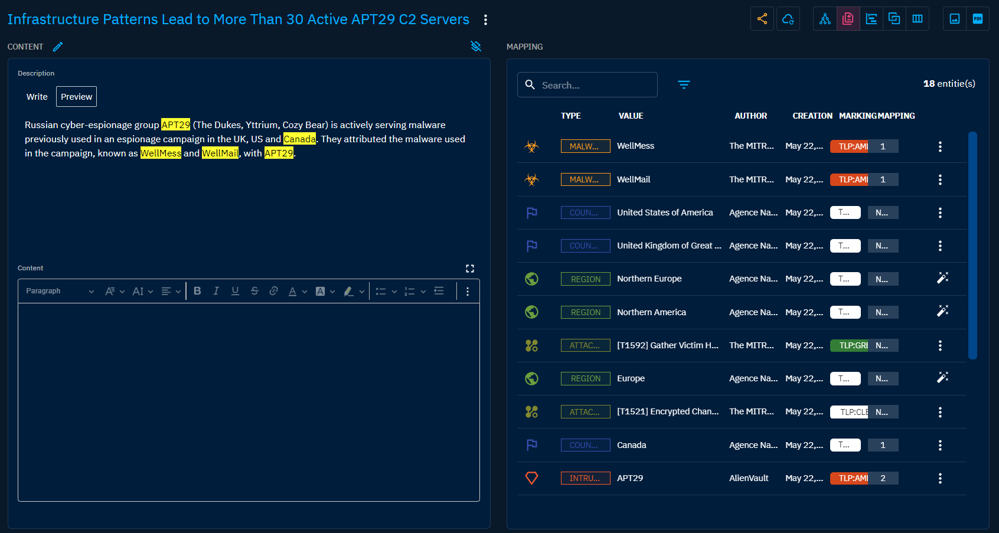
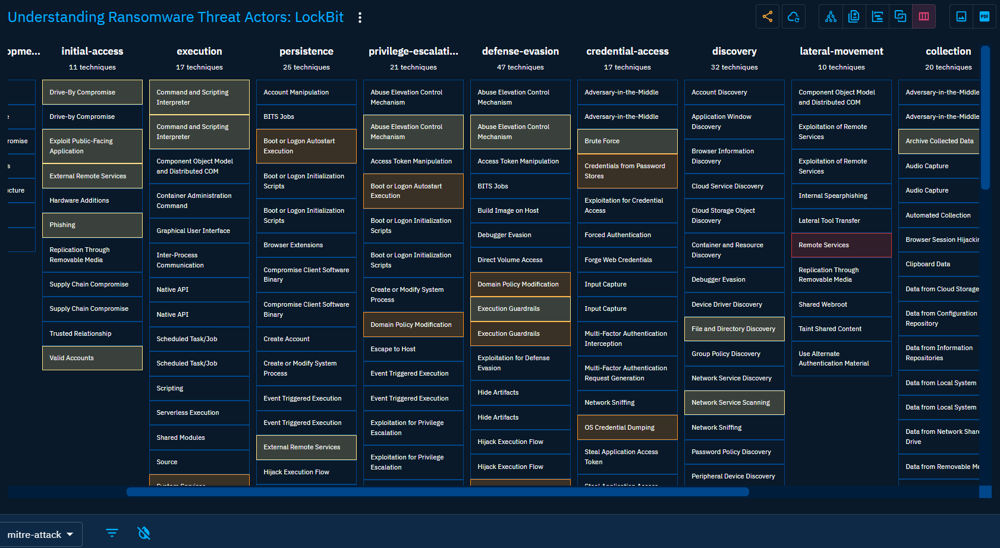

# Exploring "Analyses"

When you click on "Analyses" in the left-side bar, you see all the "Analyses" tabs, visible on the top bar on the left. By default, the user directly access the "Reports" tab, but can navigate to the other tabs as well.

From the `Analyses` section, users can access the following tabs:

- `Reports`: See Reports as a sort of containers to detail and structure what is contained on a specific report, either from a source or write by yourself. Think of it as an Intelligence Production in OpenCTI.
- `Groupings`: Groupings are containers, like Reports, but do not represent an Intelligence Production. They regroup Objects sharing an explicit context. For example, a Grouping might represent a set of data that, in time, given sufficient analysis, would mature to convey an incident or threat report as Report container.
- `Malware Analyses`: As define by STIX 2.1 standard, Malware Analyses captures the metadata and results of a particular static or dynamic analysis performed on a malware instance or family.
- `Notes`: Through this tab, you can find all the Notes that have been written in the platform, for example to add some analyst's unstructured knowledge about an Object.
- `External references`: Intelligence is never created from nothing. External references give user a way to link sources or reference documents to any Object in the platform.

## Reports

### General presentation

Reports are one of the central component of the platform. It is from a `Report` that knowledge is extracted and integrated in the platform for further navigation, analyses and exports. Always tying the information back to a report allows for the user to be able to identify the source of any piece of information in the platform at all time.

In the MITRE STIX 2.1 documentation, a `Report` is defined as such :

> Reports are collections of threat intelligence focused on one or more topics, such as a description of a threat actor, malware, or attack technique, including context and related details. They are used to group related threat intelligence together so that it can be published as a comprehensive cyber threat story.

As a result, a `Report` object in OpenCTI is a set of attributes and metadata defining and describing a document outside the platform, which can be a threat intelligence report from a security reseearch team, a blog post, a press article a video, a conference extract, a MISP event, or any type of document and source.

When clicking on the Reports tab at the top left, you see the list of all the Reports you have access to, in respect with your [allowed marking definitions](../administration/users.md). You can then search and filter on some common and specific attributes of reports.

### Visualizing Knowledge within a Report

When clicking on a Report, you land on the Overview tab. For a Report, the following tabs are accessible:

- Overview: as described [here](overview.md#overview-section).
- Knowledge: a complex tab that regroups all the structured Knowledge contained in the report, accessible through different views (See below for a dive-in). As described [here](overview.md#knowledge-section).
- Content: a tab to upload or creates outcomes document displaying the content of the Report (for example in PDF, text, HTML or markdown files). The Content of the document is displayed to ease the access of Knowledge through a readable format. As described [here](overview.md#content-section).
- Entities: A table containing all SDO (Stix Domain Objects) contained in the Report, with search and filters available. It also display if the SDO has been added directly or through [inferences with the reasonging engine](inferences.md)
- Observables: A table containing all SCO (Stix Cyber Observable) contained in the Report, with search and filters available. It also display if the SDO has been added directly or through [inferences with the reasonging engine](inferences.md)
- Data: as described [here](overview.md#data-section).

Exploring and modifying the structured Knowledge contained in a Report can be done through different lenses.

#### Graph View

In Graph view, STIX SDO are displayed as graph nodes and relationships as graph links. Nodes are colored depending of their type. Direct relationship are displayed as plain link and inferred relationships in dotted link.
At the top right, you will find a serie of icons. From there you can change the current type of view. Here you can also perform global action on the Knowledge of the Report. Let's highlight 2 of them:
- Suggestions: This tool suggests you some logical relationships to add between your contained Object to give more consistency to your Knowledge.
- Share with an Organization: if you have designated a main Organization in the platform settings, you can here share your Report and its content with users of an other Organization.
At the bottom, you have many option to manipulate the graph:
- Multiple option for shaping the graph and applying forces to the nodes and links
- Multiple selection options
- Multiple filters, including a time range selector allowing you to see the evolution of the Knowledge within the Report.
- Multiple creation and edition tools to modify the Knowledge contained in the Report.

#### Content mapping view

Through this view, you can map exsisting or new Objects directly from a readable content, allowing you to quickly append structured Knowledge in your Report before refining it with relationships and details. 
This view is a great place to see the continuum between unstructured and structured Knowledge of a specific Intelligence Production.

#### Timeline view

This view allows you to see the structured Knowledge chronologically. This view is really useful when the report describes an attack or a campaign that lasted some time, and the analyst payed attention to the dates.
The view can be filtered and displayed relationships too.

#### Correlation view

The correlation view is a great way to visualize and find other Reports related to your current subject of interest. This graph displays all Report related to the important nodes contained in your current Report, for example Objects like Malware or Intrusion sets.

#### Matrix view

If your Report describes let's say an attack, a campaign, or an understanding of an Intrusion set, it should contains multiple attack patterns Objects to structure the Knowledge about the TTPs of the Threat Actor. Those attack patterns can be displayed as highlighted matrices, by default the MITRE ATT&CK Enterprise matrix. As some matrices can be huge, it can be also filtered to only display attack patterns describes in the Report.

## Groupings

Groupings are an alternative to Report for grouping Objects sharing a context without describing an Intelligence Production.

In the MITRE STIX 2.1 documentation, a `Grouping` is defined as such :

> A Grouping object explicitly asserts that the referenced STIX Objects have a shared context, unlike a STIX Bundle (which explicitly conveys no context). A Grouping object should not be confused with an intelligence product, which should be conveyed via a STIX Report. A STIX Grouping object might represent a set of data that, in time, given sufficient analysis, would mature to convey an incident or threat report as a STIX Report object. For example, a Grouping could be used to characterize an ongoing investigation into a security event or incident. A Grouping object could also be used to assert that the referenced STIX Objects are related to an ongoing analysis process, such as when a threat analyst is collaborating with others in their trust community to examine a series of Campaigns and Indicators.

When clicking on the Groupings tab at the top of the interface, you see the list of all the Groupings you have access to, in respect with your [allowed marking definitions](../administration/users.md). You can then search and filter on some common and specific attributes of the groupings.

Clicking on a Grouping, you land on its Overview tab. For a Groupings, the following tabs are accessible:
- Overview: as described [here](overview.md#overview-section).
- Knowledge: a complex tab that regroups all the structured Knowledge contained in the groupings, as for a Report, except for the Timeline view. As described [here](overview.md#knowledge-section).
- Entities: A table containing all SDO (Stix Domain Objects) contained in the Grouping, with search and filters available. It also display if the SDO has been added directly or through [inferences with the reasonging engine](inferences.md)
- Observables: A table containing all SCO (Stix Cyber Observable) contained in the Grouping, with search and filters available. It also display if the SDO has been added directly or through [inferences with the reasonging engine](inferences.md)
- Data: as described [here](overview.md#data-section).

## Malware Analyses

Malware analyses are an important part of the Cyber Threat Intelligence, allowing an precise understanding of what and how a malware really do on the host but also how and from where it receives its command and communicates its results.

In OpenCTI, Malware Analyses can be created from enrichment connectors that will take an Observable as input and perform a scan on a online service platform to bring back results. As such, Malware Analyses can be done on File, Domain and URL.

In the MITRE STIX 2.1 documentation, a `Malware Analyses` is defined as such :
> Malware Analyses captures the metadata and results of a particular static or dynamic analysis performed on a malware instance or family.

When clicking on the Malware Analyses tab at the top of the interface, you see the list of all the Malware Analyses you have access to, in respect with your [allowed marking definitions](../administration/users.md). You can then search and filter on some common and specific attributes of the Malware Analyses.

Clicking on a Malware Analyses, you land on its Overview tab. The following tabs are accessible:
- Overview: This view contains some additions from the common Overview [here](overview.md#overview-section). You will find here details about how the analysis have been performed, what is the global result regarding the malicioussness of the analysed artifact and all the Observables that have been found during the analysis. 
- Knowledge: If you Malware analysis is linked to other Objects that are not part of the analysis result, they will be displayed here. As described [here](overview.md#knowledge-section).
- Data: as described [here](overview.md#data-section).
- History: as described [here](overview.md#history-section).

## Notes

Not every Knowledge can be structured. For allowing any users to share their insights about a specific Knowledge, they can create a Note for every Object and relationship in OpenCTI they can access to. All the Notes are listed within the Analyses menu for allowing global review of this unstructured addition to the global Knowledge.

In the MITRE STIX 2.1 documentation, a `Note` is defined as such :
> A Note is intended to convey informative text to provide further context and/or to provide additional analysis not contained in the STIX Objects, Marking Definition objects, or Language Content objects which the Note relates to. Notes can be created by anyone (not just the original object creator).

Clicking on a Note, you land on its Overview tab. The following tabs are accessible:
- Overview: as described [here](overview.md#overview-section).
- Data: as described [here](overview.md#data-section).
- History: as described [here](overview.md#history-section).

## External references

Intelligence is never created from nothing. External references give user a way to link sources or reference documents to any Object in the platform. All external references are listed within the Analyses menu for accessing directly sources of the structured Knowledge.

In the MITRE STIX 2.1 documentation, a `External references` is defined as such :
> External references are used to describe pointers to information represented outside of STIX. For example, a Malware object could use an external reference to indicate an ID for that malware in an external database or a report could use references to represent source material.

Clicking on an External reference, you land on its Overview tab. The following tabs are accessible:
- Overview: as described [here](overview.md#overview-section).

